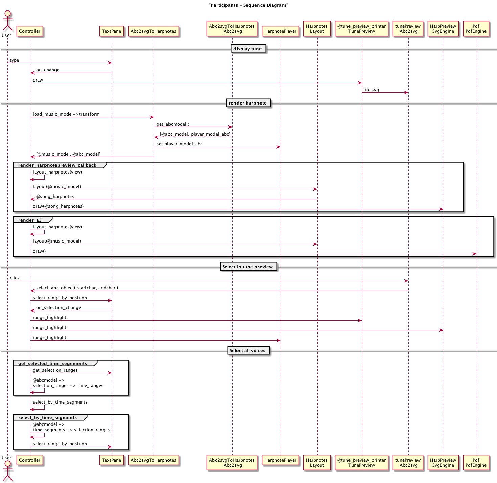

# Basic architecture

Zupfnoter applies the following models

-   **abctext** this is entered by user and maintained in textpane.rb
-   **abcmodel** this is created by abc2svg
-   **musicmodel** this is created by transform. Model elements are such
    as Playable, Note, Rest, Goto etc. This conceptualizes the Harpnote
    Elements.
-   **drawingmodel** this represents the layout independent of the
    target format. Model elements are such asl "Ellipse, Path,
    (FlowLine)". This conceptualizes graphical terms.
-   **svg** created from drawingmodel by svgengine
-   **pdf** created from drawingmodel by pdfengine
-   **harpnoteplayer** created from musicmodel

## Handling google analytics

-   Analytics ia applied for webserver-installation only, not for
    localhost nor desktop
-   this is done by the method `javascript_include_analytics` which is
    defined in the related rake tasks.
-   for localhost, the method is not defined, and therefore the template
    does not include the script

## handling drag and drop

Drag and drop is implemented by opal_svg. There is a global
drag_end-Handler installed in controller.rb ()
`@harpnote_preview_printer.on_annotation_drag_end do |info|`

Info returns the key and the value of the configuration parameter to be
changed.

We uase the library svg.min.js (https://github.com/svgdotjs/svg.js) to
manipulate the SVG nodes in partiucular we have draggable() from there.

we get the nodes by SVG.get which itself finds them by id an
subsequently adopts them. This allows to produce SVG using string
operations.

## Render flow



# build environments

## rvm ruby homebrew etc

### having some trouble with SIP

    https://digitizor.com/fix-homebrew-permissions-osx-el-capitan/

    https://www.computersnyou.com/5307/setup-homebrew-and-rvm-on-mac-osx-10-11-ei-capitan/

    http://stackoverflow.com/questions/22459944/ruby-2-1-1-with-rvm-getting-libyaml-errors

### my setup on osx

1.  install homebrew locally

    https://github.com/Homebrew/brew/blob/master/docs/Installation.md\#installation

    cd \~ git clone https://github.com/Homebrew/brew.git export
    PATH=${HOME}/brew/bin:${PATH}

2.  update \~/.bashrc

    # Add RVM to PATH for scripting. Make sure this is the last PATH variable change.

    export PATH=${HOME}/brew/bin:${PATH} export
    PATH="$PATH:$HOME/.rvm/bin"

3.  install rvm

    https://rvm.io/rvm/install

## project documentation

-   goto `30_source/ZSUPP_Tools`
-   `rake`

## maintain the application

-   goto `30_source/SRC_Zupfnoter/src`
-   `rake`

## updating syntax highlighting

-   goto your clone of the ace reporitory
    (../200_zupfnoter_external_components/ace)
-   update the files as described in <http://ace.c9.io/#nav=higlighter>
-   run `node static.js --allow-save` .
-   navigate to http://localhost:8888/tool/mode_creator.html
-   perform necessary changes
-   perform

    node Makefile.dryice.js -nc -m full

-   copy the contents of
    `200_zupfnoter_external_components/ace/build/src-min-noconflict` to
    `30_sources/SRC_Zupfnoter/vendor/ace`

# preparing a release

Zupfnoter uses gitflow
http://nvie.com/posts/a-successful-git-branching-model/

Before preparing a release, everything that should go to this release
shall be committed to the develop branch.

-   Gitflow: Start new release Pattern: V_1.4.0_RC2
-   adjust version.rb
-   perform all the builds `rake build` `rake deploy`
-   Gitflow: finish the release
-   switch back to the development branch
-   bump version in src/version.rb, add ".dev"

# building the desktop app

The desktop app is built based on node-webkit. The major steps to build
it are described in

https://github.com/rogerwang/node-webkit/wiki/How-to-package-and-distribute-your-apps

Approach follows nodebob but uses rake to do this.

1.  create the webapp
2.  create zupfnoter.nw
3.  create the binaries for windows and osx

# notes how to include Javascript files

Javascript files can be included on following ways:

1.  using a `<script>`

2.  using sprockets and ruby `require`

    This only works e.g. for userinterface.js which global objects which
    are subsequently known in Opal.

3.  using `require(xx)` on the JS side. This can be done in
    application.rb, for example

This is used for node modules or js files following common module
appraoch.

``` {.ruby}
#
%x{
  // see https://stackoverflow.com/questions/30694428/jspdf-server-side-node-js-usage-using-node-jspdf
  global.window = {document: {createElementNS: function(){return {}} }};
  global.navigator = {};
  global.btoa = function(){};

  jsPDF = require ("jspdf")   // adapt in opal-jspdf.rb
  Ajv = require("ajv")        // adapt in opal-ajv.rb
  neatJSON = require("./neatjson_js") // adapt in opal-neatjson.rb

  // these requires are requred by nodejs/dir, nodejs/file
  fs = require('fs')
  glob = require("glob")      // don't know who needs this
}
```

With this appraoch, the resulting js file can be run by node. But it
looks in the search paths of node.

If you want to run it really standalone, then we need to use browserify.

This thing resolves the requrires.

# building soundfonts

Tools:

-   polyphone http://polyphone-soundfonts.com/en/
-   audiacity

The following steps creates the soundfonts

1.  download from https://stash.reaper.fm/v/23360/Scc1t2.sf2
2.  open the file in polyphone
3.  export instrument piano1 to 0_GS sound set (16 bit).sf2
4.  export instrument Steel guitar to 25_GS sound set (16 bit).sf2
5.  Open the two files again in polyphone
6.  go to the instrument and set decay to 8sec in all columns of the
    table, set sustain to 120db
7.  save the files
8.  convert to js files as specified by @moinejf in
    https://github.com/moinejf/abc2svg/issues/84\#issuecomment-375979049
    . I did this using a rake task.

copy the sf2 files to `30_sources/SRC_Zupfnoter/sf2_sources`. File shall
be nr_name. `rake buildSoundfonts` converts t the file to e.g.
`30_sources/SRC_Zupfnoter/public/soundfont/zupfnoter/0.js`

To create a soundfont from our own recording:

1.  create wav files
2.  clean up in audiacity
3.  in poloyphone follow the instructions in
    http://polyphone-soundfonts.com/en/documentation/tutorials/create-a-soundfont-from-scratch/119
4.  name the preset to something like 01_mysound
5.  export the instrument 01_mysound to
    `30_sources/SRC_Zupfnoter/sf2_sources`
