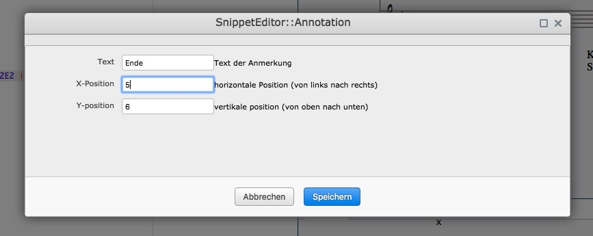
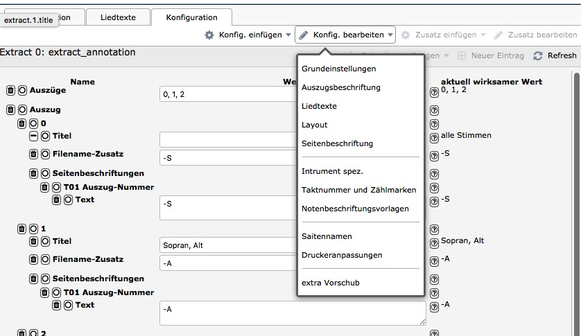
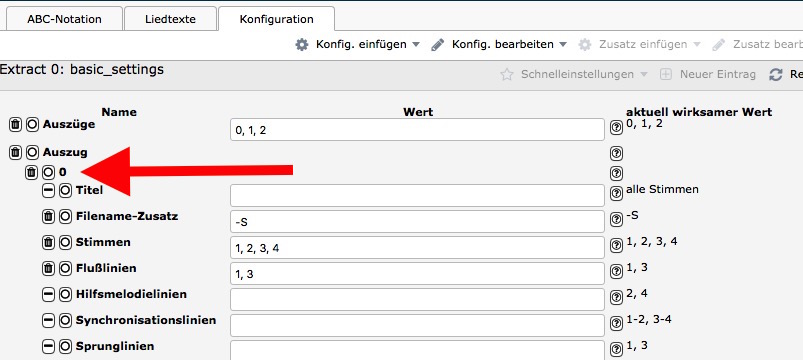
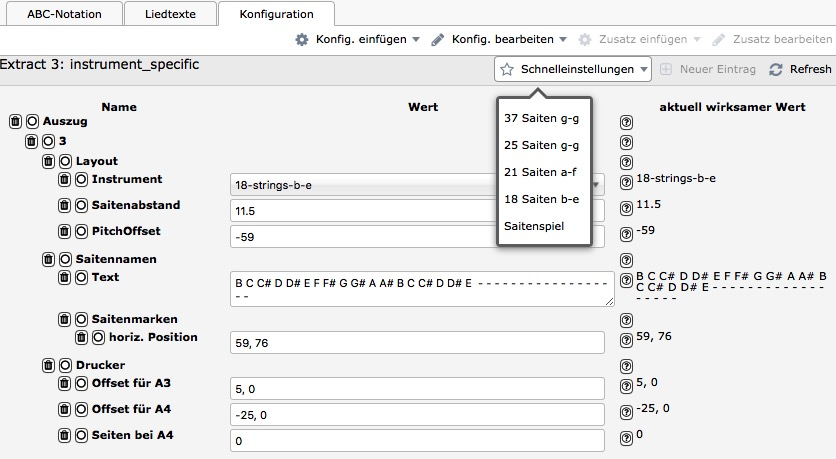

\cleardoublepage

# Zupfnoter - Übersicht für Einsteiger und Experten

Zum Verständnis von Zupfnoter sind folgende Themen wichtig:

-   [Zupfnoter-Prinzipien](#zupfnoter-prinzipien) (Kapitel
    \ref{zupfnoter-prinzipien})
-   [Elemente der von Zupfnoter erstellten
    Unterlegnoten](#elemente-der-von-zupfnoter-erstellten-unterlegnoten)
    (Kapitel \ref{elemente-der-von-zupfnoter-erstellten-unterlegnoten})
-   [Bildschimaufbau](#genereller-bildschirmaufbau) (Kapitel
    \ref{genereller-bildschirmaufbau})
-   [Erstellung von Auszügen](#auszuege) (Kapitel \ref{auszuege})

## Zupfnoter Prinzipien

Zupfnoter arbeitet nach dem Prinzip der Umwandlung von ABC-Notation in
Unterlegnoten. Im Gegensatz zu so genanten "what you see is what you
get" - Systemen werden also die Unterlegnoten nicht direkt bearbeiter,
sondern entstehen automatisch durch Umwandlung aus einem Modell des
Musikstückes.

Dieses Modell ist allgemeiner und präziser als die Unterlegnoten und
basiert auf der ABC-Notation als ein de-facto Standard. Wie du siehst
kann aus diesem Modell (der ABC-Notation) ja auch ein herkömmliches
Notenblatt erstellt werden. In diesem Sinne sind die Unterlegnoten
lediglich eine von mehreren grafischen Darstellungen des Musikstückes.

Andererseits gibt es im Gengensatz zur den herkömmlichen Noten in den
Unterlegnoten spezifische Sachverhalte, deren Darstellung in der
ABC-Notation nicht standardisiert sind. Daher verwendet Zupfnoter
zusätzlich zwei spezifische Darstellungen (Konventionen) innerhalb der
ABC-Notation:

-   **Zusätze** zu Noten und Taktstrichen: Hier werden die "Annotations"
    der ABC-Notation mit spezifischen Formaten verwendet. Diese Zusätze
    stehen vor der Note bzw. dem Taktstrich auf den sie sich
    beziehen.\index{Zusatz!Prinzipien}

    Für die Erstellung und Bearbeitung dieser "Zusätze" gibt es eine
    grafische Benutzerführung durch Bildschirmmasken (Siehe
    Kapitel \ref{masken-fuer-zusaetze} [Zusätze](#masken-fuer-zusaetze)).

-   **Konfiguration** der Unterlegnoten: Zupfnoter gewinnt seine
    Leistungsfähigkeit und \index{Konfiguration} Flexibilität durch
    vielfältige Einstellmöglichkeiten - genannt Konfigurationsparameter.
    Diese Konfigurationsparameter wirken auf die Erstellung der
    Unterlegnotenblätter und steuern z.B:

    -   Stimmen, die ausgegeben werden; Stimmen durch
        Synchronisationslinien verbunden werden usw.
    -   Größe von Notenelementen, Liniendicken
    -   Beschriftungen

    Die Konfigurationsparameter sind thematisch hierarchisiert (z.B.
    `extract.0.layout` `extract.0.printer`). Eine Referenz und
    Erläuterung zu den Konfigurationsparametern findst du in
    \ref{konfiguration} [Konfiguration](#konfiguration).

    Für die Bearbeitung der Konfigurationsmparameter gibt es
    Bildschirmmasken (siehe
    Kapitel \ref{konfigurationsmasken} [Konfigurationsmasken](#konfigurationsmasken))

    Zupfnoter speichert die Konfigurationsparameter im so genannten
    JSON-Format in einem Abschnitt nach der ABC-Notation, der durch

    `%%%%zupfnoter.config`

    abgesetzt ist.

<!-- das erstellte blatt in Vorschau drehen und als PDF wieder exportieren -->

## Elemente der von Zupfnoter erstellten Unterlegnoten

Das Bild auf der vorigen Seite zeigt die Elemente und Merkmale aus denen
Zupfnoter ein Unterlegnotenblatt aufbaut. In den nachfolgenden
Unterkapiteln werden die einzelnen Elemente und Merkmale dieser
Darstellung erläutert. Als Referenz dient die Nummer in dieser
Abbildung.

Bei manchen Elementen ist auch eine Konfiguration notwendig. Die
nachfolgende Beschreibung enthält auch einen verweise auf den (internen)
Namen des entsprechenden Kongigurationsparameters.

> **Hinweis**: In dieser Darstellung sind die englischen Begriffe
> aufgelistet. Für diese Auflistung wurde die Funktion "Liedtexte"
> verwendet.

### Darstellung der Noten

In der ABC-Notation wird in den Kopfzeilen ein Standardnotenwert
angegeben, z.B. `L:1/4`. Dies bedeutet, daß standardmäßig in
Viertelnoten erfasst wird. Ausgehend von diesem Wert ergibt sich der
Notenwert durch Multiplikation mit der angegebenen Länge. Diese
Längenangaben wird an den Notennamen angehängt.

TODO: verweise auf ABC-Kapitel

\needspace{5cm}

Im Folgenden wird von **Vierteln als Standardnotenwert** und dem
Notennamen **`C`** ausgegangen.

-   **(1) full note - ganze Note** entspricht in ABC-Notation: `C4`

-   **(2) half note - halbe Note** entspricht in ABC-Notation: `C2`

-   **(3) quarter note - viertel Note** entspricht in ABC-Notation: `C`
    oder `C1`

-   **(4) eighth note - achtel Note** entspricht in ABC-Notation: `C1/2`
    oder `C/`

-   **(5) sixteenth note - sechzehntel Note** entspricht in
    ABC-Notation: `C1/4` oder `C//`

-   **(6) punctuated half note - punktierte halbe Note** entspricht in
    ABC-Notation: `C3`

-   **(7) punctuated quarter note - punktierte viertel Note** entspricht
    in ABC-Notation: `C3/2` (also drei halbe Viertel :-)

\needspace{5cm}

### Darstellung von Pausen

Im Folgenden wird von **Vierteln als Standardnotenwert** ausgegangen.

-   **(11) full rest - ganze Pause** entspricht in ABC-Notation: `z4`

-   **(12) half rest - halbe Pause** entspricht in ABC-Notation: `z2`

-   **(13) quarter rest- viertel Pause** entspricht in ABC-Notation: `z`
    oder `z1`

-   **(14) eighth rest - achtel Pause** entspricht in ABC-Notation:
    `z1/2` oder `z/`

-   **(15) sixteenth rest - sechzehntel Pause** entspricht in
    ABC-Notation: `z1/4` oder `z//`

-   **(16) punctuated half rest - punktierte halbe Pause** entspricht in
    ABC-Notation: `z3`

-   **(17) punctuated quarter rest - punktierte viertel Pause**
    entspricht in ABC-Notation: `z3/2` (also drei halbe Viertel :-)

### Darstellung notenbezogener Elemente

Um auf den Unterlegnoten einzelnen Noten graphische Elemente oder Texte
hinzuzufügen gibt es bei Zupfnoter Elemente, die fest mit Noten
verbunden sind. Da sie im Kontext von Noten positioniert werden, nennt
man sie "notenbezogene Elemente":

-   **(20) measure bar - Taktstrich**: Der Taktstrich entsteht aus der
    Takteingabe in der ABC-Notation (z.B. `|` `|]`). Zur Eingabe dieser
    Sonderzeichen siehe Kapitel
    \ref{dein-erstes-musikstueck-eingeben} [Tastenkombinationen für
    Sonderzeichen](#dein-erstes-musikstueck-eingeben)

-   **(21) unison - Mehrklang**:\
    Ein Mehrklang entsteht, wenn in der ABC-Notation mehrere Noten in
    einer eckigen Klammer eingegeben werden (z.B. `[FA]`). Damit kann
    man innerhalb **einer** Stimme mehrere Noten spielen.

    Die Noten eines Mehrklanges werden automatisch mit einer
    Synchronisationslinie verbunden.

    > **Hinweis**: Dieser Mehrklang sieht in den Unterlegnoten nahezu
    > gleich wie der Zusammenklang von Tönen aus mehreren Stimmen aus.
    > Man kann sie jedoch anhand der Flußlinie unterscheiden und den
    > jeweiligen Stimmen zuordnen.
    >
    > **Hinweis**: Die Angabe von Akkordsymbolen in der ABC-Notation
    > wird für die Unterlegnoten ignoriert.

    Meist ist es so, dass bei Mehrklängen die höchste Note die
    Melodieführung übernimmt. Daher wird bei einem Mehrklang die
    Flußlinie and die letzte Note geführt.

    > **Hinweis**: Wenn man das anders haben möchte, muss man die
    > Reihenfolge der Noten in der ABC-Notation verändern oder doe
    > "Führungsnote" als letzte Note wiederholen. Beispiel:
    >
    > -   `[CEG]` - Die Flußlinie geht an `G`
    > -   `[GEC]` - Die Flußlinie geht an `C`
    > -   `[CEGC]` - Die Flußlinie geht an `C`

-   **(22) triplet - Triole**: Bei einer Triole werden drei Noten auf
    zwei Schläge verteilt. Bei einer Triole werden Anfang und Ende einer
    Reihe von Noten mit einem Bogen verbunden. Die Länge der Triole wird
    an den Bogen geschrieben. Eine Verallgemeinerung der Triole ist das
    Tuplet. Dieses verteilt n Noten auf m Schläge. Zupfnoter kann
    beliebige Tuplets, auch wenn bei Tischharfen meistens nur Triolen
    verwendet werden.

    Ein Tuplet entsteht, wenn in der ABC-Notation den Noten der Tuplets
    eine Klammer mit der Länge des Tuplets vorangestellt wird, z.B:
    "`(3CCC`".

-   **(23) tie - Haltebogen**: Ein Haltebogen verbindet zwei Noten
    gleicher Höhe miteinander. Dabei wird nur die erste Noten
    angeschlagen. Ein Haltebogen entsteht, wenn in der ABC-Notation die
    Noten durch einen Bindestrich verbunden sind, z.B. "`A -|A`".

    > **Hinweis**: Der Haltebogen ist zu unterscheiden vom Bindebogen,
    > welcher in der Notenansicht gleich aussieht, in den Unterlegnoten
    > jedoch nicht ausgegeben wird, da man ihn auf der Tischharfe nicht
    > spielen kann. Der Bindebogen wird in der ABC-Notation durch
    > Einklammern der Noten erstellt, z.B. "`(A|A)`".

-   **(24) repeat signs - Wiederholungszeichen**: Eine Wiederholung
    entsteht durch Beifügen eines Doppelpunktes an die Taktstriche in
    der ABC-Notation, z.B. "`|: C4 :|`".

    > **Hinweis** Wiederholungszeichen sind eine Alternative zu
    > Sprunglinien. Ihre Ausgabe hängt von der aktuellen Konfiguration
    > ab (siehe
    > Kapitel \ref{extract.0.repeatsigns} [`repeatsigns`](#extract.0.repeatsigns)).

-   (25), (26) siehe nächster Abschnitt

-   **(27) part note - Bezeichnung von Abschnitten im Musikstück**: Man
    kann ein Musikstück in Abschnitte aufteilen. Die Abschnitte können
    bezeichnet werden, z.B. als "Teil 1". Der Abschnitt unterbricht auch
    die Flusslinien. Dieses Element wird häufig genutzt, um Abfolgen von
    Abschnitten beim Spielen festzulegen.

    Ein Abschnitt entsteht, wenn in der ABC-Notation der ersten Note des
    neuen Abschnittes z.B. die Zeichenfolge "`[P:Teil 1]`" vorangestellt
    wird. Hier ist "Teil 1" die Bezeichnung des Abschnitts.

    > **Hinweis:** Die Aufteilung in Abschnitte gilt für das gesamte
    > Musikstück. daher muss die Bezeichnung von Abschnitten in der
    > **ersten Stimme** erfolgen. Sie wirkt dann auf alle Stimmen.
    > Abschnittsbezeichnungen in den folgenden Stimmen werden ignoriert.

-   **(28) countnotes - Zählhilfen**: Zupfnoter kann die Noten
    automatisch mit Zählhilfen beschriften. Die Zählweise ergibt sich
    aus der Taktangabe. Beispiel siehe Abbildung \[Zupfnoter Elemente\].
    Diese Ausgabe (für welche Stimmen, Position) ist
    konfigurationsabhängig (`extract.0.countnotes`).

    > **Hinweis** die Zählhilfen sind so gesataltet, dass man während
    > des Spiels die Zeitachse durchzählt. Bei Noten mit mehreren
    > Schlägen beginnt die Zählhilfe immer mit der Nummer des ersten
    > Schlages (z.B. 2-3 ist eine Note, die bei Schlag 2 beginnt und
    > zwei Schläge lang gespielt wird, d.h. während diese Note klingt,
    > zählt man 2 - 3)

-   **(29) barnumbers - Taktnummer**: Zupfnoter kann die Takte
    automatisch durchnummerieren. Damit kann bei gemeinsamem Spiel auch
    mitten im Musikstück wieder eingesetzt werden. Diese Ausgabe ist
    konfigurationsabhängig (`extract.0.barnumbers`.

-   **(30) decoration - Dekoration**: Zupfnoter kann einzelne
    Dekorationen (Stand Version 1.5 nur die Fermate) darstellen. Für
    diese Dekorationen werden die Eingaben der ABC-Notation verwendet
    (z.B. für die Fermate : "`!fermata!`" oder "`H`").

### Darstellung von Verbindungslinien

Um auf den Unterlegenoten die Zusammenhänge zwischen Noten darzustellen,
gibt es folgende Elemente:

-   **(25) jumpline for repeat - Sprunglinie für Wiederholungen**: Eine
    Wiederholung entsteht durch Beifügen eines Doppelpunktes an die
    Taktstriche in der ABC-Notation z.B. "`|: C4 :|`".

    > **Hinweis** Wiederholungszeichen sind eine Alternative zu
    > Sprunglinien. Ihre Ausgabe hängt von der aktuellen Konfiguration
    > ab (siehe
    > Kapitel \ref{extract.0.repeatsigns} [`extract.0.repeatsigns`](#extract.0.repeatsigns)).

-   **(26) synchline for unison - Synchronisationslinie für Mehrklang**:
    siehe (21) in Kapitel
    \ref{darstellung-notenbezogener-elemente} [Darstellung
    notenbezogener Elemente](#darstellung-notenbezogener-elemente)

-   **(31) flowline - Flusslinie**: Die
    Flußlinie[^040_UD-Zupfnoter-Referenz.md_1] verbindet die Noten
    **einer** Stimme und markiert so die Führung innerhalb dieser
    **einen** Stimme. Standardmäßig stellt Zupfnoter die Flußlinie in
    der ersten und dritten Stimme dar.

    Die Ausgabe von Flusslinien für die einzelnen Stimmen hängt von der
    aktuellen Konfiguration (siehe Kapitel
    \ref{extract.0.flowlines} [extract.0.flowlines](#extract.0.flowlines))
    ab.

-   **(32) synchline - Synchronisationslinie**: Die
    Synchronisationslinien verbinden Noten aus zwei **verschiedenen
    Stimmen**, die zum gleichen Zeitöpunt gespielt werden. Standardmäßig
    stellt Zupfnoter die Synchronisationslinie zwischen den Stimmen
    *eins und zwei* sowie *drei und vier* dar.

    Die Ausgabe von Synchronisationslinien für die einzelnen Stimmen
    hängt von der aktuellen Konfiguration (siehe Kapitel
    \ref{extract.0.synchlines} [extract.0.synchlines](#extract.0.synchlines))
    ab.

-   **(33) subflowline - Unterflusslinie**: Die Unterflusslinie
    verbindet innerhalb einer Stimme ohne Flußlinie diejenigen Noten,
    die nicht über eine Synchronisationslinie (32) mit einer anderen
    Stimme verbunden sind.

    Die Ausgabe von Unterlusslinien für die einzelnen Stimmen hängt von
    der aktuellen Konfiguration (siehe Kapitel
    \ref{extract.0.subflowlines} [extract.0.subflowlines](#extract.0.subflowlines))
    ab.

-   (34), (35), (36) siehe
    Kapitel \ref{elemente-fuer-das-ganze-blatt} [Elemente für das
    gesamte Musikstück](#elemente-fuer-das-ganze-blatt)
-   **(50) variant ending - variante Enden - Volten**: Wo mehrfach
    gespielte Abschnitte unterschiedlich enden, bezeichnet man das als
    variante Enden. In der ABC-Notation schreibt man hierfür Ziffern
    (z.B. 1 und 2) unmittelbar hinter den Taktstrich bei dem die
    Variation beginnt.

    Zupfnoter stellt diese varianten Enden als eine Menge von
    Sprunglinien dar:

    -   **(51) Eingangslinie** (im Beispiel links): Es gibt pro
        Variation eine Linie, welche zum Anfang der Variation führt
    -   **(52) Ausgangslinie** (im Beispiel rechts): Es gibt pro
        Variation eine Ausgangslinie, welche zur nächsten Note nach der
        letzten Variation führt.

        > **Hinweis**: Wenn die Varianten am Ende einer Wiederholung
        > stehen, entfällt die Ausgangslinie. Stattdessen wird eine
        > normale **(25) Sprunglinie für Wiederholung** verwendet. Die
        > Positionsangabe der Ausgangslinie wird in diesem Fall
        > ignoriert und die Positionsangabe der Sprunglinie am Ende der
        > Wiederholung verwendet.

    -   **(53) Folgelinie** ist die Ausgangslinie der letzten Variation.
        Diese kann separat positioniert werden, um das gewünschte
        Notenbild zu erreichen.

    Die Positionen dieser Linien werden als Zusatz vor den Taktstrich
    der ersten Variation geschrieben (Schaltfläche "Zusatz einfügen"
    bzw. "Zusatz bearbeiten").

    > **Hinweis:** Ab Zupfnoter 1.7 können diese Linien mit der Maus
    > verschoben werden. Diese Verschiebungen werden in der
    > Konfiguration gespeichert und von älteren Zupfnoter-Versionen
    > nicht verarbeitet. Die Konfiguration über Zusätze ist aus
    > Kompatibilitätsgründen noch vorhanden.

    > **Hinweis:** Zupfnoter stellt die Noten der verschiedenen
    > Variationen in unterschiedlichen Grautönen dar. Die Farben können
    > in der Konfigurationsmaske `Layout` über eine Schnelleinstellung
    > ausgewählt werden (siehe Konfiguration
    > [extract.x.layout.color](#extract.0.layout.color)).

### Elemente für das gesamte Musikstück bzw. Unterlegnotenblatt {#elemente-fuer-das-ganze-blatt}

Um auf den Unterlegnoten Texte und Beschriftungen allgemeiner Art
darstellen zu können, gibt es folgende Elemente:

-   **(34) legend - Legende**: Die Legende enthält die grundsätzlichen
    Informationen über das Musikstück. Die Inhalte der Legende werden
    aus den Kopfzeilen der ABC-Notation übernommen:

    -   Titel des Musikstücks (ABC-Notation Zeile "`T:`")
    -   Titel des Auszugs siehe (35)
    -   Autoren des Musikstücks bzw. Liedes (ABC-Notation Zeile "`C:`")
    -   Takt des Musikstücks (ABC-Notation Zeile "`M:`")
    -   Empfohlene Geschwindigkeit (ABC-Notation Zeile "`Q:`")
    -   Tonart des Musikstücks (ABC-Notation Zeile "`K:`")
    -   Tonart der Druckausgaben falls das Musikstück transponiert wurde

    Die Legende kann mit der Maus im rechten unteren Fenster auf den
    Unterlegnoten optimal positioniert werden.

-   **(35) extract title in legend - Titel des Auszugs**: Dies
    bezeichnet den Titel des Auszuges (siehe Konfiguration
    [extract.x.title](#extract.0.title) bzw.
    Kapitel \ref{auszuege} [Auszüge](#auszuege)).

-   **(36) lyrics - Liedtexte**: Zupfnoter stellt auch Liedtexte dar.
    Diese Liedtexte (siehe auch Kapitel \ref{musikstueck-gestalten})
    werden aus aufeinander folgenden Kopfzeilen der ABC-Notation
    entnommen (`W:`) und zu Strophen zusammengefügt. Einzelne Strophen
    trennt man mit einer "Leerzeile" ("`W:`")

        W: Strophe 1 Zeile 1
        W: Strophe 1 Zeile 2
        W:
        W: Strophe 2 Zeile 1
        W: Strophe 2 Zeile 2

    > **Hinweis**: Die Ausgabe der Strophen muß über die Konfiguration
    > eingestellt werden (siehe Kapitel
    > \ref{extract.0.lyrics} [extract.x.lyrics](#extract.0.lyrics)).

    > **Hinweis**: In der ABC-Notation kann man Liedtexte mit sowohl mit
    > Kopfzeile `W:`(Großbuchstaben) als auch mit Kopfzeile `w:`
    > (Kleinbuchstaben) eingeben. Die Variante mit Kleinbuchstaben wird
    > verwendet, um die Liedtexte direkt in die Notensysteme zu
    > schreiben. Zupfnoter ignoriert diese Liedtexte in den Notenlinien

    > **Hinweis**: Auch wenn die ABC-Notation es erlaubt, die Kopfzeilen
    > `W:` im ganzen ABC-Text zu verteilen ist es wichtig, die Liedtexte
    > dennoch in einem Block zusammenzufassen. Sonst meldet Zupfnoter,
    > dass es mehrere Liedtexte gibt. Der Editor fasst sie alle
    > zusammen, löscht aber die anderen Blöcke nicht. Das muss manuell
    > korrigiert werden.

    > **Hinweis**: Zupfnoter ignoriert Leerzeichen am Anfang von
    > Liedtexten. Manchmal möchte man aber den Liedtext in bestimmten
    > Zeilen etwas einrücken um den Text um eine Note im
    > Unterlegnotenblatt herumfließen zu lassen. Wenn also eine
    > Textzeile mit einer Reihe Tilde (`~`) - Zeichen beginnt, werden
    > diese in den Unterlegnoten als Leerraum ausgegeben und so der
    > Textbeginn nach rechts verschoben.

                W: Strophe 1 Zeile 1
                W: ~Strophe 1 Zeile 2
                W: ~~Strophe 1 Zeile 2
                W: ~~~Strophe 1 Zeile 2

### Elemente zur Handhabung des Unterlegnotenblattes

Zupfnoter druckt Elemente auf das Unterlegnotenblatt, um das Zuschneiden
und das Einelgen in das Instrument zu vereinfachen:

-   **(37) stringnames - Saitennamen**: Zupfnoter kann die Namen der
    Saiten auf den Unterlegnoten ausgeben.

    > **Hinweis**: Über die \[Einstellungen in der Konfiguration\] kann
    > die Ausgabe von Saitennamen eingestellt werden (siehe Kapitel
    > \ref{extract.0.stringnames}
    > [extract.0.stringnames](#extract.0.stringnames)).

    > **Hinweis**: Wenn einzelne Saiten nicht beschriftet werden sollen,
    > kann als Saitenname eine Tilde ('\~) angegeben werden. Diese
    > erscheint dann als festes Leerzeichen.

-   **(38) marks - Saitenmarke** Die Saitenmarken sind eine Hilfe zum
    korrekten Einlegen der Unterlegnoten in die Tischharfe. Das Blatt
    muss so in die Tischharfe eingelegt werden, dass die Marken unter
    den G-Saiten liegen.

    > **Hinweis:** Über die \[Einstellungen in der Konfiguration\] kann
    > die Ausgabe der Saitenmarken beeinflusst werden (siehe Kapitel
    > \ref{extract.0.stringnames.marks}
    > [extract.0.stringnames.marks](#extract.0.stringnames.marks)).

-   **(39) cutmarks - Schneidemarken**: Die Schneidemarken sind eine
    Zuschneidehilfe für den Fall, dass die Unterlegnoten auf DIN-A4
    Seiten ausgegeben werden (Siehe Kapitel \ref{musikstueck-drucken}
    [Musikstück drucken](#musikstueck-drucken)).

### Elemente zur Organisation von Unterlegnoten

-   **(70) input filename - Name der Eingabedatei**: Der Name der
    Eingabedatei hilft, den Ursprung eines ausgedruckten Blattes
    nachzuvollziehen. Er wird immer auf den Unterlegnoten ausgegeben und
    kann nicht unterdrückt werden.

-   **(71) creation note - Erstellungsnotiz**: Die Erstellungsnotiz gibt
    weitere Informationen zum technischen Stand der Erstellung. Diese
    wird immer auf den Unterlegnoten ausgegeben und kann nicht
    unterdrückt werden. Die Erstellungsnotiz hilft beim Nachvollziehen
    von Veränderungen und besteht aus

    -   Zeitpunkt der Erstellung der PDF-Datei (CEST steht für
        "*C*entral *E*uropean *S*ummer *T*ime")
    -   Software-Version von Zupfnoter
    -   Server von welchem der Zupfnoter geladen wurde

-   **(72) reference to zupfnoter website - Referenz auf Zupfnoter
    Website**: Dies ist die Referenz auf Zupf-\
    noter als Werkzeug zur Erstellung des Unterlegnotenblattes, also
    Werbung in eigener Sache. Diese wird immer auf den Unterlegnoten
    ausgegeben und kann nicht unterdrückt werden.

-   **(73) fingerprint - Fingerabdruck**: Diese Nummer ist wie ein
    Fingerabdruck der ABC-Datei. Dies bedeutet, dass Unterlegnoten (z.b.
    verschiedene Auszüge) mit dem selben Fingerabdruck auch aus einer
    identischen Quelle stammen und somit zuverlässig zusammen passen.

    > **Hinweis:** Der Fingerabdruck wird aus dem ABC-Text errechnet und
    > ist daher nicht im ABC-Text enthalten.

### Vordefinierte Seitenbeschriftungen

Zupfnoter bietet eine Reihe von Vorlagen für die Seitenbeschriftungen.
Damit lässt sich ein einheitliches Vorgehen bei der Beschriftung der
Unterlegnoten erreichen. Diese können in der Konfigurationsmaske
"Seitenbeschriftung" eingegeben werden. Zupfnoter hat geeignete
Vorgabewerte für die Position und Schriftart dieser Beschriftungen.

-   **(34) T05 legend - Legende**: Hier kann eine Legende eingefügt
    werden, welche mal selbst gestalten kann.

    > **Hinweis:** Wenn dieser Eintrag vorhanden ist, wird die in
    > Zupfnoter eingebaute Legende unterdrückt.
    >
    > Für eine eigenen Legende ist es sinnvoll mit Platzhaltern zu
    > arbeiten. Die Schnelleinstellung in der Seitenbeschriftung fügt
    > eine Legende ein, gleich aussieht wie die in Zupfnoter eingebaute
    > version. Sie ist daher ein guter Startpunkt für eine selbst
    > gestaltete Legende.

-   **(74) T04 to order - zu beziehen bei**: Hier kann man angeben, über
    welche Adresse das Unterlegnotenblatt bezogen werden kann
    (Konfiguration siehe Kapitel \ref{presets.notes.T04_fto_forder}
    [presets.notes.T04\_to\_order](#presets.notes.T04_to_order)). Das
    ist natürlich nur sinnvoll, wenn es für die erstellen Unterlegnoten
    einen Vertriebsweg gibt.

-   **(75) T02 Copryright music - Urheberrechte für das Stück**: Hier
    kann mam die Urheberrechte für das Musikstück angeben (Konfiguration
    siehe Kapitel \ref{presets.notes.T02_fcopyright_fmusic}
    [presets.notes.T02\_copyright\_music](#presets.notes.T02_copyright_music)).
    Es wird empfohlen, diese Rechte immer anzugeben und den Satz
    "Privatkopie" hinzuzufügen, wenn mit dem Rechteinhaber keine
    Vereinbarung geschlossen wurde.

    > **Hinweis:** In diesem Fall darf das Unterlegnotenblatt natürliche
    > auch nicht verteilt oder vertrieben werden, sondern wird nur zum
    > persönlichen Gebrauch erstellt (sog. Privatkopie)

-   **(76) T03 Coppyright harpnotes - Rechte am Notenbild**: Unabhängig
    von den Urheberrechten am Stück entsteht auch ein Urheberrecht an
    den erstellen Unterlegnoten. Hier kannst du diese Rechte
    beanspruchen (Konfiguration siehe Kapitel
    \ref{presets.notes.T03_fcopyright_fharpnotes}
    [extract.0.synchlines](#presets.notes.T03_copyright_harpnotes)).

-   **(77) T99 do not copy - Bitte nicht kopieren**: Diese Beschriftung
    soll den Blick dafür schärfen, das die erstellen Unterlegnoten nicht
    einfach wild kopiert werden dürfen, sondern die Urheberrechte zu
    bachten sind (Konfiguration siehe Kapitel
    \ref{presets.notes.T99_fdo_fnot_fcopy}
    [presets.notes.T99\_do\_not\_copy](#presets.notes.T99_do_not_copy)).

-   **(78) T01 Number - Nummer**: Hier kannst du eine Nummer angeben,
    welche das Unterlegnotenblatt eindeutig und schnell identifizierbar
    macht(Konfiguration siehe Kapitel \ref{presets.notes.T01_fnumber}
    [presets.notes.T01\_number](#presets.notes.T01_number)). Im Grunde
    ist das wie eine Bestellnummer. Es wird empfohlen, die Nummer nach
    folgendem Schema zu gestalten:

    `XXX-999` darin ist

    -   `XXX` ist ein Kürzel für den Herausgeber, z.B. RBW für Ruth und
        Bernhard Weichel, ZNR - für Zupfnoter
        [^040_UD-Zupfnoter-Referenz.md_2]

    -   `999` eine Nummer für das Blatt

    Z.B. ist dann `RBW-320` das Blatt 320 aus der Werkstatt von Ruth und
    Bernhard Weichel.

-   **(79) T01 Number extract - Kürzel für den Auszug**: Hier kannst du
    ein Kürzel für den Auszug angebeen (Konfiguration siehe Kapitel
    \ref{presets.notes.T01_fnumber_fextract}
    [presets.notes.T01\_number\_extract](#presets.notes.T01_number_extract))

### Zusammenfassung der Beschriftungen in Zupfnoter

Zupfnoter hat vielfältige Möglichkeiten, das Beschriftungen einzufügen.
Auf den Unterlegnoten sind diese nicht leider nicht immer zu
unterscheiden. Daher wird hier noch einmal eine Zusammenfassung gegeben:

-   **Standardbeschriftungen** (siehe Kapitel
    \ref{elemente-fuer-das-ganze-blatt} [Elemente für das gesamte
    Musikstück](#elemente-fuer-das-ganze-blatt))

    Die Standardbeschriftung wird aus der Kopfzeilen der ABC-Notation
    entnommen, sie erscheint auch auf den herkömmlichen Noten.

-   **Notenbeschriftung**

    Die Notenbeschriftung ist mit einer einzelnen Note verbunden und
    verschiebt sich ggf. wenn die Tonhöhe oder der Zeitbezug dieser Note
    verändert wird. Die Notenbeschriftung wird über einen
    "Zusatz"\index{Zusatz} direkt in die ABC-Notation eingefügt (siehe
    Kapitel \ref{darstellung-notenbezogener-elemente} [Darstellung
    notenbezogener Elemente](#darstellung-notenbezogener-elemente)).

    Für wiederkehrende Texte bzw. längere und mehrzeilige Texte in der
    Konfiguration eine Notenbeschriftungsvorlage (Kapitel
    \ref{annotations} [annotations](#annotations)
    \index{Notenbeschriftungsvorlage} mit Positionsangabe anlegen und
    über einen Zusatz (Schaltfläche "Ref. Notenbeschriftung") daraus
    eine Notenbeschriftung erstellen.

    > **Hinweis**: Zupfnoter kennt standardmäßig die
    > Noptenbeschriftungsvorlagen `vl` `vt`, `vr`. Damoit kann man
    > einfach ein "Abdämpfungszeichen" anbringen.
    > [^040_UD-Zupfnoter-Referenz.md_3].

    Im Zusatz kann eine Position mit angegeben angegeben werden. Damit
    bleibt die Position der Notenbeschriftung erhalten, auch wenn der
    Zeitbezug der Note geändert wird.

    > **Hinweis** Wenn man die Notenbeschriftung mit der Maus
    > verschiebt, wirkt nur noch diese Verschiebung ud die Angabe im
    > Zusatz wird ignoriert. Diese Verschiebung wird in der
    > Konfiguration gespeichert und ist an die die Startzeit der Note
    > gebunden, solange keine Verschiebemarke \index{Verschiebemarke} in
    > der ABC-Notation eingefügt ist
    > (\[extract.x.notebound.annotation.v\_{voice}.{time}\]).

-   **Seitenbeschriftung**

    Die Seitenbeschriftungen werden ausschliesslich über die
    Konfiguration hinzugefügt (Kapitel \ref{extract.0.notes}
    [extract.x.notes](#extract.0.notes). Ihre Anordnung bezieht sich auf
    den Seitenrand. Der Schriftstil kann gewählt werden (siehe auch
    Kapitel \ref{elemente-fuer-das-ganze-blatt} [Elemente für das
    gesamte Musikstück](#elemente-fuer-das-ganze-blatt)).

    > **Hinweis** In den Seitenbeschrifungen können Informationen
    > eingefügt werden, welche in Zupfnoter schon vorhanden sind. Hierzu
    > werden Platzhalter eingefügt, welche bei der Ausgabe durch die
    > entsprechende Information ersetzt werden. Die möglichen
    > Platzhalter findest du in der Hilfe zu den Parametern.

-   **Liedtexte**

    Liedtexte werden in den `W:` - Zeilen in der ABC-Notation erfasst
    und über die Konfiguration (Kapitel \ref{templates.lyrics}
    [extract.x.lyrics.x](#templates.lyrics)) auf dem Blatt positioniert.

    Für weitere Einzelheiten siehe auch Kapitel
    \ref{elemente-fuer-das-ganze-blatt} [Elemente für das ganze
    Blatt](#elemente-fuer-das-ganze-blatt).

## Zupfnoter Bildschirmaufbau {#genereller-bildschirmaufbau}

Die Benutzungsoberfläche von Zupfnoter ist aus folgenden Elementen
aufgebaut:

-   Fenster (Eingabe, Notenvorschau, Unterlegnotenvorschau) (Kapitel
    \ref{fensteraufbau} [Fensteraufbau](#fensteraufbau)) mit mit
    Reitern, Werkzueugleisten und Kontextmenüs
-   Werkzeugleiste (Kapitel \ref{menues-im-hauptfenster} [Menüs im
    Hauptfenster](#menues-im-hauptfenster))
-   Statusleiste (Kapitel \ref{statusleiste}
    [Statusleiste](#statusleiste)

 

### Fensteraufbau

Zupfnoter kennt drei Fenster[^040_UD-Zupfnoter-Referenz.md_4]:

-   Das **linken Fenster** zeigt die Eingabemöglichkeiten über drei
    Reiter (Kapitel \ref{eingabefenster-details}
    [Eingabe](#eingabefenster-details)):

    -   `ABC`- Der Texteditor für die ABC-Notation
    -   `Liedtexte` für die Erfassung der Liedtexte
    -   `Konfiguration` für die formulargeführte Bearbeitung der
        Zupfnoter-Konfiguration.

-   Im **rechten oberen Fenster** (Kapitel \ref{notenvorschau}
    [Eingabe](#notenvorschau)) wird in der herkömmlichen Notenschrift
    das Musikstück gezeigt, und kann somit musikalisch überprüft wreden.

    Die Darstellung in herkömmlicher Notenschrift kann mehrstimmig
    erfolgen (gesteuert über die `%%score` - Anweisung in der
    ABC-Notation). Wenn das Musikstück Texte enthält (also ein Lied
    ist), werden diese Texte auch in der Notenvorschau angezeigt.

-   Im **rechten unteren Fenster** werden die Unterlegnoten angezeigt.
    Diese entsprechen inhaltlich der herkömmlichen Notenschrift im
    rechten oberen Fenster (Kapitel \ref{unterlegnotenvorschau}
    [Eingabe](#unterlegnotenvorschau)).

    Über die Reiter können verschiedene Zoom-Stufen eingestellt werden.

    > **Hinweis**: Da die Berechnung der Unterlegnoten einige Sekunden
    > dauert, wird dieses Fenster nur durch `Rendern` aktualisiert.

Die Anordnung dieser Fenster ist in Zupfnoter fest vorgegeben. Man kann
aber während der Arbeit folgende Einstellungen vornehmen, um den
aktuellen Arbeitsschritt besser zu unterstützen:

-   Fenstergröße verstellen: Die Trennlinien zwischen den Fenstern
    können mit der Maus verschoben werden, um Platz für die aktuell
    wichtigen Elemente zu schaffen
-   Über das Menü **"`Ansicht`"** kann man einzelne Fenster ausblenden
    so dass die anderen Fenster größer werden (Siehe Kapitel
    \ref{menues-im-hauptfenster} [Werkzeugleiste für Schaltflächen und
    Menüs](#menues-im-hauptfenster))

Innerhalb dieser Fenster gibt es weitere **Bedienelemente**:

-   **Reiter** zum Auswählen verschiedener Ansichten
-   **Werkzeugleiste** Leiste für Schaltflächen und Menüs
-   **Kontextmenü**: zur speziellen Bearbeitung von Elementen
    (erreichbar mit rechte Maustaste)

Über die drei festen Fenster hinaus gibt es **Dialoge**. Das sind
Fenster die aufscheinen, um bestimmte Informationen einzugeben bzw. zu
ändern (z.B. Dialog im Kapitel \ref{dein-erstes-musikstueck-eingeben}
[Dein erstes Musikstück eingeben](#dein-erstes-musikstueck-eingeben)).

> **Hinweis**: Der Begriff "Fenster" wird sowohl für die Fenster des
> Betriebssystems als auch die Fenster innerhalb Zupfnoter verwendet.

### Werkzeugleiste für Schaltflächen und Menüs {#menues-im-hauptfenster}

Die Zupfnoter - Werkzeugleiste ist immer sichtbar (also auch in allen
Ansichten) und erstreckt sich über aller Fenster. In ihr befinden sich
Schaltflächen und Menüs die man während der Erstellung von Unterlegnoten
benötigt. Nach einem Klick auf die Schaltflächen führt der Zupfnoter
bestimmte Aktivitäten aus.

Einige Funktionen sind auch über Tastenkombinationen (Shortcuts)
erreichbar (siehe Kapitel \ref{shortcuts} [Shortcuts](#shortcuts))

> **Hinweis**: Für die Version 1.5 wird die Bedienungsoberfläche von
> Zupfnoter verbessert. Daher sind die Informationen in diesem Kapitel
> vorläufig.

-   Schaltfläche **Zupfnoter**: TODO: -- Detailinfo als Popup darstellen

-   Schaltfläche **Neu** (erstellen): Es wird ein leerer Bildschirm ohne
    Inhalte erstellt und man kann ein neues Musikstück erstellen (siehe
    Kapitel \ref{dein-erstes-musikstueck-eingeben} [Dein erstes
    Musikstück eingeben](#dein-erstes-musikstueck-eingeben)).

-   Schaltfläche **Einloggen**: TODO: -
    https://github.com/bwl21/zupfnoter/issues/75

    Über diese Schaltfläche kannst du das Speicherort in der Dropbox
    angeben, in die Zupfnoter dein Musikstück speichern soll.

    > **Hinweis:** Wenn du in dem Eingabefeld etwas eingibst, zeigt
    > Dropbox passende Speicherorte an, die zu zuletzt verwendet hast.

    > **Hinweis:** Du kannst den Speicherort auch in der Statuszeile
    > auswählen. Dort wird der aktuelle Speicherort angegeben. Rechts
    > davon ist eine Menüknopf, der die zuletzt verwendeten Speicherorte
    > aufrufbar macht.

-   Schaltfläche **DL abc** (Download ABC): Hiermit kann man
    Zwischenstände oder fertige Musikstücke als ABC-Datei auf seinen
    Rechner herunterladen. Abgelegte Dateien können mit der Maus wieder
    in den Zupfnoter in den linken Abschnitt gezogen werden und der
    Inhalt steht zur Bearbeitung im Zupfnoter wieder zur Verfügung.

-   Schaltfläche **Öffnen**: Es öffnet sich ein Dateiauswahlfenster
    deiner Dropbox. Dort kannst du eine Datei auswählen und zur
    Bearbeitung im Zupfnoter öffnen.

    > **Hinweis**: in der Statuszeile wird der Verbindungszustand zur
    > Dropbox und auch das aktuelle Verzeichnis in der Dropbox
    > angezeigt. "Not connected" bedeutet, das Zupfnoter nicht mit
    > deiner Dropbox verbunden ist.

-   Schaltfläche **Speichern** (sichern): Das fertig gestellte
    Musikstück wird in deiner Dropbox gespeichert. Es wird eine
    ABC-Datei, jeweils eine Datei für A3 und A4 für Unterlegnoten pro
    Auszug gespeichert.

    > **Hinweis:** Solange man noch nichts abgespeichert hat, erscheint
    > das Wort "Speichern" in roter Schrift.

-   Menü **"`Drucken`"**: Damit kann man Druckvorschauen anzeigen,
    welche auch über die Browser-Funktionen gedruckt werden können
    (siehe Kapitel \ref{musikstueck-drucken} [Musikstück
    drucken](#musikstueck-drucken)).

    -   Schaltfläche **A3**: Es öffnet sich ein Browserfenster mit
        Unterlegnoten im A3-Querformat als pdf. Dies kann nun
        ausgedruckt werden oder auf dem PC als pdf-Datei abgespeichert
        werden.

    -   Schaltfläche **A4**: Es öffnet sich ein Browserfenster mit
        Unterlegnoten im A4 Hochformat als pdf. Diese Datei enthält dann
        drei Seiten und kann nun ausgedruckt werden oder auf dem PC als
        pdf-Datei abgespeichert werden. Die Schnittmarken auf dem A4
        Papier kennzeichnen, an welcher Stelle die drei A4-Blätter
        zusammen geklebt werden müssen.

    -   Schaltfläche **Noten**: Es öffnet sich ein Browserfenster mit
        den herkömmlichen Noten. Dies ist eine HTML - Datei und muss
        daher über den Browser gedruckt werden. Du kannst diese auch
        abspeichern, aber auch dann muss sie über den Browser gedruckt
        werden.

        > **Hinweis**: Wenn du eine PDF - Datei davon haben möchtest,
        > musst diese mit "Bordmitteln" deines PC erstellen. Du kannst
        > auch eines der gängigen ABC-Programme verwenden (z.B.
        > Easy-ABC) um die Noten zu drucken.

-   Menü **Ansicht** (Ansicht): Hiermit kann man festlegen, wie der
    Bildschirmaufbau des Zupfnoter gestaltet sein soll. Einige Fesnter
    können so ausgeblendet werden, um mehr Platz für einzelne Fenster zu
    schaffen.

    -   Die Einstellung **Alle Fenster** ist der
        Standardbildschirmaufbau mit allen drei Fenstern (Eingabe,
        herkömmliche Noten, Unterlegnoten). In dieser Einstellung wird
        meistens gearbeitet, weil man eine schnelle Rückmeldung zu den
        Ergebnissen hat.

    -   Die Einstellung **Noteneingabe** zeigt das Eingabefenster
        (linkes Fenster) und die Notenvorschau (Fenster rechts oben).
        Diese Einstellung ist hilfreich, wenn man sich zunächst auf die
        reine Eingabe des Musikstücks konzentrieren will.

    -   Die Einstellung **Harfeneingabe** zeigt das Eingabefenster
        (linkes Fenster) und die Harfennotenvorschau (Fenster rechts
        unten). Diese Einstellung ist hilfreich wenn das Musikstück
        komplett erfasst ist, und man das Layout der Unterlegnoten
        optimieren will.

    -   Mit der Einstellung **Noten** sieht man nur die herkömmlichen
        Noten. Dies ist hilfreich zu Kontrolle des Musikstückes durch
        einen Lektor.

        > **Hinweis:** In dieser Ansicht werden die abgespielten Noten
        > rot dargestellt.

    -   Mit der Einstellung **Harfennoten** (Harfe) sieht man nur eine
        Vorschau der Unterlegnoten. Diese Einstellung ist hilfreich zur
        endgültigen Prüfung der erstellten Unterlegnoten z.B. durch
        einen Lektor.

        > **Hinweis:** Im Gegensatz zur Druckvorschau werden in dieser
        > Ansicht die abgespielten Noten rot dargestellt.

-   Schaltfläche **Auszug**: Hierüber wählt man den aktiven Auszug.
    Damit wird bestimmt,
    -   welcher Auszug in der Unterlegnotenvorschau dargestellt wird.
        Für Details zu Auszügen (siehe Kapitel \ref{auszuege}
        [Erstellung von Auszügen](#auszuege)).
    -   welcher Auszug in den Konfigurationsmasken bearbeitet wird
        (siehe Kapitel \ref{konfigurationsmasken}
        [Konfigurationsmasken](#konfigurationsmasken)).

    Es gibt standardmässig die Auszüge 0 bis 3. Der Auszug 0 beinhaltet
    alle Stimmen und wird automatisch vom Zupfnoter erstellt. Wenn man
    einen Auszug erstellen möchte, wählt man z.B. Auszug 1 aus und
    definiert im Abschnitt links, was man im Auszug 1 sehen möchte: z.B.
    1.te und 2.te Stimme. Der Auszug 2 könnte dann z.B. zur Darstellung
    der 3.ten und 4.ten Stimme dienen.

    TODO: Überarbeiten nach Verbesserung der Bedienung von Auszügen.

-   Schaltfläche **Rendern** (umwandeln): (alternativ Tastenkombination
    `cmd/ctrl - R` bzw. `cmd/ctrl - RETURN`.

    Mit Klick auf diese Schaltfläche werden die Ansicht der
    Unterlegnoten und die Fehlermeldungen im Texteditor des
    Eingabefensters aktualisiert.

    > **Hinweis:** Diese Funktion sollte häufig genutzt werden, um immer
    > aktuelle Ergebnisse auf dem Bildschirm zu sehen.

-   Schaltfläche **Play** (Wiedergabe) spielt das Musikstück ab. Damit
    kann man durch Anhören Fehler in den eingegebenen Noten erkennen.
    Die wiedergegebenen Noten werden wie folgt ausgewählt:

    -   wenn keine Noten selektiert sind, spielt Zupfnoter alle
        vorhandenen Stimmen. Damit kann man einen Eindruck des
        Gesamtklanges gewinnen.

        > **Hinweis:** Dabei wird mit einem Klavierklang gepsielt. Die
        > Wiedergabe umfasst berücksichtigt auch Wiedrholungen und
        > variante Enden.

    -   wenn eine einzelne Note selektiert ist, spielt Zupfnoter nur die
        Stimmen des aktuell eingestellten Auszugs. Damit kann man einen
        Eindruck gewinnen, wie das Stück klingt, wenn nur einzelne
        Stimmen kombiniert werden (z.B. nur Sopran und Alt).

        > **Hinweis:** Dabei wird mit einem Harfenähnlichen Klang
        > gespielt. Die Wiedergabe läuft einfch durch, ohne
        > Wiederholungen und vairante Enden.

    -   wenn mehrere Noten selektiert sind, spielt Zupfnoter nur genau
        die selektierten Noten. Damit kann man eine Detailkontrolle
        erreichen.

    > **Hinweis:** Bitte beachte:
    >
    > -   Zupfnoter spielt keine Wiederholungen und Sprünge, sondern nur
    >     die Noten von Anfang bis zum Ende.
    >
    > -   Zur Wiedergabe simuliert Zupfnoter einen Tischharfenspieler.
    >     Daher führt er bei Bedarf zunächst die Funktion "Rendern" aus,
    >     um die Unterlegnoten zu aktualisieren.
    >
    > -   Die Geschwindigkeit der Wiedergabe wird über die Kopfzeile
    >     "`Q:`" bestimmt.
    >
-   Menü **Hilfe** (Hilfe): Hier findet man hilfreiche Links und
    Anleitungen

    > **Hinweis**': Über das Hilfe Menü kann man auch Beispiele
    > aufrufen. Diese öffnen ein neues Zupfnoter-Fenster im Demo -
    > Modus. In desem Modus kann man nicht speichern oder öffnen. Die
    > entsprechenden Menüpunkte sind inaktiv.
    >
    > Der aktuelle Modus wird in der Statuszeile angezeigt.

### Fenster links: Eingabe {#eingabefenster}

Das Eingabefenster enthält seinerseits

-   eine eigene Werkzeugleiste zu Ansteuerung von Bearbeitungsfunktionen
-   verschiedene Bearbeitungsansichten, welche über Karteireiter
    ausgewählt werden.

#### Werkzeugleiste des Eingabefensters

-   Menü **Konfig. einfügen**

    Über dieses Menü kannst du Konfigurationsparameter (Einstellungen)
    zur Gestaltung der Unterlegnoten einfügen.

    > **Hinweis** über dieses Menü werden Konfigurationsparameter mit
    > Standardwerten eingefügt. Das Menü ist auch dann verfügbar, wenn
    > der Karteireiter "Konfiguration" aktiv ist. Damit können Parameter
    > hinzugefügt werden, die in der Maske noch nicht dargestellt
    > werden, da sie in der Konfiguration noch nicht vorhanden sind.
    >
    > Die Werte der eingefügten Parameter können dann über die
    > Konfigurationsmasken oder im Texteditor geändert werden.

    Die Reihenfolge der Menüpunkte entspricht der Bearbeitungsabfolge,
    wobei Menüpunkte auch übersprungen werden dürfen. Die Erstellung der
    ABC-Notation sollte abgeschlossen sein, bevor man mit der Gestaltung
    der Unterlegnoten beginnt.

    Die Menüpunkte sind im Kapitel \ref{grundlegende-blatteinstellungen}
    [Grundlegende-Blatteinstellungen](#grundlegende-blatteinstellungen)
    beschrieben

    > **Hinweis**: Grundsätzlich sucht Zupfnoter für jeden
    > Konfigurationsparameter einen Wert an folgenden Stellen:
    >
    > 1.  Der Wert im aktuellen Auszug bzw. im Musikstück (für Parameter
    >     die nicht pro Auszug gesetzt werden können)
    > 2.  wenn der aktuelle Auszug keinen Wert enthält: der Wert im
    >     Auszug 0
    > 3.  wenn auch der Auszug 0 keinen Wert enthält: der systeminterne
    >     Vorgabewert

-   Menü **Konfig. bearbeiten**

    Über dieses Menü kannst du die Konfigurationsparameter bearbeiten.
    Dazu werden entprechende Bildschirmmasken aufgerufen. Weitere
    Informationen findest du im\
    Kapitel \ref{konfigurationsmasken}
    [Konfigurationsmasken](#konfigurationsmasken).

-   Menü **Zusatz einfügen**

    \index{Zusatz!einfügen|textbf}Über dieses Menü können
    Zupfnoter-spezifische Zusätze an eine Note bzw. an einen Taktstrich
    eingefügt werden. Zupfnoter verwendet spezifische Zusätze, um z.B.
    die Position von Sprunglinien anzugeben oder notengebundene
    Anmerkungen zu erfassen. Diese Zusätze sind an eine Note bzw. an
    einen Taktstrich gebunden und werden in Form einer ABC-Anmerkung
    notiert (z.B.`"^@@3" :|` für die Lage einer Sprunglinie für eine
    Wiederholung).

    > **Hinweis**: Dieses Menü wird daher erst dann aktiv, wenn die
    > Schreibmarke (Cursor) zwischen einem Leerzeichen und einer
    > Note/bzw. einem Taktstrich steht. Man erkennt das auch in der
    > Statusleiste links unten: dort sollte das Wort `editable.before`
    > erscheinen, dann ist die Schaltfläche aktiv.
    >
    > Einzelne Unterpunkte des Menüs sind nur aktiv, wenn die
    > Schreibmarke (Cursor) vor einer Note steht.

    Über das Menü können Fenster aufgerufen werden, um diese Zusätze
    einzufügen.

-   Schaltfläche **Zusatz bearbeiten**

    Über diese Schaltfläche kann man die Bearbeitungsmasken für
    vorhandene Zusätze erneut aufrufen.

    > **Hinweis**: Diese Schaltfläche ist erst aktiv, wenn die
    > Schreibmarke (Cursor) in einem solchen Zusatz steht. Man erkennt
    > das auch in der Statusleiste links unten: dort sollte das Wort
    > `editable` erscheinen, dann ist die Schaltfläche aktiv.

#### Bearbeitungsansichten des Eingabefensters

 <!-- hier fixes leerzeichen belassen -->

Über die Karteireiter kann man zwischen den verschiedenen
Bearbeitungsansichten umschalten:

-   `ABC`: \index{Texteditor}Texteditor zur Bearbeitung der ABC-Notation
    (siehe Kapitel \ref{texteditor} [Texteditor](#texteditor))
-   `Liedtexte`: Texteditor zur Bearbietung der Liedtexte\
-   `Konfiguration`: Masken zur Bearbeitung der
    Konfigurationsparameterwerte (siehe
    Kapitel \ref{konfigurationsmasken}
    [Konfigurationsmasken](#konfigurationsmasken))

### Fenster rechts oben: Notenvorschau {#notenvorschau}

Die Notenvorschau zeigt das Musikstück in herkömmlichen Noten an. Damit
kann man sich bei der Erfassung auf die musikalischen Aspekte
konzentrieren.

Wenn man auf Elemente in der Notenvorschau klickt, werden diese auch im
Texteditor der Eingabe und in der Unterlegnotenvorschau hervorgehoben.

> **Hinweis::** Wenn man zunächst eine Note anklickt, und dann mit
> gedrückter "Shift"-Taste ("Umschalttaste") eine zweite Note anklickt,
> dann werden die dazwischen liegenden Noten selektiert. Damit kannst du
> z.B. einen Ausschnitt aus einer bestimmten Stimme über die
> Notenvorschau auswählen und anschließend abspielen lassen.

### Fenster rechts unten: Unterlegnotenvorschau {#unterlegnotenvorschau}

Die Unterlegnotenvorschau zeigt die erzeugten Unterlegnoten. Über den
Reiter "Zoom" kann man die Anzeige vergrößern oder verkleinern.

Über die Scrollbalken kann man den angezeigten Ausschnitt wählen.

Durch Ziehen/Ablegen kann man Elemente auf dem Notenblatt verschieben.
Wenn du die Maus über ein verschiebbares Element bewegst, wird der
Mauszeiger zu einer "Hand". Das Ergebnis der Verschiebung wird in den
entsprechenden Konfigurationsparametern abgespeichert.

Über ein Kontextmenü (klick mit rechter Maustaste) kannst du erweiterte
Einstellungen vornehmen (Konfigurationsparameter setzen)

> **Hinweis:** Die Konfigurationsparameter werden im Texteditor des
> Eingabebereiches abgelegt. Der Name der betroffenen
> Konfigurationsparameters erscheint rechts unten in der Statuszeile,
> wenn man mit der Maus über ein Element fährt.

### Statusleiste am unteren Bildschirmrand {#statusleiste}

Am unteren Bildschirmrand gibt es eine Statusleiste mit folgenden
Einträgen

-   Position der Schreibmarke im Editor
-   Bedeutung des Symbols links von der Schreibmarke (Syntax Token)
-   Speicherort in der Dropbox - Das ist ein Menü über welches du die
    letzten Pfade wieder aufrufen kannst, um schnell den Speicherort für
    deine Stücke auszuwählen.
-   Aktiver Filter für Meldungen in der Konsole (Loglevel). Das Filter
    kann über deen Eingebbefehl`loglevel error` in der Konsole
    umgestellt werden [^040_UD-Zupfnoter-Referenz.md_5].
-   Aktueller Modus von Zupfnoter. Hier gibt es `work` und `demo`. im
    Demo-Modus sind einge Menüpunkte nicht aktiv.
-   Menü zur Auswahl der Papierformate beim Speichern
-   Menü zur Auswahl der Meldungen (Fehler / Warnung / Info)\
-   Menü zur Auswahl von Auto-Render\
-   Button zum Ein- Ausblenden der Konsole
-   Name des Konfigurationsparameters für das Element unter dem
    Mauszeiger falls dieses mit der Maus verschoben werden kann oder
    über das Kontext-Menü konfiguriert werden kann.

### Konsole {#konsole-fenster}

Die Konsole ist nur sichtbar, wenn sie mit der Tastenkombination
`cmd/ctrl-K` (bzw. durch klick auf den Button `>_` in der Statusleiste)
eingeschaltet wurde. Sie stellt die letzten Meldungen von Zupfnoter dar.
Experten können in der Konsole auch weitere Befehle eingeben, die
Zupfnoter direkt steuern. Die möglichen Befehle kann man mit dem Befehl
`help` in der Konsole anzeigen.

> **Hinweis**: Die Zupfnoter-Menüs lösen letztendlich solche
> Konsolenbefehle aus. Daher werden selbst Experten diese Befehle in der
> Regel nicht brauchen.

> **Hinweis**: Diese Funktionen können teilweise über das Menü `Extras`
> erreicht werden.

Andererseits gibt es gerade in der Konsole manche experimentelle
Zusatzfunktion, die noch nicht an die grafische Oberfläche angeschlossen
ist.

Folgende Befehle steuern, welche Files in der Dropbox gespeichert
werden:

-   `saveformat A3` - Es werden nur die A3-Druckdateien gespeichert
-   `saveformat A4` - Es werden nur die A4-Druckdateien gespeichert
-   `saveformat A3-A4` - Es werden die A3 und A4-Druckdateien
    gespeichert

> **Hinweis:** Diese Einstellung wird in der Statusleiste angezeigt.
> Duch klicken auf diese Anzeige kann die einstellung einfach geändert
> werden.

Folgende Befehle dienen zum Arbeiten mit voreingestellen Auszügen bzw.
Beschriftungen

-   `setstdnotes`: kopiert dem aktuellen Stück die Konfiguration der
    Blattbeschriftungen usw um sie auf ein anderes Stück zu übertragen.
-   `stdnotes`: überträgt die zuletzt kopierte Konfiguration der
    Blattbeschriftungen auf das aktuelle Stück in den aktuellen Auszug.
-   `setstdextract`: kopiert aus dem aktuellen Stück die Konfiguration
    der Auszüge, um sie auf ein anderes Stück zu übertragen. \>
    **Hinweis**: diese Anwweisung wird auch ausgeführt bei `settemplate`
-   `stdectract`: überträgt die zuletzt kopierte Konfiguration der
    Auszüge auf das aktuelle Stück

    > **Hinweis**: Diese Befehle sind hilfreich um schnell die
    > Konfiguration eines aus MusicXml importierten Stückes
    > einzustellen. 'stdextract' wird automatisch beim import aus
    > MusicXml ausgeführt.

-   `settemplate`: Damit wird der aktuelle Editor-Inhalt als Vorlage
    hinterlegt (siehe Kapitel \ref{filetemplates} [Arbeiten mit
    Dateivorlagen](#filetemplates)).

Über folgende Befehle kann eingestellt werden, ob die Vorschaufenster
zur aktuellen Note scrollen bzw. der Wiedergabe folgen

-   `setsetting autoscroll true` - Vorschaufenster scrollen automatisch
-   `setsetting autoscroll false` - Vorschaufenster scrollen nicht
-   `setsetting follow true` - Vorschaufenster folgen der Wiedergabe
-   `setsetting follow false` - Vorschaufenster folgen der Wiedergabe
    **nicht mehr**

Weitere Laufzeiteinstellungen sind:

-   `setsetting watermark "text"` - Damit kann ein Text eingestellt
    werden, welcher über den Platzhalter `{{watermark}}` in die
    Seitenbeschriftung eingefügt werden kann. Damit kann man z.b. für
    ein bestimmtest Projekt Anmerkungen einfügen, ohne den ABC-Code zu
    ändern.

Über folgende Befehle können Flußlinien gestaltet werden:

-   `setsetting flowconf edit`: Mit dieser Einstellung werden die
    Flußlinien bearbeitbar, d.h. man kann die Flußlinien mit der Maus
    verformen, (sozusagen verbiegen).
-   `setsetting flowconf none`: Mit dieser Einstellung werden die
    Flußlinien nicht mehr bearbeitbar. Bearbeitete Flußlinien bleiben
    weiterhin "verbogen".

    > **Hinweis:** Wenn die Bearbeitung der Flußlinien eingeschaltet
    > ist, wird Zupfnoter deutlich langsamer. Daher wird diese
    > Einstellung beim Neuladen von Zupfnoter zurückgesetzt.

Selbst wenn Zupfnoter die Eingabe fehlerhafter Konfigurationsparameter
eigentlich verhindern soll, so kann es trotzdem vorkommen. Wenn also
schwer verständliche Meldungen erscheinen kann man eine erweiterte
Prüfung der Konfigurationsparameter vornehmen:

-   `setsetting validate true`: Diese Einstellung bewirkt eine extra
    Prüfung/Validierung der Konfigurationsparameter.
-   `setsetting validate false`: Diese Einstellung beendet eine extra
    Prüfung/Validierung der Konfigurationsparameter.
-   `editconf errors`: Damit werden die fehlerhaften
    Konfigurationsparameter in den Konfigurationseditor geladen.

    > **Hinweis:** Diese Prüfungen sind noch nicht ausgereift und daher
    > standardmässig ausgeschaltet. Auch zeigt der Editor noch nicht die
    > Fehler noch nicht genau genug an.

Folgende Befehle sind für die Arbeit mit Dateivorlagen:

-   `editconf template`: Damit kann man die Eigenschaften für ein
    File-Template einstellen. Im Wesentlichen ist das der Dateiname.
-   `edittemplate`: Damit wird die aktuelle Dateivorlage zur Bearbeitung
    geladen ()

> **Hinweis:** Weitere Informationen hierzu siehe [Arbeiten mit
> Dateivorlagen](#filetemplates)

Weiterhin zeigt die Konsole einige Meldungen, die für die Fehleranalyse
hilfreich sind. Insbesondere, wenn der "debug" - Modus eingestellt ist.

-   `loglevel debug` - schaltet ausführlichere Fehlermeldungen ein.
    Zupfnoter wird dadurch zwar deutlich langsammer, aber für den
    Zupfnoter-Entweickler sind die Ausgaben hilfreich um die Ursache von
    Problemen einzukreisen
-   `loglevel error` - Es werden nur noch schwerwiegende Fehler
    gemeldet. Das ist für die normale Anwendung ausreichend.
-   `loglevel warning` - Es werden Fehler und Warnungen gemeldet. In
    Einzelfällen kann man mit Warnungen leben. Ein Beispiel für eine
    Warnung ist die Meldung `Beschriftungen zu dicht beieinander`
-   `loglevel info` - Es werden Fehler, Warnungen und
    Informationsmeldungen angezeigt. Informationsmeldungen betreffen
    Versionsnummern und Laufzeitmessungen.

Die Konsole kann auch für eine bessere Fehlersuche in der Konfiguration
verwendet werden. Selbst wenn Zupfnoter die Eingabe fehlerhafter
Konfigurationsparameter eigentlich verhindern soll, so kann es trotzdem
vorkommen. Wenn also schwer verständliche Meldungen erscheinen kann man
den `loglevel debug` einschalten. Dann kann man in der Konsole mit

-   `editconf errors` - die fehlerhaften Konfigurationsparameter als
    Formular bearbeiten.

> **Hinweis**: Diese Funktion ist noch experimentell (1.7). Wenn es sich
> bewährt, wird sie in in die Menüs integriert.

Eine Übersicht der Befehle für die Konsole gibt der Befehl

-   `help <thema>` - z.B. `help std` gibt aus

        stdnotes  : configure extract with template from localstore
        stdextract  : configure with template from localstore
        setstdnotes  : configure stdnotes in localstore
        setstdextract  : configure stdc onfig in localstore

Über folgende Befehle kann die Wiedergabe gesteuert werden.

-   `p ff` - Wiedergabe des aktuellen Auszuges ab der selektierte Note.
    Wenn keine Note selektiert ist, dann wirkt der Befehl wie `p all`

-   `p sel` - Wiedergabe der ausgewählten Noten

-   `p all` - Wiedergabe des kompletten Stückes mit alle Stimmen die im
    ABC code angelegt sind. Dabei werden Wiederholungen und varianten
    Enden ausgespielt. Mit dieser Funktion kan man sich einen
    Gesamteindruck verschaffen.

-   `p auto` - Wiedergabe
    -   ab der ausgewählten Note wie `p ff`
    -   der ausgewählten Noten wie `p sel` - falls mehrere Noten
        ausgewählt sind
    -   des kompletten Stückes wie `p all` - falls keine Note ausgewählt
        ist

`stop` - hält die Wiedergabe an

-   `speed {factor>}` - damit kann man die Wiedergabegeschwindigkeit
    verändern, ohne den ABC-Code ändern zu müssen.

    > Hinweis: Die Einstellung bleibt über mehrere Abspielvorgänge
    > erhalten. Sie kann auch währende des Abspielens verändert werden.
    >
    > Hinweis: um sicher mit der Einstellung aus dem ABC-Code
    > abzuspielen sollte `speed 1` angegeben werden.

## Tastenkombinationen (Shortcuts) {#shortcuts}

Für eine flüssige Bedienung stellt Zupfnoter folgende
Tastenkombinationen (Shortcuts) zur Verfügung:

-   'cmd + s': Speichern in der Dropbox
-   'cmd + k': Konsole anzeigen
-   'cmd + r': Rendern (aktualisieren der Unterlegnoten)
-   'cmd + p': Play (abspielen)
-   'cmd + l': Large - schaltet zwischen Ansicht "Harfennoten" hin und
    her. Gut für eine schnelle Kontrolle
-   'cmd + 0' .. cmd \# '9': Schalte auf Ansicht 0 .. 9

> **Hinweis:** unter Windows / Linux entspricht "cmd" der "ctrl" oder
> "strg" - Taste

Im ABC-Editor gelten (nur die häufigsten Tasten ...)

-   'cmd + z': letzte Eingabe rückgänig
-   'shift cmd + z': letzte Eingabe wiederholen
-   'cmd + f': Suchen
-   'cmd + shift + f': Suchen / Ersetzen

mehr unter <https://ace.c9.io/demo/keyboard_shortcuts.html> (das ist
aber wirklich nur für die IT-Profis)

> **Hinweis:** 'cmd + alt + f' bedeutet, dass die Tasten 'cmd', 'alt',
> 'f' gleichzeitig gedrückt werden.

## Eingabe {#eingabefenster-details}

Im Fenster "Eingabe", (linkes Fenster) kannst du folgende
Eingabemöglichkeiten nutze:

-   `ABC`- Der \index{Texteditor}Texteditor für die ABC-Notation sowie
    die Konfiguration der Unterlegnoten (im JSON-Format) angezeigt und
    bearbeitet (siehe Kapitel \ref{texteditor}
    [Texteditor](#texteditor)). Für die ABC-Notation gibt es eine
    separate Anleitung im Menü **`Hilfe`**

-   `Liedtextexte` für die Erfassung der Liedtexte (siehe Kapitel
    \ref{liedtexteditor} [Liedtexteditor](#liedtexteditor))

-   `Konfiguration` für die formulargeführte Bearbeitung der
    Zupfnoter-Konfiguration. Die hier gemachten Eingaben werden sofort
    in den Texteeditor zurückgeführt. Es gibt daher zwei
    Bearbeitungsmöglichkeiten für die Konfiguration.

    > Hinweis: bei komplexen Konfigurationen kann diese Rückführung
    > einige Sekunden dauern. Die formulargeführte Konfiguration ist
    > jedoch reobuster als die direkte Bearbeitung im Texteditor, bietet
    > integrierte Hilfe und Prüfungen.

### Erfassung der ABC-Notation im Texteditor {#texteditor}

Im Texteditor kannst du die ABC-Notation bearbeiten. Darüberhinaus
kannst du die Konfigurationsparameter sehen und ggf. direkt (d.h. ohne
Bildschirmmasken) sehen und ggf. korrigieren (für Experten).

Im Texteditor kannst du die ABC-Notation erfassen. Elemente werden
entsprechend ihrer Bedeutung farblich hervorgehoben (Syntax-Coloring).
In der Statusleiste links unten zeigt Zupfnoter auch Hinweise über die
Bedeutung des Elementes links von der aktuellen Schreibmarke an.

> **Hinweis**: Diese Anzeige ist noch sehr technisch, in manchen Fällen
> aber dennoch hilfreich. Sie steuert z.B. die Verfügbarkeit der
> Schaltflächen für die Zusätze.

> **Hinweis:** Veränderungen in der ABC-Notation wirken unterschiedlich
> auf die beiden anderen Fenster:
>
> -   Die Notenvorschau wird unmittelbar aktualisiert
> -   Die Unterlegnotenvorschau wird erst durch die Funktion `Rendern`
>     aktualisiert

Der Texteditor ist mit den anderen Fenstern synchronisiert. Wenn man mit
der Maus eine Note in der ABC-Notation selektiert, wechselt die Note in
der herkömmlichen Notenschrift und in den Unterlegnoten von schwarz auf
Rot. Umgekehrt funktioniert es genauso: wenn du auf eine Noten in einer
der Vorschauen klickst, wird diese im Eingabebereich selektiert. So
findest du schnell zu einer Stelle, die du ändern möchtest oder wo du
etwas hinzufügen möchtest.

> **Hinweis**: Wenn man zunächst eine Note, und dann mit gedrückter
> "Shift"-Taste eine zweite Note anklickt, dann werden die dazwischen
> liegenden Noten selektiert.

> **Hinweis**: Das Ende der ABC-Notation wird mit einer Leerzeile
> eingeleitet. Sollte nach einer Leerzeile noch ABC-Notation folgen,
> wird dies von Zupfnoter ignoriert.

> **Hinweis**: Auch wenn der Texteditor die Zusätze, die Liedtexte und
> die Konfigurationsparameter anzeigt ist es doch besser, die grafischen
> Barbeitungsmöglichkeiten zu nutzen:
>
> -   (Kapitel \ref{liedtexteditor} [Masken für
>     Zusätze](#liedtexteditor))
> -   (Kapitel \ref{masken-fuer-zusaetze} [Masken für
>     Zusätze](#masken-fuer-zusaetze))
> -   (Kapitel \ref{konfigurationsmasken}
>     [Konfigurationsmasken](#konfigurationsmasken))

#### Anzeige von Fehlern im Texteditor

\index{Fehlermeldung}Zupfnoter zeigt im Texteditor über ein rotes
Quadrat mit Kreuz links von den ABC-Notationszeilen oder den
Zupfnoter-Einstellungen an, daß in der Zeile ein Fehler aufgetreten ist.
Wenn man mit der Maus auf das rote Quadrat geht, wird die Fehlermeldung
angezeigt, z.B. abc:12:11 Error:Bad character '2'.

> > >  

Das bedeutet in Zeile 12 an Stelle 11 ist das Zeichen '2' fehlerhaft
ist. Im vorliegenden Fall ist ein Leerzeichen zwischen der Tonhöhe und
dem Notenwert.

Es sollten alle Fehler beseitigt werden, ansonsten können unter
Umständen keine herkömmlichen Noten oder Unterlegnoten generiert werden.

> **Hinweis**: Die Position des Cursors (der Schreibmarke) wird im
> Format Zeile:Spalte (z.B. 12:11) ganz links in der Statusleiste
> angezeigt.

> **Hinweis**: Die letzten Fehlermeldungen kann man in der Konsole (mit
> `cmd/ctrl - K`) sehen. Nach wichtigen Befehlen zeigt Zupfnoter auch
> ein Fenster mit den letzten Fehlermeldungen an.

#### Darstellung der Konfigurationsparameter im Texteditor

Nach der ABC-Notation kommen die Zupfnoter-Einstellungen. Diese werden
durch den Kommentar

    %%%%zupfnoter.config

von der ABC-Notation abgetrennt. Die ABC-Notation und die
Zupfnoter-Einstellungen dürfen nicht gemischt werden.

Die Zupfnoter-Einstellungen sind in der ABC-Datei in einem
standardisierten Textformat abgelegt, welches leicht lesbar und mit
etwas Übung auch bearbeitbar ist (sog. JSON-Format). Dieses Format sieht
eine Gruppierung und Hierarchisierung zusammenhängender Einstellungen
vor.

> **Hinweis**: Zupfnoter bietet eine komfortable Benutzerführung über
> Bildschirmmasken zur Bearbeitung der Konfigurationsparameter, so dass
> die dierekte Bearbeitung im Texteditor nur noch in besonderen Fällen
> notwendig ist (siehe Kapitel \ref{konfigurationsmasken}
> [Konfigurationsmasken](#konfigurationsmasken)).
>
> Dazu muss die ABC-Datei mit einem Texteditor ausserhalb von Zupfnoter
> geöffnet und bearbeitet werden.

Über die Zupfnoter-Einstellungen wird das Design der Unterlegnoten
verfeinert. So können zum Beispiel repeat lines (Wiederholungslinien)
besser positioniert werden oder string names (Saitennamen) eingefügt
werden. Die Zupfnoter-Einstellungen können manuell eingegeben werden
oder über das Menü sheet config (Blattkonfiguration) erzeugt werden.
Weitere Informationen zu den Zupfnoter-Einstellungen stehen im
Kapitel \ref{konfiguration} [Konfiguration](#konfiguration).

> **Hinweis**: Wichtig ist, nach einer Änderung in der Menüleiste immer
> auf auf `Rendern` (ausführen) zu drücken, damit die Unterlegnoten
> aktualisiert werden.

### Editor für Liedtexte {#liedtexteditor}

\index{Liedtexte}Liedtexte werden in der ABC-Notation in den Kopfpzeilen
`W:` erfasst. Zur Vereinfachung der Eingabe bietet Zupfnoter auch einen
Liedtext-Editor Dieser ist über den Reiter `Liedtexte` erreichbar.

>  

Die Texte werden beim Klick auf den Reiter `Liedtexte` aus dem
Texteditor für ABC-Notation entnommen. Bei jeder Änderung werden werden
die Texte sofort in den Textedtior zurückgeführt. Daher kann man die
Änderungen an Texten sofort in der Notenvorschau sehen und auch aus dem
Liedtexteditor `Rendern` aufrufen, um sie in der Unterlegnotenvorschau
zu sehen.

> **Hinweis**: Die Anordnung der Liedtexte wird über die Konfiguration
> bestimmt (siehe Kapitel \ref{templates.lyrics}
> [extract.0.lyrics](#templates.lyrics)).

### Konfigurationsmasken

Zupfnoter bietet eine komfortable Barbeitung der Konfigurationsparameter
über Bildschirmmasken. Diese Masken werden über das Menu "**Konfig.
bearbeiten**" aufgerufen. Die Masken wirken dann auf den aktuell
eingestellten Auszug.

> **Hinweis**: Grundsätzlich bildet Zupfnoter für jeden
> Konfigurationsparameter einen Wert in folgender Reihenfolge
>
> 1.  Der Wert im aktuellen Auszug bzw. im Musikstück (für Parameter die
>     nicht pro Auszug gesetzt werden können)
> 2.  wenn der aktuelle Auszug keinen Wert enthält: der Wert im Auszug 0
> 3.  wenn auch der Auszug 0 keinen Wert enthält: der systeminterne
>     Vorgabewert

Dabei gibt es verschiedene Arten von Masken

-   **vordefinierte Masken** mit einem festen Aufbau. Diese zeigen
    Eingabefelder für Parameter auch dann, wenn sie im Musikstück noch
    nicht vorhanden sind. Wichtigstes Beispiel ist die Maske
    "Grundeinstellungen". Diese Masken verändern ihren Aufbau nicht.
-   **dynamische Masken**, welche nur die Parameter zeigen, die im
    Musikstück auch wirklich vorhanden sind. Prominentestes Beispiel
    hierfür ist die Maske "Liedtexte". Diese Maske verändern ihren
    Aufbau, je nach dem, welche Paramter im Musikstück wirklich
    vorhanden sind.
-   **Auzugsbezogene Masken**: Diese Masken bearbeiten den aktuell
    eingestellten Auszug. Dieser wird in der Maskenüberschrift links
    angezeigt (z.B. `Grundeinstellungen [Auszug 2]`). Sie passen sich
    an, wenn der aktuelle Auszug gewechselt wird.

Da die Konfigurationsparameter an verschiedenen Stellen gesucht werden,
muss auch das Einfügen / Löschen von Konfigurationsparametern über die
Masken möglich sein. Daher gibt es in den Konfigurationsmasken pro
Parameter je eine Zeile mit den folgenden Elementen:

-   `Löschen` - Löscht den Parameter aus der Konfiguration

    > **Hinweis**: Diese Taste kann ggf. einen ganzen Auszug löschen
    > (wenn man die `Löschen` - Button an einem Auszug drückt. Also sei
    > bitte vorsichtig.

-   `Füllen` - Diese Taste füllt den Parameter mit den Vorgabewerten.
    Falls noch nicht vorhanden wird er auch in die in die Konfiguration
    eingefügt (Ggf. werden auch Unterparameter mit eingefügt, z.B. bei
    "Layout").
-   `Name` - die Beschriftung des Parameters
-   `Eingabefeld` - hier kann der Wert eingegeben werden. Bei
    Gruppierungen gibt es kein Eingabefeld, da hier die Werte in die
    Unterparameter eingetragen werden.
-   `Hilfe` - zeigt eine spezifische Hilfe für diesen Parameter an
-   `aktuell wirksamer Wert` - zeigt den Wert an, der für den Parameter
    gerade gültig ist.

    > **Hinweis**: Hier wird ggf. der Wert aus `extract.0` angezeigt
    > falls im aktuellen Auszug noch kein Wert vorhanden ist.
    >
    > Mit Klick auf den Knopf `Füllen` wird der Parameter in den
    > aktuellen Auszug eingefügt und mit dem wirksamen Wert befüllt. Der
    > Wert kann dann ggf. für diesen Auszug angepasst werden.

    > **Hinweis**: Wenn ein neuer Wert im Eingabefeld eingegebn, das
    > Eingabefeld aber noch nicht verlassen wurde, Zeit "aktuell
    > wirksamer Wert" noch den alten Wert an. Du musst das Eingabefeld
    > verlassen (z.b. mit der "Tab" - Taste) um die Eingabe des Wertes
    > abzuschließen.

>  

Für die Bedienung der Masken ist noch wichtig

-   In der Kopfzeile der Konfigurationsmaske gibt es ein Eingabefeld
    "Suche". Wenn du dort etwas eingbist, dann sucht Zupfnoter nach
    passenden Konfigurationsparametern. Dieses Suchfeld ist hilfreich,
    um schnell einen Parameter zu finden. Z.B. führt die Eingeabe des
    Wortes `Farbe` zu einer Maske in der alle Parameter angezeigt
    werden, die etwas mit "Farbe" zu tun haben.
-   Schaltfläche `Refresh`: Um sicher zu gehen, dass die
    Konfigurationsmaske wirklich die aktuellen Werte zeigt, kann mit
    `Refresh` die Maske neu aufgebaut werden. Dies ist z.B. dann
    notwendigWenn der Konfigurationsparameer außerhalb der Maske
    geändert wird (z.B. im Texteditor).
-   Schaltfläche `Neuer Eintrag`: Diese Taste fügt eine neue Instanz
    eines Parameters ein. Sie ist nur aktiv, wenn es für einen Parameter
    mehrere Instanzen geben kann (z.B. \index{Liedtexte}Liedtexte
    \[lyrics.x\], \index{Seitenbeschriftung}Seitenbeschriftung
    \[notes.x\])
-   Schaltfläche `Schnelleinst.`: Diese Taste (Schnelleinstellungen)
    öffnet ein Menü, aus dem du für die aktuelle Maske eine
    Voreinstellung auswählen kannst. Eine solche Voreinstellung ist eine
    sinnvolle Kombination von Parametern für einen bestimmten Fall (z.B.
    für ein "kompaktes Layout"). Diese Schaltfläche ist nur für solche
    Masken aktiv, für die es auch Voreinstellungen gibt.
-   Feldeingabe mit der "TAB"-Taste bestätigen
-   `Rendern` nicht vergessen (**In der Maske drücke erst TAB, dann geht
    auch das "Rendern" ab**)

### Masken für Zupfnoter-spezifische Zusätze {#masken-fuer-zusaetze}

Um notenbezogene Zusatzinformation für Zupfnoter direkt zu erfassen,
verwendet\index{Zusatz}Zupfnoter "Annotations" der ABC-Notation mit
spezifischen Konventionen. Diese Zusätze stehen vor der Note bzw. dem
Taktstrich auf den sie sich beziehen. Beispiel für solche Zusätze sind

-   Positionierung von Sprunglinien `"^@da cape@10" C` oder `"@@4" :|`
-   Verschiebung von Noten nach links/rechts `"^>!" C`

    **Hinweis**: diese Methode ist veraltet. Stattdessen verwende bitte
    die über das Kontextmenü in der Harfenvorschau erreichbare
    notenbezogene Konfiguration `notebound.nconf` bzw. `nshift`.

-   Notenbeschriftung `"^!fine@1,1"`
-   Sprungziele `"^:fine"`
-   Verschiebemarken `[r: hugo]`

Zupfnoter unterstützt die Pflege diese Zusätze über Bildschirmmasken.
Diese kannst du über Schaltflächen bzw. Menüs in der Werkzeugleiste des
Eingabefensters aufrufen (siehe
Kapitel \ref{werkzeugleiste-des-eingabefensters} [Werkzeugleiste des
Eingabefensters](#werkzeugleiste-des-eingabefensters)).

> **Hinweis**: Der Aufruf von "Zusatz einfügen" und "Zusatz bearbeiten"
> liegt auf unterschiedlichen Schaltflächen, da beim "Einfügen" ein Menü
> erscheint über welches ausgewählt wird, "was" eingefügt werden soll.
> Beim Bearbeiten ist diese Auswahl nicht mehr notwendig. Daher wird
> "bearbeiten" über eine Schaltfläche direkt aufgerufen.

> > >  

Es erscheint eine Maske nach folgendem Beispiel:

> >  

### Einfügen von Bildern zur Illustration des Notenblattes

Zupfnoter kann Bilder in das Unterlegnotenblatt einfügen.

> **Hinweis**: Bitte achte darauf dass die eingefügten Bilder insgesamt
> nicht zu groß werden (getestet bis zu 600 kB). Sonst funktioniert ggf.
> die Druckvorschau nicht mehr. Normalerweise hat man ein höchstens zwei
> Bilder auf dem Blatt. Dann sollte diese Begrenzung kein Problem
> darstellen. Man muss aber wissen, dass Lade - und Speichervorgänge
> deutlich länger brauchen.

Um Bilder zu verwenden geht man folgende Schritte:

1.  Das Bild muss im "JPG" - Format vorliegen. Da Zupfnoter keine
    Bildbearbeitungsfunktionen hat muss mit einem externen Programm das
    Bild aufbereitet werden.

2.  das Bild wird dann über `Datei / importieren` in den Zupfnoter
    importiert.

> **Hinweis**: Die Bilddatei kann auch in das Zupfnoter-Fenster
> hineingezogen werden.

3.  In der Konfigurationsmenü `Konfig bearbeiten / Bilder` können nun
    die Bilder auf dem Blatt positioniert werden. Dabei kann man
    Anzeige, Höhe und Position des Bildes angeben.

    > **Hinweis**: Bitte lege alle Bilder zunächst im Auszug 0 an. Der
    > Konfigurationseditor zeigt in den anderen Auszügen nur Einträge
    > an, die auch im Auszug 0 vorhanden sind.

    >  

    > **Hinweis**: Du kannst das Bild auch mit der Maus positionieren.

    In dieser Konfigurationsmaske kann man oben im Abschnitt
    `$ Ressourcen` auch sehen, welche Bilder bereits vorhenden sind.
    Durch Klick auf den kleinen Papierkorb kannst du Bilder auch wieder
    aus der Datei entfernen. Klick auf den Hilfe-Button zeigt eine
    kleine Vorschau des Bildes.

## mit der Maus konfigurieren

Einstellungen, welche die Position und Gestalt von Element im
Unterlegnotenblatt betreffen, lassen sich auch mit der Maus vornehmen:

-   Positionierung von Texten und Bildern (Titel, Legende, Beschriftung
    usw.)
-   Anordnung von Sprunglinien
-   Gestalt der Triolenbogen (Tuplet)
-   Gestalt der Flußlinien (experimentell)

Für die grundsätzliche Bedienung gilt:

-   Wenn du den Mauszeiger über ein solches Element bewegst, ändert
    dieser seine Form. Darüber hinaus zeigt die Statusleiste rechts
    unten, welcher Konfigurationsparameter verändert wird.
-   Bei solchen Elementen ruft das Kontextmenü **`Edit config`** den
    entsprechenden Konfigurationseditor auf.
-   Nach dem Bearbeiten des Elementes mit der Maus wird das Element rot.
    Bitte führe einen "Render" aus um die Unterlegnotenvorschau zu
    aktualisieren.

> **Hinweis**: Bitte beachte, dass manche Einstellungen am Zeitbezug der
> Note hängen. Wenn du also dein Stück so überarbeitest, dass sich der
> Zeitbezug einer Note ändert, musst du ggf. die Konfiguration erneut
> durchführen.

> **Hinweis**: Bitte beachte, dass Einstellungen von Dekorationen und
> notenbezogenen Anmerkungen and der Reihenfolge im ABC code hängen.
> Wenn du also z.b. von zwei aufeinanderfolgenden Anmerkungen die erste
> löschst, dann wird die verbleibende Anmerkung an die Position der
> gelöschten Anmerkung verschoben.

> **Hinweis**: Es kann sein, dass beim Verändern deines Stückes nicht
> mehr genutzte Konfigurationen übrig bleiben. Diese werden nicht
> entfernt und könnten später zu unerwarteten Effekten führen. In diesem
> Fall ist es am besten mit der rechten Maustaste in der
> Harfennotenvorschau die entsprechende Konfiguration aufzurufen, zu
> löschen und neu zu erstellen.

### Texte und Bilder verschieben

Du kannst Titel, Legende, Notenbeschriftungen, Blattbeschriftungen,
Taktnummern, Zählhinweise, Variantenbezeichner, Bezeichner von Parts
sowie Bilder mit der Maus verschieben.

### Sprunglinien verschieben

Du kannst horizontale Lage der Sprunglinien mit der Maus einstellen. Die
Linen rasten beim ziehen mit der Maus zwischen den Saiten ein.

> **Hinweis**: Bei varianten Enden wirkt der selbe
> Konfigurationsparameter ggf. auf mehrere Sprunglinien. Bitte drücke
> daher auf `Render` um das Endergebnis zu sehen. Danach sind auch die
> Pfeile an den Sprunglinien wieder korrekt.

> **Hinweis**: man kann Sprunglinien unterdrücken, indem man im
> Kontext-Menü Kontextmenü **`Edit config`** wählt, und dann den
> paramteter auf `0` stellt. Die linie verschwindet dann, und kann nur
> schwer wieder sichtbar gemacht werden: `Konfig.Bearb / Notenbeezogen`,
> dann den Parameter suchen (`p_begin`, `p_end`, `p_follow`, `p_repeat`)
> und den Wert auf ungleich 0 setzen.

### Triolenbogen gestalten

Das Gestalten von Triolenbogen ist etwas vom komplexesten, was Zupfnoter
zu bieten hat :-). Aber mit der Maus geht es ganz einfach:

 

-   wenn man genau hinschaut, dann siehst du an den Triolenbögen zwei
    kleine Griffe. Wenn du die Maus darüber bewegst, kann due diese mit
    gedrückter Maustaste bewegen.
-   wenn du die Maus bewegst, ändert sich das Bild zu einem Trapez. Der
    entstehende Bogen wird durch zwei Kontrollpunkte (die oberen Ecken
    des Trapezes) gestaltet. Im vorstehenden Bild wurde der linke Griff
    (d.h. der linke Kontrollpunkt) bewegt.

> **Hinweis**: Am besten experimentierst du ein bisschen, um Erfahrung
> zu sammeln. Es würde zu weit führen, hier alle Möglichkeiten
> darzustellen.

> **Hinweis**: Es kann vorkommen, dass die Griffe von Noten verdeckt und
> daher mit der Maus nicht erreichbar sind. In diesem Fall kannst du an
> der Triolenbeschriftung oder an einem andere Griff `Edit Cconfig`
> aufrufen und den Kontrollpunkt so ändern, dass er wieder sichtbar
> wird.

### Flußlinien gestalten {#flowconf}

Bei manchen Stücken kommt es vor, dass die Flußlinie einer Stimme durch
die Begleintnoten verläuft. In diemesm Fall muss man ggf. die Flußlinie
um die Begleitnonten "herumbiegen". Da zu gibt es eine experimentelle
Möglichkeit die Flußlinie mit der Maus zu gestalten, ähnlich wie die
Triolenbögen.

Die Bearbeitungsmöglichkeiten müssen in der [Konsole](#konsole-fenster)
bzw. im Menü `Extras` eingeschaltet werden.

> **Hinweis:** Wenn die Bearbeitung der Flußlinien eingeschaltet ist,
> wird Zupfnoter deutlich langsamer.

<!-- -->
\clearpage

## Erstellung von Auszügen {#auszuege}

### Funktionsweise von Auszügen

Zupfnoter erfasst zunächst **alle Stimmen** eines Musikstückes als
umfassendes Modell. Aus diesem kompletten Modell können Auszüge erstellt
werden, welche spezifische Elemente darstellen. Damit kannst du Blätter
für verschiedene Zielgruppen erstellen, z.B.:

-   Gesamtansicht für Lektoren
-   Einzelstimmen für Anfänger (z.B. nur die erste Stimme, Zählhilfen)
-   Beliebige Kombinationen von Stimmen für Leiter und Fortgeschrittene
    (z.B. zwei Stimmen, aber keine Zählhilfen mehr)
-   verschiedene Hilfsinformationen (Zählhilfen, Taktnummern etc.)
-   Sonstige Einstellungen (z.B. Druckeroptimierung usw.)

Für jeden Auszug gibt es einen Satz von Konfigurationsparameetern
(`extract.0`, `extract.1`) usw. welcher den Inhalt des jeweiligen
Auszuges bestimmt. Über die Schaltfläche `Auszug` kannst aktuell aktiven
Auuszug einstellen. Der aktive Auszug bestimmt,

-   was in der Unterlegnotenvorschau angezeigt wird
-   auf welchen Auszug die Konfigurationsmasken wirken.

Die Auszüge werden durchnummeriert[^040_UD-Zupfnoter-Referenz.md_6].

Der Auszug mit der **Nummer 0** hat eine besondere Rolle: Er gilt als
Vorgabe für die anderen Auszüge. Die im Auszug 0 angegebenen Werte für
die Konfigurationsparameter wirken also auf die Auszüge mit höherer
Nummer solange sie dort nicht überschrieben werden.

Damit kannst du im Auszug 0 die grundlegenden Einstellungen vornehmen
und in den höheren Auszügen spezifische Anforderungen erfüllen.

Einstellungen, die auch im Auszug 0 nicht definiert sind, belegt
Zupfnoter mit programminternen Voreinstellungen. Diese Vorgabewerte sind
so, dass folgende Auszüge definiert entstehen.

-   Auszug 0: Alle Stimmen
-   Auszug 1: Sopran, Alt
-   Auszug 2: Tenor, Bass

Dabei wird von einem vierstimmigen Satz ausgegangen und Flusslinien,
Synchronisationslinien, Stimmenauswahl etc. darauf abgestimmt.

\needspace{15cm}

Die folgende Abbildung illustriert das Konzept der Auszüge:

 

In diesem Beispiel kannst du die Zusammenhänge sehen:

-   Auszug 0 ist hier so konfiguriert

    -   alle Stimmen (1,2,3,4)
    -   Wiederholungszeichen statt Sprunglinien
    -   Aufteilung der Liedtexte auf zwei Blöcke
        -   Block 1: Strophe 1 und 2
        -   Block 2: Strophe 3 und 4

-   Auszug 1 hat gegenüber Auszug 0:

    -   nur Stimme 1 und 2
    -   andere Position der Liedtexte

-   Auszug 2 gat gegenüber Auszug 0:

    -   nur Stimme 3 und 4 Voreinstellung in Zupfnoter entspricht.)
    -   andere Positionierung der Legende
    -   andere Aufteilung der Liedtexte:
        -   Alle Strophen in einem Block (Angabe `"verses": [1,2,3,4]`)
        -   Liedtextblock 2 enthält keine Strophen mehr (Angabe
            `"verses" : [0]`). Diese Angabe ist notwendig, weil sonst
            die in Auszug 0 definerten Strophen wirksam bleben.
            `extract.0.lyrics.2`

> **Hinweis**: Die Angaben der auszugebenden Stimmen könnte an sich
> entfallen, da da sie der Voreinstellung in Zupfnoter entsprechen. Sie
> sind hir nur zur Illustration aufgeführt.

### Praktisches Vorgehen bei der Erstellung von Auszügen {#bestPracticeExtract}

Das Konzept der Auszüge in Zupfnoter ist ein mächtiges Werkzeug.
Mächtige Werkzeuge müssen aber mit Bedacht eingesetzt werden, wenn man
Verwirrung vermeiden will.

Daher ist folgendes Reihenfolge zu empfehlen:

1.  **Planung der Auszüge**: Die Konzeption der Auszüge hängt von der
    Anzahl der Stimmen, der Überlagerungen (wie laufen die Stimmen in
    einander) der Stimmen und den unterstützten Instrumenten ab. Die in
    Zupfnoter eingebaute Voreinstellung ist:

    -   **0 Alle Stimmen**: Stimmen 1,2,3,4; Auszgsnummer -S
    -   **1 Sopran Alt**: Stimmen 1,2; Auszugsnummer -A
    -   **2 Tenor Bass**: Stimmen 3,4; Auszugsnummer -B
    -   **3 Melodie**: Stimme 1; Auszugsnummer -M

    > **Hinweis:** Bei Verwendung von Platzhalten in den
    > Seitenbeschriftungen ist es sinnvoll die Auszugsnummer im
    > Parameter "extract.\*.filenamepart" einzutragen. Der Eintrag kann
    > über den Plathalter `{{extract_filename}}` dann die
    > Seitenbeschriftungen eingetragen werden. Der Plathalter
    > `{{printed_extracts}}` entnimmt die auszugsbezeichnungen ebenfalls
    > aus "extract.\*.filenamepart".
    >
    > Auf diese Weise wird erreicht, dass die Filenamen der Auzüge und
    > die Blattbeschrifungen für die Auszüge konsistent sind.

2.  **Anlegen der Auszüge**: Ausgehend von der Planung sollte unter dem
    Menü **`Konfig. bearbeiten / Auszugsbeschriftung`** alle geplanten
    Auszüge angelegt werden. Dabei sollte "Titel", "Auszugsnummer",
    "Filenamezusatz" festgelegt werden. Der eingegebenen Titel wird nun
    auch für das Menü zur Einstellung des Auszuges verwendet.

     

3.  **Bearbeitung der gemeinsamen Anteile**: Nun kannst du über das Menü
    `Konfig. bearbeiten / Grundeinstellungen` die Maske für die
    Grundeinstellungen aufrufen. Die hier gesetzten Einstellungen wirke
    **auf alle nachfolgenden** Auszüge. Daher ist es sinnvoll, z.b.
    Flusslinien, Synchronisationslinien, Wiederholungen usw. für alle
    Stimmen zu konfigurieren. Am besten konfiguriert man so weit, dass
    das Blatt gut aussieht, d.h. Position der Legende und Liedtexte
    sollte möglichst auf Auszug 0 erfolgen.

    Auch die Sprunglinien sollten weitgehend in Auszug 0 konfiguriert
    werden. Nur in Ausnahmefällen ist eine weitere Positionierung in
    anderen Auszügen notwendig.

    Als Faustregel gilt, so viel wie möglich auf Auszug 0 zu
    konfigurieren, so dass man im Grunde bei den Folgeauszügen nur noch
    die Stimmen auswählen muss.

4.  **Bearbeitung der folgenden Auszüge**: Wenn Auszug 0 gut
    konfiguriert ist, dann kann man sich den anderen Auszügen zuwenden.
    Dazu wird der zu bearbeitende Auszug im Menü rechts oben
    eingestellt. Die Konfigurationsmasken und Einstellungen mit der Maus
    wirken nun auf den eingestellten Auszug.

    > **Hinweis**: Es ist eine häufige Fehlerquelle, dass man nicht den
    > richtigen Auszug eingestellt hat. Daher ist es wichtig den
    > eingestellten Auszug immer wieder zu überprüfen.
    >  
    > Im vorliegenden Fall wird Auszug 0 konfiguriert.

    In den weiteren Auszügen kann man sich konzentrieren auf:

    -   Auswahl der Stimmen
    -   Auszugsnummer
    -   Feinjustierung der Liedtexte und sonstigen Beschriftungen
    -   Einstellung von Instrumentenspezifika, wenn aus der gleichen
        Stück, Auszüge für verschiedene Instrumente (z.b. 18 Saiten,
        Saitenspiel) erstellt werden sollen

### Instrumentenspezifika

Die flexible Konfiguration von Zupfnoter erlaubt die Anpassung der
Auasgabe auf viele verschiedene Instrumente. Allerdings führt hier meist
eine Kombination verschiedener Parameter zu Ziel. Zur Vereinfachung sind
diese Kombinationen für gebräuchliche Instrumente als
"Schnelleinstellung" hinterlegt.

Wähle das Menü **"`Konfig. bearbeiten > Instrument spez.`"**. Es
erscheint eine Maske mit den Parametern deren Zusammenspiel die Ausgabe
für diverse Instrumente optimiert.

In dieser Maske kannst du aus den `Schnelleinstellungen` das gewünschte
Instrument auswählen.

 

> **Hinweis**: Bitte beachte, dass es auch einen Parameter "Instrument"
> gibt. Dieser ist nicht zu verwechseln mit der Schnelleinstellung, auch
> wenn er zum Teil dieselben Bezeichnungen verwendet. Der Parameter
> `Instrument` veränderte programminterne Abläufe welche sich nicht über
> Konfiguration ausdrücken lassen (z.b. diatonische Stimmung bei
> Saitenspiel bzw. OKON-Harfe)

> **Hinweis**: Für Tischharfen mit Halbton-Klappen (z.B. OKON-Harfe)
> muss man zuächst die Schnelleinstellung für das Instrument aufrufen.
> Mit dem Paramter "Instrument" wählt man dann die Tonart aus, auf
> welche die Harfe eingestellt werden soll. Dann kann Zupfnoter die
> Tonhöhen den entsprechenden Saiten zuordnen und auch am unteren Rand
> anzeigen, welche Klappen aktiviert (bzw. welche Saiten einen Halbton
> hochgestimmt) werden sollen.

## Sonstige Hinweise

### Wenn Zupfnoter beim Start hängen bleibt

Was ist heute schon perfekt - auch bei Zupfnoter kann es Probleme geben.
In seltenen Fällen kann es vorkommen, dass die ABC-Noten oder die
Konfiguration so fehlerhaft ist, dass Zupfnoter beim Start sofort in den
gleichen Fehler läuft und keine Bearbeitung mehr möglich ist.

In diesem Fall kannst du beim Aufruf von Zupfnoter `/?debug` anhängen,
z.B.

    https://zupfnoter.weichel21.de/?debug

Dann startet Zupfnoter, versucht aber nicht gleich ein "Rendern" . Damit
kannst dann die Eingaben korrigieren bis "Rendern" wieder funktioniert.

> **Hinweis**: Zupfnoter erkennt selbständig, dass beim letzten Rendern
> ein Problem aufgetreten war und startet dann ohne automatisches
> Rendern. Daher sollte diese Schalter nicht mehr notwendig sein.

### Transponieren

Wenn das Musikstück nicht auf die Harfe passt, kann man es ggf. durch
transponieren zurecht schieben. Dazu gibt man in der ABC-Notation z.B.
die folgende Kopfzeile ein. Diese verschiebt das Stück drei Halbtöne
nach unten (in den Unterlegnoten also nach links).

> **Hinweis**: Zupfnoter gibt die Transponierung der ersten Stimme im
> Unterlegnotenblatt aus. Abweichende Transponierungen in den anderen
> Stimmen werden zwar ausgeführt, aber nicht vermerkt.

Dazu gibt es mit ABC 2.2 eine standardisierte Spezifikation, die ab
Zupfnoter 1.6 auch umgesetzt ist.

Es würde zu weit führen hier alle Möglichkeiten darzustellen (und es
sind wirklich sehr viele). Sie sind in
<http://abcnotation.com/wiki/abc:standard:v2.2#voice_modifiers_-_clefs_and_transposition>
zu finden.

-   Transponierungen können nun an den Kopfzeilen `K:` und `V:`angegeben
    werden.
-   Angaben zur Transponierung ersetzen die vorherigen Angaben

Die Angaben erfolgen über den parameter `shift=<note1><note2>`, zum
Beispiel

    V:1 shift=cd
    K:c shift=cd

Das intervall für die Transponierung wird durch zwei Noten, `<note1>`
`<note2>` angegeben. Hier bezieht sich `<note1>` auf den transkribierten
abc-Code und `<note2>` bezieht sich auf die gerenderte Ausgabe.

> **Hinweis**: ABC-Notation kennt noch weitere Schlüsselworte zum
> Transponieren (score, sound, instrument). Es wirken sich nur die
> Angaben aus `shift` auf die Unterlegnoten aus, weil die Tischharfe
> kein transponierendes Instrument ist.

Beispiel: Im Folgenden wird die Setzpartitur von C nach G transponiert.

    K:C shift=CG
    CDE

is äquivalent zu

    K:G
    GAB

### wechselnde Taktlängen

Es gibt Stück, mit wechslenden Taktlängen. Bei einzelnen Takten kanns du
dasd mit einer eingebetteten Kopfnzeile machen `[M:3/2]`. Bei häufigen
Taktwechwseln ist das aber recht umständlich. In diesem Fall kannst du
z.B. die Kopfzeile so angeben:

    M: 2/2 3/2=2/2

Damit werden alle im Stück auftretenden Taktlängen angegeben. Nach dem
Gleichheitszeichen kann die kürzeste Taktlänge angegeben werden. Die
Notenvorschau schreibt nur dann eine Taktnummer, wenn der Takt
ausgefüllt ist. Mit der Angabe der kürzesten Taktlänge bekommst du an
allen Takten eine Nummer.

### Variante Enden mitten im Takt

Wenn eine Variation mitten in einem Takt beginnen soll, dann muss als
"Taktstrich" eine rechte eckige Klammer (z.b. `]1` ) geschrieben werden.
Zupfnoter stellt dann weder in der Notenvorschau noch in den
Unterlegnoten einen Taktstrich dar. Auch die Zählung der Takte kommt
nicht durcheinander.

### Wenn Takte nicht synchron sind

Zupfnoter prüft nicht, ob die Takte in allen Stimmen synchron sind. Wenn
die Takte in den Stimmen nicht synchron sind, kommt es zu
unterschiedlichen Zeilenumbrüchen und fehlerhaften Unterlegnoten.

Die Takte kann man am besten prüfen, wenn jede Stimme eine eigene
Notenzeile im Notensystem hat.

Dies erreicht man mit

`%%score 1 2 3 4`

Das bewirkt ein Notensystem mit einer Notenzeile pro Stimme. Weitere
Einzelheiten im nächsten Kapitel.

In diesem Zusammenhang ist es auch hilfreich, die Taktnummern
einzuschalten.

Taktnummern in den Noten sind standardmässig eingeschaltet. Um diese
auszuschalten dient die Kopfzeile

    I:measurenb 0

> **Hinweis** Bei zu kurzen Takten erscheint die Taktnummer nicht
> korrekt.

### Änderung der Takte im Stück

Die ABC-Notation erlaubt es, in einem Stück die Takte zu ändern. Hierfür
empfiehlt sich folgende Vorgehensweise:

1.  in der `M:` - Kopfzeile werden alle Taktarten aufgeführt, die im
    Stük vorkommen. Die Start-Taktart wird als erstes geschrieben.

        M:4/4 3/4 =4/4

Die Angabe `=4/4` wird zur Berechung des ersten Taktstriches
herangezogen

2.  in der Stimme kann nun eine eingebettete Kopfzeile zur
    Taktumschaltung eingefügt werden. Soll die Taktänderung auch im
    Blatt erscheinen, dann muss sie als notenbezogene Anmerkung
    hinzugefügt werden.

        M:3/4] "^!Takt: 3/4" f

> **Hinweis**: Die manuelle Erzeugung der notenbezogenen Anmerkung zum
> Taktwechsel ist flexibler als eine eventuelle Automatik. Daher bietet
> Zupfnoter diese Automatik nicht an.

### Mehrere Stimmen in ABC-Notation {#mehrere-Stimmen-in-abc}

Da das im Zupfnoter-tutorial dieses Thema eher knapp behandelt ist gibt
es hier weitere Informationen.

Die Kopfzeile `V:` The V: erlaubt die Erfassung mehrstimmiger Stücke.
Dabei wird das Stück in Stimmen aufgeteilt. Jede Stimme beginnt mit
einer `V:` - Kopfzeile. Alle Noten die dieser Zeile folgen bis zur
nächsten `V:` - Kopfzeile oder dem Ende des Stückes gehören zu dieser
Stimme.

Die `V:` Zeile definiert auch die Eigenschaften der Stimme mit folgendem
Aufbau

> `V:<ID> [clef=]<clef name> [octave=<number>]"`

Darin ist

-   `<ID>` eine Identifikation der Stimme, sie wird in der `%%score` -
    Anweisung referenziert. Es empfiehlt sich hier einfach ganze Zahlen
    zu verwenden un die Stimme so durchzunumerieren.
-   `[clef=]<clef name>` optionale Angabe des Notenschlüssels. Name ist
    -   `treble` `treble+8` `treble-8` Violinschlüssel (+8 bzw. -8
        verschiebt Unterlegnoten um eine Oktave)
    -   `bass` `bass+8` `bass-8` Bass-Schlüssel (+8 bzw. -8) verschiebt
        die Unterlegnoten um eine Oktave)
-   `octave=<number>` optionale Angabe einer Oktavierung. Positive
    Zahlen transponieren eine Oktave noch oben, negative Zahlen um eine
    Oktave nach unten.
-   `shift=<note1><note2>` Transponiert die Stimme (siehe Kapitel
    \ref{transponieren} [Transponieren](#transponieren)).

    > **Hinweis**: Auf den Unterlegnoten wird nur die Transponierung
    > angegeben, die auf die erste Stimme wirkt.

Die Darstellung der Stimmen im Notensystem wird durch die `%%score` -
Anweisung bestimmt. Hier einfach zwei im Zusammenhang von Zupfnoter
relevante Beispiele

-   `%%score 1 2 3 4` - Stimme 1,2,3,4 jeweils in einer eigenen
    Notenzeile
-   `%%score (1 2) (3 4)` - Stimme 1, 2 bzw. 3,4 zusammengefasst in in
    einer Notenzeile

> **Hinweis**: In einigen Konfigurationseinstellungen von Zupfnoter
> werden Stimmen über eine Stimmen-Nummer angegeben. Die dabei relevante
> Nummerierung der Stimmem ergibt sich aus der Reihenfolge der Stimmen
> in der `%%score` - Anweisung im ABC-Notation (nicht zu verwechseln mit
> der Identifikation der Stimme in der `V:` - Zeile.

> **Hinweis**: Die ABC-Notation erlaubt mehrere `%%score` - Anweisungen.
> Bitte vermeide das, weil Zupfnoter dafür nicht ausgelegt ist und das
> Verhalten noch nicht ausgetestet ist.

### Bearbeiten von Takten in allen Stimmen

Wenn man im das gesamte Musiktück Takte einfügen bzw. löschen will, ist
es notwendig, an mehreren Stellen im ABC-Code zu editieren.

Das ist eigentlich der Moment in dem man das Stück in ein
Notensatzprogramm z.B. Musescore übernimmt, bearbeitet und dann in den
Zupfnoter zurückbringt.

Zupfnoter kann diesen Anwendungfall auch abdecken:

1.  wähle einen Abchnitt in der ersten Stimme
2.  Benutze das Menü "Bearbeiten / Abschnitt in allen Stimmen auswählen"
3.  Im ABC-Fenster siehst du nun, dass mehrere, nicht zusammen hängende
    Abschnitte selektiert sind.

     

4.  mit der Taste "Löschen" kannst du nu die gesamte Auswahl löschen.
    Damit werden die ausgewählten Takte in allen Stimmen gelöscht.
5.  mit der Taste "\<-" (Pfeiltaste nach links) kannst du die
    Schreibmarke an den Anfang der Auswahl stellen und weitere Takte
    eingeben.

    > **Hinweis:** Es ist sinnvoll, hier zunächst Takte mit ganzen Noten
    > einzugeben. Danach lassen sich neuen Takten in den einzelnen
    > Stimmen bearbeiten.

> **Hinweis:** das Verfahren ist etwas fragil und solte mit
> entsprechender Vorsicht angewandt werden
>
> 1.  Das Verfahren funktioniert nur, jede Stimme in einem eigenen Block
>     (mit genau einem "V:" pro Stimme) angegeben wird.
> 2.  Das Verfahren basiert auf dem Zeitbezug der Noten. Dabei wird ein
>     Taktstrich der folgenden Note zugeordnet. Wenn also die Auswahl
>     mit einem Taktstich endet, dann wird die folgende Note in die
>     Auswahl mit einbezogen.
> 3.  Die Grenze der ursprünglichen Auswahl muss in allen Stimmen auch
>     vorhanden sein. Wird z.B. eine **viertel** Note ausgewählt, in
>     einer anderen Stimme fällt deren Ende aber in eine **halbe Note**,
>     dann ist die Auswahl in den Stimmen nicht zeitsynchron und es kann
>     zu Fehlern kommen.
> 4.  Das Verfahren erfordert, dass die Harfennoten aktuell sind (d.h.
>     seit dem letzten Rendern keine Bearbeitung mehr gemacht wurde),

### Wenn die vertikale Anordnung optimiert werden soll

Zupfnoter errechnet die vertikale Anordnung der Noten selbständig und
erreicht auch gute Ergebnisse. In Grenzsituationen (z.B. bei langen
Stücken) ist eine manuelle Korrektur sinnvoll. Diese Optimierungen
sollten in folgender Reihenfolge ausgeführt werden.

1.  in `extract.0.layoutlines` über die Grundeinstellungen eine `0`
    eintragen. Diese führt dazu, dass nur noch die Stimmen, die auf dem
    Blatt dargestellt werden, auch für die Berechnung vertikalen
    Anordnung berücksichtigt werden. Damit entstehen keine scheinbar
    unmotivierten Vorschübe.

2.  Synchronisationslinien abschalten (das Feld im Edior löschen oder
    '0-1' eintragen). Bei sehr vollen Blättern verwirren die
    Synchronisationslinien mehr als sie helfen.

3.  im Konfigurationsmenü `Layout` mit den Schnelleinstellungen
    `Noten klein` bzw. `Packer kompakt` die beste Einstellung suchen

4.  ggf. gebundene Noten zu einer Note zusammenfassen

5.  Den vertikalen Vorschub manuell steuern. Die Möglichkeiten dazu sind
    in
    Kapitel \ref{extract.0.notebound.minc} [`minc`](#extract.0.notebound.minc)
    beschrieben.

6.  Die Flußlinie gestalten (siehe Kapitel \ref{flowconf} [Flußlinien
    gestalten](#flowconf))

7.  Positionierung von Taktnummern und Zählmarken optimieren

### Positionierung von Taktnummern und Zählmarken optimieren {#barnumberautopos}

> **Hinweis:** die feste, d.h. nicht automatisierte Positionierung kann
> man zwar in der Konfiguration noch einstellen. Diese Möglichkeit führt
> jedoch in der Praxis nicht zu befriedigenden Ergebnissen und wird also
> bald entfernt.

Die automatische Positionierung der Taktnummern bzw. Zählmarken
geschieht wie folgt:

1.  Taktnummern stehen am Anfang der Note in Spielrichtung (also oben
    bei spiel von oben nach unten)

2.  Zählmarken stehen am Ende der Noten in Spielrichtung (also unten bei
    Spiel von oben nach unten)

3.  die horziontale Position errechnet sich aus dem Verlauf der
    Flussinien. Man kann aber über das Kontextmenü für jede Taktnummer /
    Zählmarke einstellen, ob sie links oder rechts von der Note
    platziert wird.

4.  Man kann einstellen, ob die Taktnummern / Zählmarken bezogen auf die
    **Notenmitte oder den Notenrand** positioniert werden (Kapitel
    \ref{extract.0.barnumbers.apanchor} [`extract.0.barnumbers.apanchor`](#extract.0.barnumbers.apanchor)
    bzw.
    \ref{extract.0.barnumbers.apbase} [`extract.0.barnumbers.apbase`](#extract.0.barnumbers.apbasera)
    )

5.  Man kann einstellen, wie weit entfgernt Taktnummern / Zählmarken
    bezogen auf die **Notenmitte oder den Notenrand** positioniert
    werden (Kapitel
    \ref{extract.0.barnumbers.apbase} [`extract.0.barnumbers.apbase`](#extract.0.barnumbers.apbase)
    bzw.
    \ref{extract.0.barnumbers.cpbase} [`extract.0.barnumbers.apbase`](#extract.0.countnotes.apbase)
    )

> **Hinweis**: Die Positionierung der Taktnummern / Zählmarken kann für
> jede einzeln über die rechte Maustaste beeinflusst werden.
>
> -   `Konfig bearb.` Da kann man einige Parameter in der Notenbezogenen
>     Konfiguration einstellen
> -   `... rechts` Nummer wird rechts von der Note geschrieben. Sie wird
>     dadurch linksbündig.
> -   `... links` Nummer wird links von der Note geschrieben. Sie wird
>     dadurch rechtsbündig.
> -   verschieben mit der Maus
>
> Zunächst sollte man versuchen, die Nummer auf die andere Seite der
> Note zu schieben. Damit ergibt sich immer noch eine exakte Ausrichtung
> und ein bessers Notenbild. Erst dann ist eine manuelle Positionierung
> mit der Maus sinnvoll.

> **Hinweis**: Auch beim manuellen Verschieben wird die Anodnung der
> Nummer (links/rechts der Note) berücksichtigt und die Ausrichtung
> (linksbündig/rechtsbündig) entsprechend errechnet. Damit können die
> Nummern auch bei unterschiedlicher Länge sehr präzise positioniert
> werden.

### Warnung: "Beschriftung zu dicht beieinander"

Diese Warnungen sind experimentell. Sie kommen nur wenn
`loglevel warning` eingestellt ist.

> **Hinweis** Noch werden nicht alle Kollisionen sicher erkannt. Es kann
> auch sein dass Kollisionen gemeldet werden, die gerade noch gehen
> würden. Das liegt daran dass Zupfnoter die Größe der Texte nicht genau
> abschätzen kann.

Wenn man eine solche Warnung beseitigen will, geht man am besten
folgende Schritte:

1.  Situation feststellen - dazu selektiert man im Eingabefenster die
    Note, die rot untertrichen ist.
2.  In der Unterlegnotenvorschau wirde die betroffene Note rot
    hervorgehoben.
3.  Dann sieht man auch schon die Kollision. Zunächst sollte man
    versuchen, über das Kontextmenü die Beschreiftung auf die andere
    Seite der Note zu schieben. Dann kann man dann durch Verschieben von
    einer der beteiligten Beschriftungen mit der Maus bereinigen.

> **Hinweis:** Man kann zunächst versuchen die Basis für die
> Positionierung von Taktnummern / Zählmarken zu verändern. Manchmal
> lässt sich dadurch die Anzahl der Warnungen zu reduzieren (siehe
> Kapitel \ref{barnumberautopos} [Positionierung von Taktnummern und
> Zählmarken optimieren](#barnumberautopos))

### feste Leerzeichen in Texten

Zupfnoter wandelt eine Tilde ('\~') in Texten in feste Leerzeichen um.
Anwendungsfälle hierfür sind:

-   Einrückungen in Liedtexten, so dass Noten ggf. in den Text ragen
    können
-   Besondere Saitenbeschriftungen, welche Leerzeichen enthalten sollen

> **Hinweis**: Sollte je doch eine Tilde benötigt werden kann diese mit
> maskiert werden, z.B. '`das\~ist`' ergibt '`das~ist`'.

### Extra Einstellungen für die Notenvorschau

Die Notenvorschau kann durch I: oder "%%" - Zeilen beeinflusst werden.
Einhelheiten siehe <http://moinejf.free.fr/abcm2ps-doc/index.html>

Häufige Einstellungen bei Zupfnoter sind:

-   `I:measurenb 1` - schreibt Taktnummern in die Notenvorschau. Die
    Anzeigt ist nur dann korrekt, wenn die Takte die korrekte Länge
    haben.
-   `I:contbarnb 1` - schreibt fortlaufende Taktnummern auch für
    Variante Enden. Dies wirkt auch auf die Unterlegnoten
-   `I:staffnonote 2` - zeigt auch leere Notenlinien in der
    Notenvorschau
-   `I:linewarn 0` - unterdrückt Meldungen über nicht gefüllte oder zu
    volle Zeilen in der Notenvorschau

Zupfnoter verwendet von sich aus die folgenden Einstellungen:

    I:titletrim 0
    I:measurenb 1
    I:contbarnb 1
    I:linewarn 0
    I:staffnonote 2

### Arbeiten mit Dateivorlagen (Templates) {#filetemplates}

Erstellt man über das Menü "Neu" ein neues Stück, fügt Zupfnoter eine
Vorlage ein. Standardmäßig ist das die Vorlage für ein vierstimmiges
Stück. Dieses legt auch die Konfiguration an welche in Kapitel
[Praktisches Vorgehen bei der Erstellung von
Auszügen](#bestPracticeExtract) beschrieben ist.

Wenn man z.B. für eine Notenmappe mehrere Stücke mit ähnlichen
Einstellungen schreiben will, ist es sinnvoll, die eingebaute Vorlage
durch eine projektspezifische Vorlage zu ersetzen, in der schon einige
Parameter (z.B. Blattbeschriftungen) vorausgefüllt sind.

Eine Dateivorlage ist eine normale ABC-Datei in der einige Platzhalter
eingefügt sind, welche beim erstellen eines neuen Stückes anhand der
Benutzereingaben aufgelöst bzw. ausgefüllt werden. Folgende Platzhalter
sind verfügbar:

`{{song_id}}`
:   Das ist die Identifikationsnummer des Stückes
`{{filename}}`
:   Das ist die Basis für den Dateinamen
`{{song_title}}`
:   Das ist der Titel des Stückes.

> **Hinweis:** In den Seitenbeschrifungen gibt es weitere Platzhalter,
> welche jedoch erst bei der Erzeugung der Unterlegnoten aufgelöst
> werden. Die möglichen Platzhalter werden in der Hilfe bei den
> Konfigurationsparametern angezeigt.

Es gibt in der Statuszeile ein Vorlagenmenü. Dieses ist beschriftet mit
der aktuell eingestellten Vorlage.

Für Projektarbeit mit Vorlagen wird folgendes Vorgehen empfohlen:

1.  Erstelle ein Beispielstück mit der gewünschen Konfiguration.

    > **Hinweis**: Verwende für die Seitenbeschriftung die Platzhalter

2.  Konvertiere das Beispielstück in eine Vorlage. Dazu gibt es in
    Vorlagenmenü der Statuszeile eine Funktion (beschriftet mit der
    aktuellen Vorlage).

    Dabei werden die Kopfzeilen X: F: T: durch Platzhalter ersetzt.
    Weiterhin wird das Konfigurationsmaske für die Vorlage aufgerufen.
    Dort musst du einen Dateinamen für die Vorlage eintragen.

3.  Speichere nun die Vorlage über `Speichern`

    > **Hinweis**: Dabei ist es wichtig, dass die Kopfzeile `F:` einen
    > Platzhalter - Zeichen `{{` enthält. Dadurch wird im "Vorlagen -
    > modus" gespeichert, d.h. der Dateiname wird nicht aus der `F:` -
    > Zeile entnommen sondern aus dem Konfigurationsparameter
    > `template.filebase`.

4.  Aktiviere die so erstellte Vorlage nun über das Vorlagenmenü der
    Statuszeile.

    > **Hinweis** Wenn due die Vorlage im Verzeichnis des neuen
    > Projektes speicherst, kannst du in einem Schitt die Vorlage wieder
    > laden und den aktuellen Speicherort auf das Projektverzeichniss
    > stellen. So kannst du einfach zwischen den Projekten wechseln

5.  Wenn du nun ein neues Stück erstellst oder eine XML-Datei
    importierst, werden die Einstellungen der Vorlage automatisch
    übernommen.

6.  Du kannst die aktuelle Vorlage auch auf ein vorhandenes Stück
    anwenden. Dazu gibt es im Vorlagenmenü der Statuszeile den
    Menüeintrag `Auszüge aus Vorlage übernehmen`

7.  Du kannst die aktuelle Vorlage auch auf die Zupfnoter-Voreinstellung
    zurücksetzen.

> **Hinweis**: Die Konfigurationsparameter `template.filebase` werden
> auch in die neuen Stücke kopiert, haben dort aber keine Wirkung mehr
> weil die `F:` - zeile nun keinen Platzhalter mehr enthält. Sie sind
> jedoch als Dokumentation hilfreich, welche Vorlage bei der Erstellung
> des Stückes verwendet wurde.

### Auflösen von Akkorden

Manchmal bekommt man XML-Dateien bei denen Mehrklänge nicht auf einzelne
Stimmen aufgeteilt sind, ondern in Mehrklängen dargestellt werden. Für
Tischharfen kann es vorteilhaft sein, diese Mehrklänge aufzulösen.
Hierfür ist folgendes Vorgehen sinnvoll:

1.  Die Stimme mit den Mehrklängen kopieren, neu Einfügen und eine neue
    Stimmnummer vergeben.

2.  Alle Noten der neuen Stimme selektieren

3.  Im Menü `Bearbeiten / Mehrklang zu erster Note` bzw.
    `Bearbeiten / Mehrklang zu letzter Note` aufrufen.

Es kann auch sein, dass die Flusslinie bei Mehrklängen am "falschen
Ende" anschließt. Bei Sopran sollte die Flußlinie an der höchsten Noten
anschließen. Bei den Bass-Stimmen möchte man dagegen dass die Flußlinie
and der tiefsten Noten anschließt. Mit folgenden Schritten kann man die
erste und letzte Note eines Mehrklanges vertauschen:

2.  Alle Noten der Stimme selektieren

3.  Im Menü `Bearbeiten / Noten` in Mehrklang tauschen\` aufrufen.

### Parameter in der Zupfnoter-URL

In der Adressleiste des Browsers können Parameter übergeben wreden. Das
ist für den Benutzer meist nicht erforderlich. Die Parameter werden hier
zur Vollständigkeit aufgeführt.

-   `?mode={demo | work}`
-   `?debug`

[^040_UD-Zupfnoter-Referenz.md_1]: Manchmal wird die Flußlinie auch als
    Melodielinie bezeichnet. Dies ist aber nur korrekt, wenn es sich um
    die Flußlinie der Melodiestimme (meist der ersten Stimme) handelt.

[^040_UD-Zupfnoter-Referenz.md_2]: Vielleicht gelingt es eines Tages,
    ein Verzeichnis dieser Kürzel zu erstellen um so Kollisionen zu
    vermeiden

[^040_UD-Zupfnoter-Referenz.md_3]: Leider gibt es keine entsprechende
    Dekoration im ABC-Standard

[^040_UD-Zupfnoter-Referenz.md_4]: Es gibt noch ein weiteres Fenster,
    die Konsole, welche nur bei Bedarf von Experten genutzt wird (siehe
    Kapitel \ref{konsole-fenster} [Konsole](#konsole-fenster)).

[^040_UD-Zupfnoter-Referenz.md_5]: Das Filter lässt man am besten auf
    "Error" eingestellt, nur bei Problembehebungen bzw. Fehlersuche im
    Programm sind andere Einstellungen sinnvoll

[^040_UD-Zupfnoter-Referenz.md_6]: Zupfnoter kann über die Menüleiste
    die Auszüge 0-3 wählen. Braucht man mehr Auszüge, so ist das über
    die Konsole möglich.
