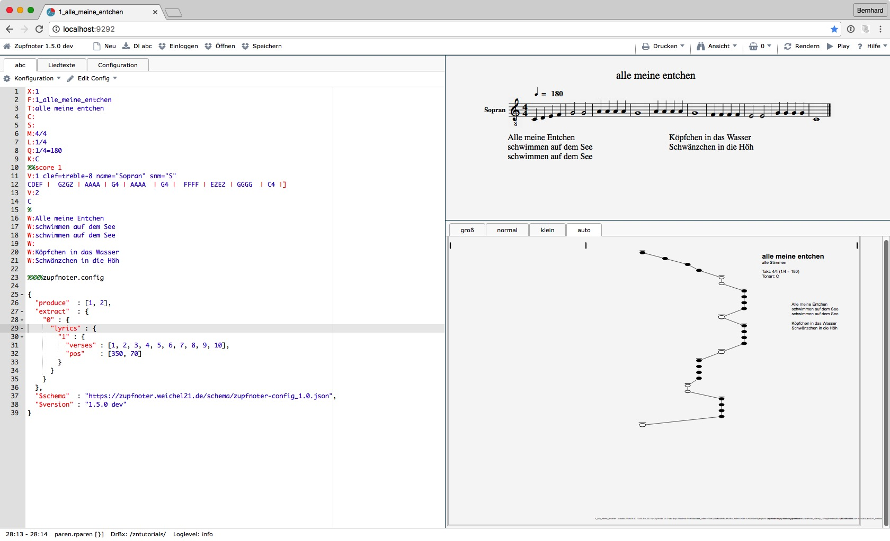

# Erste Schritte mit Zupfnoter

Mit dem Zupfnoter kannst du ganz schnell einfache Musikstücke eingeben
und als Unterlegnoten darstellen. Mit der Zeit wirst du immer mehr
Funktionen und Möglichkeiten von Zufnoter erobern, um auch komplexe
Musikstücke zu bearbeiten bzw. die Unterlegnoten im Detail nach deinen
Wünschen zu gestalten.

## Zupfnoter starten

Starte nun Zupfnoter in folgenden Schritten:

1.  öffne deinen Web-Browser (vorzugsweise Chrome)

2.  gehe zu "https://www.zupfnoter.de"

3.  drücke auf die Schaltfläche "Zupfnoter Starten"

     

    Hinweis: Wer lieber erst die Einführungsvideos anschaut, kann
    natürlich auch auf die Schaltfläche "Tutorials" klicken :-).

Beim ersten Aufruf des Zupfnoter erscheint ein beispielhaftes
Musikstück. Mit diesem Beispiel kannst du in die Grundlagen des
Zupfnoters einsteigen.

Anhand der schriftlichen Anleitungen unter dem Hilfemenü und mit den
mündlichen Unterweisungen in den Tutorial-Videos (Selbstlerneinheiten)
lassen sich gut die einzelnen Schritte für die Erstellung “Alle meine
Entchen” nachvollziehen.

## Dein erstes Musikstück eingeben {#dein-erstes-musikstueck-eingeben}

Zupfnoter erfasst das Musikstück in der so genannten ABC-Notation. Diese
wurde (unabhängig von Zupfnoter) erfunden, um Musikstücke auf Computern
verarbeiten zu können. Computer können die ABC-Notation interpretieren,
um daraus herkömmliche Musiknoten zu generieren oder auch Musikstücke
auf dem Computer abspielen zu können. Unter dem Hilfemenü des Zupfnoters
findet man eine deutsche Anleitung für die ABC-Notation.

1.  klicke auf Schaltfläche "Neu", es erscheint ein Eingabeformular

2.  gib die Liednummer (X:) und den Titel in das ein (z.B.; X: "1",
    Titel: "Alle meine Entchen") und bestätige mit der Schaltfläche
    "Ok".

    > >  

    Im linken Fenster erscheint die Nummer in Zeile 1 und der Titel in
    Zeile 3. Zeile 2 zeigt den Dateinamen den Zupfnoter aus Nummer und
    Titel gebildet hat.

    > **Hinweis**: Der Wert von `X:` (Liednummer) muss eine positive
    > Ganzzahl sein. Es dürfen keine Buchstaben, Leerzeichen oder
    > Unterstriche enthalten sein.

3.  klicke im linken Fenster in Zeile 12

4.  gib die folgenden Notennamen und Notenwerte ein:

    `CDEF |  G2G2 | AAAA | G4 | AAAA  | G4 |  FFFF | E2E2 | GGGG  | C4 |]`

    Da du zunächst nur eine Stimme eingegeben hast, kannst du in Zeile
    10 die "2" am Ende löschen. Dann wird nur die erste Stimme
    dargestellt.

5.  klicke auf Schaltfläche "Rendern", um die Unterlegnoten zu erzeugen
    und die Meldungen im linken Fenster zu aktualisieren.

    \needspace{15cm}

6.  im Fenster rechts unten siehst du nun eine Vorschau der
    Unterlegnoten:

     

**Herzlichen Glückwunsch!** Du hast dein erstes Musikstück mit Zupfnoter
erstellt.

\needspace{5cm}

**Hinweis:** Um Taktstriche, Wiederholungszeichen und Schlussstriche
darstellen zu können, benötigt man folgende Tastenkombinationen zur
Erstellung des senkrechten Striches (vertical bar) bzw. der eckigen
Klammer:

**Windows**

-   `|` erzeugt man mit der Taste AltGr und der Taste links vom Y
-   `[` erzeugt man mit der Taste `AltGr` und der Taste `8`
-   `]` erzeugt man mit der Taste `AltGr` und der Taste `9`

**Mac**

-   `|` erzeugt man mit der Taste `Alt` und der Taste `7`
-   `[` erzeugt man mit der Taste `Alt` und der Taste `5`
-   `]` erzeugt man mit der Taste Alt und der Taste `6`

## Dein Musikstück prüfen

Du möchtest nun prüfen, ob die Noten auch korrekt sind. Dazu kannst du
es einfach mal anhören:

1.  klicke auf die Schaltfläche "Play"

    Zupfnoter spielt "Alle meine Entchen" von Beginn an.

2.  klicke auf die erste ganze Note imf Fenster rechts oben (das sollte
    ein "G" sein). Diese wird dadurch ausgewählt und in allen Fenstern
    markiert.

    > **Hinweis**: Die Note ist nun auch im linken Fenster selektiert.
    > Auf diese Weise kann einfach in der ABC-Notation navigiert werden.

3.  klicke wieder auf die Schaltfläche "Play"

    Zupfnoter spielt "Alle meine Entchen" ab der ausgewählten Note.

## Die Unterlegnoten gestalten

Als nächstes kannst du die Unterlegnoten gestalten. Zupfnoter bietet
eine sehr große Vielfalt an Gestaltungsmöglichkeiten. Als einfaches
Beispiel kannst zunächst einen Liedtext hinzufügen:

1.  klicke im linken Fenster auf den Reiter `Liedtexte`

2.  füge nun die folgendenden Zeilen ein

        alle meine Entchen
        schwimmen auf dem See
        schwimmen auf dem See
        Köpfchen in das Wasser
        Schwänzchen in die Höh

    Dieser Text erscheint sofort in dem Fenster rechts oben (der
    Notenvorschau), nicht jedoch in den Unterlegnoten. Dort erscheint
    der Liedtext erst, wenn die Einstellungen zur Gestaltung und
    Positionierung von Liedtexten eingefügt worden sind.

    > **Hinweis**: Wenn du zurück gehst auf den den Reiter `ABC` siehst
    > du in Zeile 15, (also in die Zeile nach dem "C,") nun die
    > folgenden zeilen (dies ist die Darstellung von Liedtexten in der
    > ABC-Notation):

        W: alle meine Entchen
        W: schwimmen auf dem See
        W: schwimmen auf dem See
        W: Köpfchen in das Wasser
        W: Schwänzchen in die Höh

3.  klicke auf die Schaltfläche "Einstellungen". Dadurch öffnet sich das
    Menü zum Einfügen von "Konfiguration" in das Musikstück.

4.  klicke auf den Eintrag "Liedtexte", um die Einstellungen für
    Liedtexte hinzuzufügen. Dadurch wird im linken Fenster folgendes
    eingefügt (zunächst musst du hier nichts tun. Wenn du einst ein
    Profi im Zupfnoter sein wirst, wirst du diese Zeilen schätzen
    lernen):

    \needspace{10cm}

          "extract"  : {
            "0" : {
              "lyrics" : {
                "1" : {
                  "verses" : [1, 2, 3, 4, 5, 6, 7, 8, 9, 10],
                  "pos"    : [350, 70]
                }
              }
            }
          }

    \needspace{15cm}

5.  klicke auf die Schaltfläche "Rendern", um die Unterlegnoten zu
    aktualisieren.

    Nun erscheinen die Liedtexte:

     

6.  Verschiebe mit der Maus die Liedtexte in der Vorschau der
    Unterlegnoten (Fenster rechts unten) an die Position, die dir
    gefällt.

    > **Hinweis:** Der Liedtext ist nun rot, um bei nahe an einander
    > liegenden Texten anzuzeigen, welcher Text verschoben wurde. Durch
    > klicken auf die Schaltfläche "Rendern" wird er wieder schwarz.

## Dein Musikstück drucken {#musikstueck-drucken}

Wenn das Musikstück fertig gestaltet ist, willst du es natürlich auch
drucken:

1.  klicke auf die Schaltfläche "Drucken"

2.  klicke auf "A4" (oder auf "A3", wenn du einen Din-A3 Drucker hast)

    Es erscheint eine Druckvorschau des Unterlegnotenblattes.

3.  klicke auf das Druckersymbol oben rechts.

    Es öffnet sich der Druckdialog deines Browsers.

    > **Hinweis**: bitte konfiguriere die Druckereinstellung so, dass
    > der Ausdruck **nicht vergößert oder verkleinert** wird (100%, 1:1,
    > evtl. 'randlos' ...).

     

    Schneide alle ausgedruckten Blätter an den linken Schnittmarken (die
    kleinen "x" oben und unten am Blatt) mittig im "x" durch und klebe
    die Blätter so zusammen, dass die Schnittmarken wieder genau ein "x"
    ergeben.

Wenn du dein Musikstück als herkömmliche Noten ausdrucken willst:

1.  gehe zurück zum Zupfnoter und klicke erneut auf die Schaltfläche
    "Drucken"

2.  klicke auf Menüeintrag "Noten"

    Es erscheint ein neuer Reiter in deinem Browser mit einer Vorschau
    der herkömmlichen Noten.

3.  Wähle in deinem Browser zum Drucken die Druckfunktion aus.

## Dein Musikstück speichern

### Speichern per Download

Du hast vielleicht schon bemerkt, dass Zupfnoter bei einem Neustart
immer das zuletzt bearbeitete Musikstück wieder geladen hat. Natürlich
solltest du dein Musikstück auf deinem Rechner so abspeichern, dass du
es später auch überarbeiten kannst.

1.  klicke auf die Schaltfläche "Dl abc"
2.  dein Musikstück wird in deinem Download-Ordner abgelegt. Zupfnoter
    bildet den Dateinamen aus der Information in Zeile 2:

    aus "`F: 1_Alle-meine-Entchen`" entsteht
    "`1_Alle-meine-Entchen.abc`"

Bei Bedarf kannst du die Unterlegnoten als PDF herunterladen (z.B. um
diese weiter zu geben):

1.  klicke auf die Schaltfläche "Drucken"

2.  klicke auf "A4" (oder auf "A3", wenn du einen Din-A3 Drucker hast)

    Es erscheint eine Druckvorschau des Unterlegnotenblattes.

3.  klicke auf das Downloadsymbol oben rechts

4.  Wähle den Speicherort

    Zupfnoter bildet auch hier den Dateinamen aus der Information in
    Zeile 2:

    aus "`F: 1_Alle-meine-Entchen`" entsteht
    "`1_Alle-meine-Entchen_alle-Stimmen.pdf`"

### Speichern in der Dropbox

Wenn du regelmäßig mit Zupfnoter arbeiten willst, bietet es sich an, zum
Speichern der Muskstücke die Dropbox zu benutzen. Eine Dropbox ist ein
Speicher außerhalb deines Rechners (in der "Cloud"). Mit der Dropbox
hast du viele Vorteile bei Zupfbnoter:

-   Zupfnoter speichert abc, pdf und Noten eines Musikstücks mit nur
    einem Klick
-   du hast alle deine Musikstücke zentral abgelegt und kannst sie mit
    einem Klick wieder in den Zupfnoter laden

    > **Hinweis**: Beim Laden von Muskstücken in Zupfnoter, wird der
    > Anfang des Dateinamens bis zum ersten "\_" herangezogen. Daher
    > muss pro Dropbox-Ordner diese Nummer eindeutig sein.

-   Dropbox speichert frühere Versionen, so dass du bei Problemen darauf
    zurück greifen kannst und den Verlauf deiner Änderungen
    nachvollziehen kannst.
-   Über die Dropbox kannst du deine Dateien mit anderen teilen, um
    gemeinsam an einem Musikstück zu arbeiten
-   Selbst, wenn du nicht online bist, hast du ein Kopie aller deiner
    Musikstücke (auch der PDFs) auf deiner lokalen Platte

Zur Einrichtung einer Dropbox gehst du auf <https://www.dropbox.com/de>.
Wenn du dich bei Dropbox angemeldet hast, findest du dort ein
deutschsprachiges Benutzerhandbuch.

> **Hinweis**: Dropbox speichet seine Daten nicht in Deutschland.

Wenn du ein Konto bei Dropbox hast, musst du Zupfnoter **einmalig pro
verwendetem Browser** mit diesem Dropbox-Konto verbinden:

-   klicke auf Schaltfläche "Einloggen"
-   es erscheint das Anmeldefenster der Dropbox
-   gib Email-Adresse und Kennwort ein
-   Zupfnoter ist nun verbunden

> **Hinweis** bei Verwendung öffentlicher Computer (z.B. Internet-Cafe)
> Solange du mit deinem Browser bei Dropbox angemeldet bist, hat der
> Browser Zugriff auf alle deine Dateien. Daher musst du dich
> **unbedingt bei Dropbox** abmelden, wenn du an einem öffentlichen
> Computer arbeitest. Besser ist es, gleich im "Inkognito"-Modus des
> Browsers zu arbeiten.
>
> Dropbox-Anwendungen speichern ein geheime Zeichenkette (auch Token
> genannt) auf deinem lokalen Rechner. Wenn du vermutest, das dieses
> Token kompromittiert ist, kannst du auf der Website von Dropbox die
> Verbindung zu Zupfnoter löschen. Dadurch wird bei der nächsten
> Anmeldung ein neues Token erzeugt.

## Musikstück importieren

Falls du schon ein anderes Musikprogramm verwendest (z.B. Musescore
<https://www.musescore.com>) kannst du deine Musikstücke in den
Zupfnoter importieren, wenn dein anderes Musikprogramm MusicXml
(<https://www.musicxml.com/de/>) exportieren kann.

Es gibt auch Webseiten, die frei zugängliche Musikstücke als MusicXML
oder ABC Dateien zum Download anbieten.

Um ABC oder MusicXML zu importieren, kannst du einfach die Datei aus
deinem Rechner (Explorer oder Finder) in den Zupfnoter ziehen.\
Zupfnoter übersetzt das xml-Format in Abc Notation.

Bei der Auswahl eines Musikstückes im xml-Format sollte man 30 Takte
nicht überschreiten. Am besten eignen sich Klaviernoten für den Import.
Ausserdem sollte man auf die Bandbreite der Noten achten, die
Tisch-Harfen mit 25 Saiten haben einn Tonumfang von zwei Oktaven (G bis
g).

In der Regel ist etwas Nacharbeit erforderlich, um das importierte
Muskskstück für die Tischharfe anzupassen.

> **Hinweis**: bitte achte darauf, dass du die Zeile "F:" ggf. von Hand
> hinzufügst, damit Zupfnoter den Dateinamen kennt unter welchem er das
> Musikstück speichern soll.

Die ABC-Notation kann man anhand der Anleitung im Hilfemenü manuell
eingeben oder man sucht das gewünschte Stück im Internet auf einer
Musikseite raus und lädt sich das Musikstück im xml-Format herunter.
Danach wird die xml-Datei per Maus in den Zupfnoter in den linken
Abschnitt gezogen.
