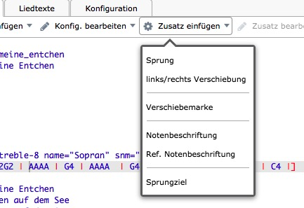

\cleardoublepage

# Zupfnoter - Übersicht für Einsteiger und Experten

Zum Verständnis von Zupfnoter sind folgende Themen wichtig:

-   [Zupfnoter-Prinzipien](#zupfnoter-prinzipien) (Kapitel
    \ref{zupfnoter-prinzipien})
-   [Elemente der von Zupfnoter erstellten
    Unterlegnoten](#elemente-der-von-zupfnoter-erstellten-unterlegnoten)
    (Kapitel \ref{elemente-der-von-zupfnoter-erstellten-unterlegnoten})
-   [Bildschimaufbau](#genereller-bildschirmaufbau) (Kapitel
    \ref{genereller-bildschirmaufbau})
-   [Erstellung von Auszügen](#auszuege) (Kapitel \ref{auszuege})

## Zupfnoter Prinzipien

Zupfnoter arbeitet nach dem Prinzip der Umwandlung von ABC-Notation in
Unterlegnoten. Im Gegensatz zu so genanten "what you see is what you
get" - Systemen werden also die Unterlegnoten nicht direkt bearbeiter,
sondern entstehen automatisch durch Umwandlung aus einem Modell des
Musikstückes.

Dieses Modell ist allgemeiner und präziser als die Unterlegnoten und
basiert auf der ABC-Notation als ein de-facto Standard. Wie du siehst
kann aus diesem Modell (der ABC-Notation) ja auch ein herkömmliches
Notenblatt erstellt werden. In diesem Sinne sind die Unterlegnoten
lediglich eine von mehreren grafischen Darstellungen des Musikstückes.

Andererseits gibt es im Gengensatz zur den herkömmlichen Noten in den
Unterlegnoten spezifische Sachverhalte, deren Darstellung in der
ABC-Notation nicht standardisiert sind. Daher verwendet Zupfnoter
zusätzlich zwei spezifische Darstellungen (Konventionen) innerhalb der
ABC-Notation:

-   **Zusätze** zu Noten und Taktstrichen: Hier werden die "Annotations"
    der ABC-Notation mit spezifischen Formaten verwendet. Diese Zusätze
    stehen vor der Note bzw. dem Taktstrich auf den sie sich
    beziehen.\index{Zusatz!Prinzipien}

    Für die Erstellung und Bearbeitung dieser "Zusätze" gibt es eine
    grafische Benutzerführung durch Bildschirmmasken (Siehe
    Kapitel \ref{masken-fuer-zusaetze} [Zusätze](#masken-fuer-zusaetze)).

-   **Konfiguration** der Unterlegnoten: Zupfnoter gewinnt seine
    Leistungsfähigkit und \index{Konfiguration} Flexibilität durch
    vielfältige Einstellmöglichkeiten - genannt Konfigurationsparameter.
    Diese Konfigurationsparameter wirken auf die Erstellung der
    Unterlegnotenblätter und steuern z.B:

    -   Stimmen, die ausgegeben werden; Stimmen durch
        Synchronisiationslinien verbunden werden usw.
    -   Größe von Notenelementen, Liniendicken
    -   Beschriftungen

    Die Konfigurationsparameter sind thematisch hierarchisiert (z.B.
    `extract.0.layout` `extract.0.printer`). Eine Referenz und
    Erläuterung zu den Konfigurationsparametern findst du in
    \ref{konfiguration} [Konfiguration](#konfiguration).

    Für die Bearbeitung der Konfigurationsmparameter gibt es
    Bildschirmmasken (siehe
    Kapitel \ref{konfigurationsmasken} [Konfigurationsmasken](#konfigurationsmasken))

    Zupfnoter speichert die Konfigurationsparameter im so genannten
    JSON-Format in einem Abschnitt nach der ABC-Notation, der durch

    `%%%%zupfnoter.config`

    abgesetzt ist.

<!-- das erstellte blatt in Vorschau drehen und als PDF wieder exportieren -->

## Elemente der von Zupfnoter erstellten Unterlegnoten

Das Bild auf der vorigen Seite zeigt die Elemente und Merkmale aus denen
Zupfnoter ein Unterlegnotenblatt aufbaut. In den nachfolgenden
Unterkapiteln werden die einzelnen Elemente und Merkmale dieser
Darstellung erläutert. Als Referenz dient die Nummer in dieser
Abbildung.

Bei manchen Elementen ist auch eine Konfiguration notwendig. Die
nachfolgende Beschreibung enthält auch einen verweise auf den (internen)
Namen des entsprechenden Kongigurationsparameters.

> **Hinweis**: In dieser Darstellung sind die englischen Begriffe
> aufgelistet. Für diese Auflistung wurde die Funktion "Liedtexte"
> verwendet.

### Darstellung der Noten

In der ABC-Notation wird in den Kopfzeilen ein Standardnotenwert
angegeben, z.B. `L:1/4`. Dies bedeutet, daß standardmäßig in
Viertelnoten erfasst wird. Ausgehend von diesem Wert ergibt sich der
Notenwert duch Multiplikation mit der angegebenen Länge. Diese
Längenangaben wird an den Notennamen angehängt.

TODO: verweise auf ABC-Kapitel

\needspace{5cm}

Im Folgenden wird von **Vierteln als Standardnotenwert** und dem
Notennamen **`C`** ausgegangen.

-   **(1) full note - ganze Note** entspricht in ABC-Notation: `C4`

-   **(2) half note - halbe Note** entspricht in ABC-Notation: `C2`

-   **(3) quarter note - viertel Note** entspricht in ABC-Notation: `C`
    oder `C1`

-   **(4) eighth note - achtel Note** entspricht in ABC-Notation: `C1/2`
    oder `C/`

-   **(5) sixteenth note - sechzehntel Note** entspricht in
    ABC-Notation: `C1/4` oder `C//`

-   **(6) punctuated half note - punktierte halbe Note** entspricht in
    ABC-Notation: `C3`

-   **(7) punctuated quarter note - punktierte viertel Note** entspricht
    in ABC-Notation: `C3/2` (also drei halbe Viertel :-)

\needspace{5cm}

### Darstellung von Pausen

Im Folgenden wird von **Vierteln als Standardnotenwert** ausgegangen.

-   **(11) full rest - ganze Pause** entspricht in ABC-Notation: `z4`

-   **(12) half rest - halbe Pause** entspricht in ABC-Notation: `z2`

-   **(13) quarter rest- viertel Pause** entspricht in ABC-Notation: `z`
    oder `z1`

-   **(14) eighth rest - achtel Pause** entspricht in ABC-Notation:
    `z1/2` oder `z/`

-   **(15) sixteenth rest - sechzehntel Pause** entspricht in
    ABC-Notation: `z1/4` oder `z//`

-   **(16) punctuated half rest - punktierte halbe Pause** entspricht in
    ABC-Notation: `z3`

-   **(17) punctuated quarter rest - punktierte viertel Pause**
    entspricht in ABC-Notation: `z3/2` (also drei halbe Viertel :-)

### Darstellung notenbezogener Elemente

Um auf den Unterlegnoten einzelnen Noten graphische Elemente oder Texte
hinzuzufügen gibt es bei Zupfnoter Elemente, die fest mit Noten
verbunden sind. Da sie im Kontext von Noten positioniert werden, nennt
man sie "notenbezogene Elemente":

-   **(20) measure bar - Taktstrich**: Der Taktstrich entsteht aus der
    Takteingabe in der ABC-Notation (z.B. `|` `|]`). Zur Eingabe dieser
    Sonderzeichen siehe Kapitel
    \ref{dein-erstes-musikstueck-eingeben} [Tastenkombinationen für
    Sonderzeichen](#dein-erstes-musikstueck-eingeben)

-   **(21) unison - Mehrklang**:\
    Ein Mehrklang entsteht, wenn in der ABC-Notation mehrere Noten in
    einer eckigen Klammer eingegeben werden (z.B. `[FA]`). Damit kann
    man innerhalb **einer** Stimme mehrere Noten spielen.

    Die Noten eines Mehrklanges werden automatisch mit einer
    Synchronisationslinie verbunden.

    > **Hinweis**: Dieser Mehrklang sieht in den Unterlegnoten nahezu
    > gleich wie der Zusammenklang von Tönen aus mehreren Stimmen aus.
    > Man kann sie jedoch anhand der Flußlinie unterscheiden und den
    > jeweiligen Stimmen zuordnen.
    >
    > Die Angabe von Akkordsymbolen in der ABC-Notation wird für die
    > Unterlegnoten ignoriert.

-   **(22) triplet - Triole**: Bei einer Triole werden drei Noten auf
    zwei Schläge verteilt. Bei einer Triole werden Anfang und Ende einer
    Reihe von Noten mit einem Bogen verbunden. Die Länge der Triole wird
    an den Bogen geschrieben. Eine Verallgemeinerung der Triole ist das
    Tuplet. Dieses verteilt n Noten auf m Schläge. Zupfnoter kann
    beliebige Tuplets, auch wenn bei Tischharfen meistens nur Triolen
    verwendet werden.

    Ein Tuplet entsteht, wenn in der ABC-Notation den Noten der Tuplets
    eine Klammer mit der Länge des Tupletes vorangestellt wird, z.B:
    "`(3CCC`".

-   **(23) tie - Haltebogen**: Ein Haltebogen verbindet zwei Noten
    gleicher Höhe miteinander. Dabei wird nur die erste Noten
    angeschlagen. Ein Haltebogen entsteht, wenn in der ABC-Notation die
    Noten durch einen Bindestrich verbunden sind, z.B. "`A -|A`".

    > **Hinweis**: Der Haltebogen ist zu unterscheiden vom Bindebogen,
    > welcher in der Notenansicht gleich aussieht, in den Unterlegnoten
    > jedoch nicht ausgegeben wird, da man ihn auf der Tischharfe nicht
    > spielen kann. Der Bindebogen wird in der ABC-Notation durch
    > Einklammern der Noten erstellt, z.B. "`(A|A)`".

-   **(24) repeat signs - Wiederholungszeichen**: Eine Wiederholung
    entsteht durch Beifügen eines Doppelpunktes an die Taktstriche in
    der ABC-Notation, z.B. "`|: C4 :|`".

    > **Hinweis** Wiederholungszeichen sind eine Alternative zu
    > Sprunglinien. Ihre Ausgabe hängt von der aktuellen Konfiguration
    > ab (siehe
    > Kapitel \ref{extract.0.repeatsigns} [`repeatsigns`](#extract.0.repeatsigns)).

-   (25), (26) siehe nächster Abschnitt

-   **(27) part note - Bezeichnung von Abschnitten im Musikstück**: Man
    kann ein Musikstück in Abschnitte aufteilen. Die Abschnitte können
    bezeichnet werden, z.B. als "Teil 1". Der Abschnitt unterbricht auch
    die Flusslinien. Dieses Element wird häufig genutzt, um Abfolgen von
    Abschnitten beim Spielen festzulegen.

    Ein Abschnitt entsteht, wenn in der ABC-Notation der ersten Note des
    neuen Abschnittes z.B. die Zeichenfolge "`[P:Teil 1]`" vorangestellt
    wird. Hier ist "Teil 1" die Bezeichnung des Abschnitts.

-   **(28) countnotes - Zählhilfen**: Zupfnoter kann die Noten
    automatisch mit Zählhilfen beschriften. Die Zählweise ergibt sich
    aus der Taktangabe. Beispiel siehe Abbildung [Zupfnoter Elemente].
    Diese Ausgabe (für welche Stimmen, Position) ist
    konfigurationsabhängig (`extract.0.countnotes`).

    > **Hinweis** die Zählhilfen sind so gesataltet, dass man während
    > des Spields die Zeitachse durchzählt. Bei Noten mit mehreren
    > Schlägen beginnt die Zählhilfe immer mit der Nummer des ersten
    > Schlages (z.B. 2-3 ist eine Note, die bei Schlag 2 beginnt und
    > zwei Schläge lang gespielt wird, d.h. während diese Note klingt,
    > zählt man 2 - 3)

-   **(29) barnumbers - Taktnummer**: Zupfnoter kann die Takte
    automatisch durchnummerieren. Damit kann bei gemeinsamem Spiel auch
    mitten im Musikstück wieder eingesetz werden. Diese Ausgabe ist
    konfigurationsabhängig (`extract.0.barnumbers`.

-   **(30) decoration - Dekoration**: Zupfnoter kann einzelne
    Dekorationen (Stand Version 1.5 nur die Fermate) darstellen. Für
    diese Dekorationen werden die Eingaben der ABC-Notation verwendet
    (z.B. für die Fermate : "`!fermata!`" oder "`H`").

### Darstellung von Verbindungslinien

Um auf den Unterlegenoten die Zusammenhänge zwischen Noten darzustellen,
gibt es folgende Elemente:

-   **(25) jumpline for repeat - Sprungline für Wiederholungen**: Eine
    Wiederholung entsteht durch Beifügen eines Doppelpunktes an die
    Taktstriche in der ABC-Notation z.B. "`|: C4 :|`".

    > **Hinweis** Wiederholungszeichen sind eine Alternative zu
    > Sprunglinien. Ihre Ausgabe hängt von der aktuellen Konfiguration
    > ab (siehe
    > Kapitel \ref{extract.0.repeatsigns} [`extract.0.repeatsigns`](#extract.0.repeatsigns)).

-   **(26) synchline for unison - Synchronisationslinie für Mehrklang**:
    siehe (21) in Kapitel
    \ref{darstellung-notenbezogener-elemente} [Darstellung
    notenbezogener Elemente](#darstellung-notenbezogener-elemente)

-   **(31) flowline - Flusslinie**: Die
    Flußlinie[^040_UD-Zupfnoter-Referenz.md_1] verbindet die Noten
    **einer** Stimme und markiert so die Führung innerhalb dieser
    **einen** Stimme. Standardmäßig stellt Zupfnoter die Flußline in der
    ersten und dritten Stimme dar.

    Die Ausgabe von Flusslinien für die einzelnen Stimmen hängt von der
    aktuellen Konfiguration (siehe Kapitel
    \ref{extract.0.flowlines} [extract.0.flowlines](#extract.0.flowlines))
    ab.

-   **(32) synchline - Synchronisationslinie**: Die
    Synchronisationslinien verbinden Noten aus zwei **verschiedenen
    Stimmen**, die zum gleichen Zeitöpunt gespielt werden. Standardmäßig
    stellt Zupfnoter die Synchronisationslinie zwischen den Stimmen
    *eins und zwei* sowie *drei und vier* dar.

    Die Ausgabe von Synchronisationslinien für die einzelnen Stimmen
    hängt von der aktuellen Konfiguration (siehe Kapitel
    \ref{extract.0.synchlines} [extract.0.synchlines](#extract.0.synchlines))
    ab.

-   **(33) subflowline - Unterflusslinie**: Die Unterflusslinie
    verbindet innerhalb einer Stimme ohne Flußlinie diejenigen Noten,
    die nicht über eine Synchronisationslinie (32) mit einer anderen
    Stimme verbunden sind.

    Die Ausgabe von Unterlusslinien für die einzelnen Stimmen hängt von
    der aktuellen Konfiguration (siehe Kapitel
    \ref{extract.0.subflowlines} [extract.0.subflowlines](#extract.0.subflowlines))
    ab.

-   (34), (35), (36) siehe
    Kapitel \ref{elemente-fuer-das-ganze-blatt} [Elemente für das
    gesamte Musikstück](#elemente-fuer-das-ganze-blatt)
-   **(50) variant ending - variante Enden - Volten**: Wo mehrfach
    gespielte Abschnitte unterschiedlich enden, bezeichnet man das als
    variante Enden. In der ABC-Notation schreibt man hierfür Ziffern
    (z.B. 1 und 2) unmittelbar hinter den Taktstrich bei dem die
    Variation beginnt.

    Zupfnoter stellt diese varianten Enden als eine Menge von
    Sprunglinien dar:

    -   **(51) Eingangslinie** (im Beispiel links): Es gibt pro
        Variation eine Linie, welche zum Anfang der Variation führt
    -   **(52) Ausgangslinie** (im Beispiel rechts): Es gibt pro
        Variation eine Ausgangslinie, welche zur nächsten Note nach der
        letzten Variation führt.

        > **Hinweis**: Wenn die Varianten am Ende einer Wiederholung
        > stehen, entfällt die Ausgangslinie. Stattdessen wird eine
        > normale **(25) Sprunglinie für Wiederholung** verwendet. Die
        > Positionsangabe der Ausganslinie wird in diesem Fall ignoriert
        > und die Positionsangabe der Sprunglinie am Ender der
        > Wiederholung verwendet.

    -   **(53) Folgelinie** ist die Ausgangslinie der letzten Variation.
        Diese kann separat positioniert werden, um das gwünschte
        Notenbild zu erreichen.

    Die Positionen deieser Linien werden als Zusatz vor den Taktstrich
    der ersten Variation geschrieben (Schaltfläche "Zusatz einfügen"
    bzw. "Zusatz bearbeiten")

### Elemente für das gesamte Musikstück bzw. Unterlegnotenblatt {#elemente-fuer-das-ganze-blatt}

Um auf den Unterlegnoten Texte und Beschriftungen allgemeiner Art
darstellen zu können, gibt es folgende Elemente:

-   **(34) legend - Legende**: Die Legende enthält die grundsätzlichen
    Informationen über das Musikstück. Die Inhalte der Legende werden
    aus den Kopfzeilen der ABC-Notation übernommen:

    -   Titel des Musikstücks (ABC-Notation Zeile "`T:`")
    -   Titel des Auszugs siehe (35)
    -   Autoren des Musikstücks bzw. Liedes (ABC-Notation Zeile "`C:`")
    -   Takt des Musikstücks (ABC-Notation Zeile "`M:`")
    -   Empfohlene Geschwindigkeit (ABC-Notation Zeile "`Q:`")
    -   Tonart des Musikstücks (ABC-Notation Zeile "`K:`")
    -   Tonart der Druckausgaben falls das Musikstück transponiert wurde
        (ABC-Notation z.B. "`I:transpose=1`")

    Die Legende kann mit der Maus im rechten unteren Fenster auf den
    Unterlegnoten optimal positioniert werden.

-   **(35) extract title in legend - Titel des Auszugs**: Dies
    bezeichnet den Titel des Auszuges (siehe Konfiguration
    [extract.x.title](#extract.0.title) bzw.
    Kapitel \ref{auszuege} [Auszüge](#auszuege)).

-   **(36) lyrics - Liedtexte**: Zupfnoter stellt auch Liedtexte dar.
    Diese Liedtexte (siehe auch Kapitel \ref{musikstueck-gestalten})
    werden aus aufeinander folgenden Kopfzeilen der ABC-Notation
    entnommen (`W:`) und zu Strophen zusammengefügt. Einzelne Strophen
    trennt man mit einer "Leerzeile" ("`W:`")

        W: Strophe 1 Zeile 1
        W: Strophe 1 Zeile 2
        W:
        W: Strophe 2 Zeile 1
        W: Strophe 2 Zeile 2

    > **Hinweis**: Die Ausgabe der Strophen muß über die Konfiguration
    > eingestellt werden (siehe Kapitel
    > \ref{extract.0.lyrics} [extract.x.lyrics](#extract.0.lyrics)).

    > **Hinweis**: In der ABC-Notation kann man Liedtexte mit sowhohl
    > mit Kopfzeile `W:`(Großbuchstaben) als auch mit Kopfzeile `w:`
    > (Kleionbuchstaben) eingeben. Die Variante mot Kleinbuchstaben wird
    > verwendet, um die Lietexte direkt in die Notensyteme zu schreiben.
    > Zupfnoter ignoriert diese Liedtexte in den Notenlinien

    > **Hinweis**: Auch wenn die ABC-Notation es erlaubt, die Kopfzeilen
    > `W:` im ganezn ABC-Text zu verteilen ist es wichtig, die Liedtexte
    > dennoch in einem Block zusammenzufassen. Sonst meldet Zupfnoter,
    > dass es mehrere Liedtexte gibt. Der Editor fasst sie alle
    > zusammen, löscht aber die anderen Blöcke nicht. Das muss manuell
    > korrigiert werden.

    > **Hinweis**: Zupfnoter ignoriert Leerzeichen am Anfang von
    > Liedtexten. Macnhmal möchte man aber den Liedtext in bestimmten
    > Zeilen etwas einrücken um den Text um eine Note im
    > Unterlegnotenblatt herumfließen zu lassen. Wenn aleo eine
    > Textzeile mit einer Reihe Tilde (`~`) - Zeichen beginnt werden
    > diese in den Unterlegnoten als Leerraum ausgegeben und so der
    > Textbeginn nach rechts verschoben.

                W: Strophe 1 Zeile 1
                W: ~Strophe 1 Zeile 2
                W: ~~Strophe 1 Zeile 2
                W: ~~~Strophe 1 Zeile 2

### Elemente zur Handhabung des Unterlegnotenblattes

Zupfnoter druckt Elemente auf das Unterlegnotenblatt, um das Zuschneiden
und das Einelgen in das Instrument zu vereinfachen:

-   **(37) stringnames - Saitennamen**: Zupfnoter kann die Namen der
    Saiten auf den Unterlegnoten ausgeben.

    > **Hinweis**: Über die [Einstellungen in der Konfiguration] kann
    > die Ausgabe von Saitennamen eingestellt werden (siehe Kapitel
    > \ref{extract.0.stringnames}
    > [extract.0.stringnames](#extract.0.stringnames)).

-   **(38) marks - Saitenmarke** Die Saitenmarken sind eine Hilfe zum
    korrekten Einlegen der Unterlegnoten in die Tischharfe. Das Blatt
    muss so in die Tischharfe eingelegt werden, dass die Marken unter
    den G-Saiten liegen.

    > **Hinweis:** Über die [Einstellungen in der Konfiguration] kann
    > die Ausgabe der Saitenmarken beeinflusst werden (siehe Kapitel
    > \ref{extract.0.stringnames.marks}
    > [extract.0.stringnames.marks](#extract.0.stringnames.marks)).

-   **(39) cutmarks - Schneidemarken**: Die Schneidemarken sind eine
    Zuschneidehilfe für den Fall, dass die Unterlegnoten auf DIN-A4
    Seiten ausgegeben werden (Siehe Kapitel \ref{musikstueck-drucken}
    [Musikstück drucken](#musikstueck-drucken)).

### Elemente zur Organisation von Unterlegnoten

-   **(70) input filename - Name der Eingabedatei**: Der Name der
    Eingabedatei hilft, den Ursprung eines ausgedruckten Blattes
    nachzuvollziehen. Er wird immer auf den Unterlegnoten ausgegeben und
    kann nicht unterdrückt werden.

-   **(71) creation note - Erstellungsnotiz**: Die Erstellungsnotiz gibt
    weitere Informationen zum technischen Stand der Erstellung. Diese
    wird immer auf den Unterlegnoten ausgegeben und kann nicht
    unterdrückt werden. Die Erstellungsnotiz hilft beim Nachvollziehen
    von Veränderungen und besteht aus

    -   Zeitpunkt der Erstellung der PDF-Datei (CEST steht für
        "*C*entral *E*uropean *S*ummer *T*ime")
    -   Software-Version von Zupfnoter
    -   Server von welchem der Zupfnoter geladen wurde
-   **(72) reference to zupfnoter website - Referenz auf Zupfnoter
    Website**: Dies ist die Referenz auf Zupf-\
    noter als Werkzeug zur Erstellung des Unterlegnotenblattes, also
    Werbung in eigener Sache. Diese wird immer auf den Unterlegnoten
    ausgegeben und kann nicht unterdrückt werden.

-   **(73) fingerprint - Fingerabdruck**: Diese Nummer ist wie ein
    Fingerabdruck der ABC-Datei. Dies bedeutet, dass Unterlegnoten (z.b.
    verschiedene Auszüge) mit dem selben Fingerabdruck auch aus einer
    identischen Quelle stammen und somit zuverlässig zusammen passen.

    > **Hinweis:** Der Fingerabdruck wird aus dem ABC-Text errechnet und
    > ist daher nicht im ABC-Text enthalten.

### Vordefinierte Blattbeschriftungen

Zupfnoter bietet eine Reihe von Vorlagen für die Seitenbeschrifungen.
Damit lässt sich ein einheitliches Vorgehen bei der Beschrifung der
Unterlegnoten erreichen. Diese können in der Konfigurationsmaske
"Seitenbeschriftung" eingegeben werden. Zupfnoter hat geeignete
Vorgabewerte für die Position und Schriftart dieser Beschriftungen.

-   **(74) T04 to order - zu beziehen bei**: Hier kann man angeben, über
    welche Adresse das Unterlegnotenblatt bezogen werden kann
    (Konfiguration siehe Kapitel
    \ref{presets.notes.T04ux5ftoux5forder}[presets.notes.T04_to_order](#presets.notes.T04_to_order).
    Das ist natürlich nur sinnvoll, wenn es für die erstellen
    Unterlegnoten einen Vertriebsweg gibt.

-   **(75) T02 Copryright music - Urheberrechte für das Stück**: Hier
    kann mam die Urheberrechte für das Musikstück angeben (Konfiguration
    siehe Kapitel
    \ref{presets.notes.T02ux5fcopyrightux5fmusic}[presets.notes.T02_copyright_music](#presets.notes.T02_copyright_music).
    Es wird empfohlen, diese Rechte immer anzugeben und den Satz
    "Privatkopie" hinzuzufügen, wenn mit dem Rechteinhaber keine
    Vereinbarung geschlossen wurde.

    > **Hinweis:** In diesem Fall darf das Unterlegnotenblatt natürliche
    > auch nicht verteilt oder vertrieben werden, sondern wird nur zum
    > persönlichen Gebrauch erstellt (sog. Privatkopie)

-   **(76) T03 Coppyright harpnotes - Rechte am Notenbild**: Unabhängig
    von den Urheberrechten am Stück entsteht auch ein Urheberrecht an
    den erstellen Unterlegnoten. Hier kannst du diese Rechte
    beanspruchen (Konfiguration siehe Kapitel
    \ref{presets.notes.T03ux5fcopyrightux5fharpnotes}[extract.0.synchlines](#presets.notes.T03_copyright_harpnotes).

-   **(77) T99 do not copy - Bitte nicht kopieren**: Diese Beschriftung
    soll den Blick dafür schärfen, das die erstellen Unterlegnoten nicht
    einfach wild kopiert werden dürfen, sondern die Urheberrechte zu
    bachten sind (Konfiguration siehe Kapitel
    \ref{presets.notes.T99ux5fdoux5fnotux5fcopy}[presets.notes.T99_do_not_copy](#presets.notes.T99_do_not_copy).

-   **(78) T01 Number - Nummer**: Hier kannst du eine Nummer angeben,
    welche das Unterlegnotenblatt eindeutig und schnell identifizierbar
    macht(Konfiguration siehe Kapitel
    \ref{presets.notes.T01ux5fnumber}[presets.notes.T01_number](#presets.notes.T01_number).
    Im Grunde ist das wie eine Bestellnummer. Es wird empfohlen, die
    Nummer nach folgendem Schema zu gestalten:

    `XXX-999` darin ist

    -   `XXX` ist ein Kürzel für den Herausgeber, z.B. RBW für Ruth und
        Bernhard Weichel, ZNR - für Zupfnoter
        [^040_UD-Zupfnoter-Referenz.md_2]

    -   `999` eine Nummer für das Blatt

    Z.B. ist dann `RBW-320` das Blatt 320 aus der Werkstatt von Ruth und
    Bernhard Weichel.

-   **(79) T01 Number extract - Kürzel für den Auszug**: Hier kannst du
    ein Kürzel für den Auszug angebeen (Konfiguration siehe Kapitel
    \ref{presets.notes.T01ux5fnumberux5fextract}[presets.notes.T01_number_extract](#presets.notes.T01_number_extract))

### Zusammenfassung der Beschriftungen in Zupfnoter

Zupfnoter hat vielfältige Möglichkeiten, das Beschriftungen einzufügen.
Auf den Unterlegnoten sind diese nicht leider nicht immer zu
unterscheiden. Daher wird hier noch einmal eine Zusammenfassung gegeben:

-   **Standardbeschriftungen** (siehe Kapitel
    \ref{elemente-fuer-das-ganze-blatt} [Elemente für das gesamte
    Musikstück](#elemente-fuer-das-ganze-blatt))

    Die Standardbeschriftung wird aus der Kopfzeilen der ABC-Notation
    entnommen, sie erscheint auch auf den herkömmlichen Noten.

-   **Notenbeschriftung**

    Die Notenbeschriftung ist mit einer einzelnen Note verbunden und
    verschiebt sich ggf. wenn die Tonhöhe oder der Zeitbezug dieser Note
    verändert wird. Die Notenbeschriftung wird über einen
    "Zusatz"\index{Zusatz} direkt in die ABC-Notation eingefügt (siehe
    Kapitel \ref{darstellung-notenbezogener-elemente} [Darstellung
    notenbezogener Elemente](#darstellung-notenbezogener-elemente)).

    Für wiederkehrende Texte bzw. längere und mehrzeilige Texte in der
    Konfiguration eine Notenbeschriftungsvorlage (Kapitel
    \ref{annotations} [annotations](#annotations)
    \index{Notenbeschriftungsvorlage} mit Positionsangabe anlegen und
    über einen Zusatz (Schaltfläche "Ref. Notenbeschriftung") daraus
    eine Notenbeschrifung erstellen.

    > **Hinweis**: Zupfnoter kennt standardmäßig die
    > Noptenbeschriftungsvorlagen `vl` `vt`, `vr`. Damoit kann man
    > einfach ein "Abdämpfungszeichen" anbringen.
    > [^040_UD-Zupfnoter-Referenz.md_3].

    Im Zusatz kann eine Position mit angegeben angegeben werden. Damit
    bleibt die Position der Notenbeschriftung erhalten, auch wenn der
    Zeitbezug der Note geändert wird.

    > **Hinweis** Wenn man die Notenbeschriftung mit der Maus
    > verschiebt, wirkt nur noch diese Verschiebung ud die Angabe im
    > Zusatz wird ignoriert. Diese Verschiebung wird in der
    > Konfiguration gespeichert und ist an die die Startzeit der Note
    > gebunden, solange keine Verschiebemarke \index{Verschiebemarke} in
    > der ABC-Notation eingefügt ist
    > ([extract.x.notebound.annotation.v\_{voice}.{time}]).

-   **Seitenbeschriftung**

    Die Seitenbeschriftungen werden ausschliesslich über die
    Konfiguration hinzugefügt (Kapitel \ref{extract.0.notes}
    [extract.x.notes](#extract.0.notes). Ihre Anordnung bezieht sich auf
    den Seitenrand. Der Schriftstil kann gewählt werden (siehe auch
    Kapitel \ref{elemente-fuer-das-ganze-blatt} [Elemente für das
    gesamte Musikstück](#elemente-fuer-das-ganze-blatt)).

-   **Liedtexte**

    Liedtexte werden in den `W:` - Zeilen in der ABC-Notation erfasst
    und über die Konfiguration (Kapitel \ref{templates.lyrics}
    [extract.x.lyrics.x](#templates.lyrics)) auf dem Blatt positioniert.

    Für weitere Einzelheiten siehe auch Kapitel
    \ref{elemente-fuer-das-ganze-blatt} [Elemente für das ganze
    Blatt](#elemente-fuer-das-ganze-blatt).

## Zupfnoter Bildschirmaufbau {#genereller-bildschirmaufbau}

Die Benutzungsoberfläche von Zupfnoter ist aus folgenden Elementen
aufgebaut:

-   Fenster (Eingabe, Notenvorschau, Unterlegnotenvorschau) (Kapitel
    \ref{fensteraufbau} [Fensteraufbau](#fensteraufbau)) mit mit
    Reitern, Werkzueugleisten und Kontextmenüs
-   Werkzeugleiste (Kapitel \ref{menues-im-hauptfenster} [Menüs im
    Hauptfenster](#menues-im-hauptfenster))
-   Statusleiste (Kapitel \ref{statusleiste}
    [Statusleiste](#statusleiste)

 

### Fensteraufbau

Zupfnoter kennt drei Fenster[^040_UD-Zupfnoter-Referenz.md_4]:

-   Das **linken Fenster** zeigt die Eingabemöglichkeiten über drei
    Reiter (Kapitel \ref{eingabefenster-details}
    [Eingabe](#eingabefenster-details)):

    -   `ABC`- Der Texteditor für die ABC-Notation
    -   `Liedtextexte` für die Erfassung der Liedtexte
    -   `Konfiguration` für die formulargeführte Bearbeitung der
        Zupfnoter-Konfiguration.
-   Im **rechten oberen Fenster** (Kapitel \ref{notenvorschau}
    [Eingabe](#notenvorschau)) wird in der herkömmlichen Notenschrift
    das Musikstück gezeigt, und kann somit musikallisch überprüft
    wreden.

    Die Darstellung in herkömmlicher Notenschrift kann mehrstimmig
    erfolgen (gesteuert über die `%%score` - Anweisung in der
    ABC-Notation). Wenn das Musikstück Texte enthält (also ein Lied
    ist), werden diese Texte auch in der Notenvorschau angezeigt.

-   Im **rechten unteren Fenster** werden die Unterlegnoten angezeigt.
    Diese entsprechen inhaltlich der herkömmlichen Notenschrift im
    rechten oberen Fenster (Kapitel \ref{unterlegnotenvorschau}
    [Eingabe](#unterlegnotenvorschau)).

    Über die Reiter können verschiedene Zoom-Stufen eingestellt werden.

    > **Hinweis**: Da die Berechnung der Unterlegnoten einige Sekunden
    > dauert, wird dieses Fenster nur durch `Rendern` aktualisiert.

Die Anordnung dieser Fenster ist in Zupfnoter fest vorgegeben. Man kann
aber während der Arbeit folgende Einstellungen vornehmen, um den
aktuellen Arbeitsschrit besser zu unterstützen:

-   Fenstergröße verstellen: Die Trennlinien zwischen den Fenstern
    können mit der MAus verschoben werden, um Platz für die aktuell
    wichtigen Elemente zu schaffen
-   Über das Menü "Ansicht" kann man einzelne Fenster ausblenden so dass
    die anderen Fenster größer werden (Siehe Kapitel
    \ref{menues-im-hauptfenster} [Werkzeugleiste für Schaltflächen und
    Menüs](#menues-im-hauptfenster)

Innerhalb dieser Fenster gibt es weitere **Bedienelemente**:

-   **Reiter** zum Auswählen verschiedener Ansichten
-   **Werkzeugleiste** Leiste für Schaltflächen und Menüs
-   **Kontextmenü**: zur speziellen Bearbeitung von Elementen
    (erreichbar mit rechte Maustaste)

Über die drei festen Fenster hinaus gibt es **Dialoge**. Das sind
Fenster die aufscheinen, um bestimmte Informationen einzugeben bzw. zu
ändern (z.B. Dialog im Kapitel \ref{dein-erstes-musikstueck-eingeben}
[Dein erstes Musikstück eingeben](#dein-erstes-musikstueck-eingeben)).

> **Hinweis**: Der Begriff "Fenster" wird sowohl für die Fenster des
> Betriebssytems als auch die Fenster innerhalb Zupfnoter verwendet.

### Werkzeugleiste für Schaltflächen und Menüs {#menues-im-hauptfenster}

Die Zupfnoter - Werkzeugleiste ist immer sichtbar (also auch in allen
Ansichten) und ersteckt sich über aller Fenster. In ihr befinden sich
Schaltflächen und Menüs die man während der Erstellung von Unterlegnoten
benötigt. Nach einem Klick auf die Schaltflächen führt der Zupfnoter
bestimmte Aktivitäten aus.

Einige Funktionen sind auch über Tastenkombinationen (Shortcuts)
erreichbar (siehe Kapitel \ref{shortcuts} [Shortcuts](#shortcuts))

> **Hinweis**: Für die Vesrion 1.5 wird die Bedienungsoberfläche von
> Zupfnoter verbessert. Daher sind die Informationen in diesem Kapitel
> vorläufig.

-   Schaltfläche **Zupfnoter**: TODO: – Detailinfo als Popup darstellen

-   Schaltfläche **Neu** (erstellen): Es wird ein leerer Bildschirm ohne
    Inhalte erstellt und man kann ein neues Musikstück erstellen (siehe
    Kapitel \ref{dein-erstes-musikstueck-eingeben}[Dein erstes
    Musikstück eingeben](#dein-erstes-musikstueck-eingeben)).

-   Schaltfläche **Einloggen**: TODO: -
    https://github.com/bwl21/zupfnoter/issues/75

    Über diese Schaltfläche kannst du das Verzeichnis in der Dropbox
    angeben, in die Zupfnoter dein Musikstück speichern soll.

-   Schaltfläche **DL abc** (Download ABC): Hiermit kann man
    Zwischenstände oder fertige Musikstücke als ABC-Datei auf seinen
    Rechner herunterladen. Abgelegte Dateien können mit der Maus wieder
    in den Zupfnoter in den linken Abschnitt gezogen werden und der
    Inhalt steht zur Bearbeitung im Zupfnoter wieder zur Verfügung.

-   Schaltfläche **Öffnen**: Es öffnet sich ein Dateiauswahlfenster
    deiner Dropbox. Dort kannst du eine Datei auswählen und zur
    Bearbeitung im Zupfnoter öffnen.

    TODO: anpassen auf kommenden Dialog

    > **Hinweis**: in der Statuszeile wird der Verbindungszustand zur
    > Dropbox und auch das aktuelle Verzeichnis in der Dropbox
    > angezeigt. "Not connected" bedeutet, das Zupfnoter nicht mit
    > deiner Dropbox verbundn ist.

-   Schaltfläche **Speichern** (sichern): Das fertig gestellte
    Musikstück wird in deiner Dropbox gespeichert. Es wird eine
    ABC-Datei, jeweils eine Datei für A3 und A4 für Unterlegnoten pro
    Auszug gespeichert.

    > **Hinweis:** Solange man noch nichts abgespeichert hat, erscheint
    > das Wort "Speichern" in roter Schrift.

-   Menü **Drucken**: Damit kann man Druckvorschauen anzeigen, welche
    auch über die Browser-Funktionen gedruckt werden können (siehe
    Kapitel \ref{musikstueck-drucken} [Musikstück
    drucken](#musikstueck-drucken)).

    -   Schaltfläche **A3**: Es öffnet sich ein Browserfenster mit
        Unterlegnoten im A3-Querformat als pdf. Dies kann nun
        ausgedruckt werden oder auf dem PC als pdf-Datei abgespeichert
        werden.

    -   Schaltfläche **A4**: Es öffnet sich ein Browserfenster mit
        Unterlegnoten im A4 Hochformat als pdf. Diese Datei enthält dann
        drei Seiten und kann nun ausgedruckt werden oder auf dem PC als
        pdf-Datei abgespeichert werden. Die Schnittmarken auf dem A4
        Papier kennzeichnen, an welcher Stelle die drei A4-Blätter
        zusammen geklebt werden müssen.

    -   Schaltfläche **Noten**: Es öffnet sich ein Browserfenster mit
        den herkömmlichen Noten. Dies ist eine HTML - Datei und muss
        daher über den Browser gedruckt werden. Du kannst diese auch
        abspeichern, aber auch dann muss sie über den Browser gedruckt
        werden.

        > **Hinweis**: Wenn du eine PDF - Datei davon haben möchest,
        > musst diese mit "Bordmitteln" deines PC erstellen. Du kannst
        > auch eines der gänigen ABC-Programme verwenden (z.B. Easy-ABC)
        > um die Noten zu drucken.

-   Menü **Ansicht** (Ansicht): Hiermit kann man festlegen, wie der
    Bildschirmaufbau des Zupfnoter gestaltet sein soll. Einige Fesnter
    können so ausgeblendet werden, um mehr Platz für einzelne Fenster zu
    schaffen.

    -   Die Einstellung **Alle Fenster** ist der
        Standardbildschirmaufbau mit allen drei Fenstern (Eingabe,
        herkömmliche Noten, Unterlegnoten). In dieser Enstellung wird
        meistens gearbeitet, weil man eine schnelle Rückmeldung zu den
        Ergebnissen hat.

    -   Die Einstellung **Noteneingabe** zeigt das Eingebaefenster
        (linkes Fenster) und die Notenvorschau (Fenster rechts oben).
        Diese Einstellung ist hilfreich, wenn man sich zunächst auf die
        reine Eingabe des Muskstücks konzentrieren will.

    -   Die Einstellung **Harfeneingabe** zeigt das Eingabefenster
        (linkes Fenster) und die Harfennotenvorschau (Fenster rechts
        unten). Diese Einstellung ist hilfreich wenn das Musikstück
        komplett erfasst ist, und man das Layout der Unterlegnoten
        optimieren will.

    -   Mit der Einstellung **Noten** sieht man nur die herkömmlichen
        Noten. Dies ist hilfreich zu Kontrolle des Musikstückes durch
        einen Lektor.

        > **Hinweis:** In dieser Ansicht werden die abgespielten Noten
        > rot dargestellt.

    -   Mit der Einstellung **Harfennoten** (Harfe) sieht man nur eine
        Vorschau der Unterlegnoten. Diese Einstellugn ist hilfreich zur
        endgültigen Prüfung der erstellten Unterlegnoten z.B. durch
        einen Lektor.

        > **Hinweis:** Im Gegensatz zur Druckvorschau werden in dieser
        > Ansicht die abgespielten Noten rot dargestellt.

-   Schaltfläche **Auszug**: Hierüber wählt man den aktiven Auszug.
    Damit wird bestimmt,
    -   welcher Auszug in der Unterlegnotenvorschau dargestellt wird.
        Für Details zu Auszügen (siehe Kapitel \ref{auszuege}
        [Erstellung von Auszügen](#auszuege)).
    -   welcher Auszug in den Konfigurationsmasken bearbeitet wird
        (siehe Kapitel \ref{konfigurationsmasken}
        [Konfigurationsmasken](#konfigurationsmasken)).

    Es gibt standardmässig die Auszüge 0 bis 3. Der Auszug 0 beinhaltet
    alle Stimmen und wird automatisch vom Zupfnoter erstellt. Wenn man
    einen Auszug erstellen möchte, wählt man z.B. Auszug 1 aus und
    definiert im Abschnitt links, was man im Auszug 1 sehen möchte: z.B.
    1.te und 2.te Stimme. Der Auszug 2 könnte dann z.B. zur Darstellung
    der 3.ten und 4.ten Stimme dienen.

    TODO: Überarbeiten nach Verbesserung der Bedienung von Auszuügen.

-   Schaltfläche **Rendern** (umwandeln): (alternativ Tastenkombination
    `cmd/ctrl - R` bzw. `cmd/ctrl - RETURN`.

    Mit Klick auf diese Schaltfläche werden die Ansicht der
    Unterlegnoten und die Fehlermeldungen im Texteditor des
    Eingebefensters aktualisiert.

    > **Hinweis:** Diese Funktion sollte häufig genutzt werden, um immer
    > aktuelle Ergebnisse auf dem Bildschirm zu sehen.

-   Schaltfläche **Play** (Wiedergabe) spielt das Musikstück ab. Damit
    kann man durch Anhören Fehler in den eingegebenen Noten erkennen.
    Die wiedergegebenen Noten werden wie folgt ausgewählt:

    -   wenn keine Noten selektiert sind, spielt Zupfnoter alle
        vorhandenen Stimmen. Damit kann man einen Eindruck des
        Gesamtklanges gewinnen.

    -   wenn eine einzelne Note selektiert ist, spielt Zupfnoter nur die
        Stimmen des aktuell eingestellten Auszugs. Damit kann man einen
        Eindruck gewinnen, wie das Stück klingt, wenn nur einzelne
        Stimmen kombiniert werden (z.B. nur Sopran und Alt).

    -   wenn mehrere Noten selektiert sind, spielt Zupfnoter nur genau
        die selektierten Noten. Damit kann man eine Detailkontrolle
        errreichen.

    > **Hinweis:** Bitte beachte:
    >
    > -   Zupfnoter spielt keine Wiederholungen und Sprünge, sondern nur
    >     die Noten von Anfang bis zum Ende.
    >
    > -   Zur Wiedergabe simuliert Zupfnoter einen Tischharfenspieler.
    >     Daher führt er bei Bedarf zunächst die Funktion "Rendern" aus,
    >     um die Unterlegnoten zu aktualisieren.
    >
    > -   Die Geschwindigkeit der Wiedergabe wird über die Kopfzeile
    >     "`Q:`" bestimmt.
    >
-   Menü **Hilfe** (Hilfe): Hier findet man hilfreiche Links und
    Anleitungen

### Fenster links: Eingabe {#eingabefenster}

Das Eingeabefenster enthält seinerseits

-   eine eigene Werkzeugleiste zu Ansteuerung von Bearbeitungsfunktionen
-   verschiedene Bearbeitungsansichten, welche über Karteireiter
    ausgewählt werden.

#### Werkzeugleiste des Eingabefensters

-   Menü **Konfig. einfügen**

    Über dieses Menü kannst du Konfigurationsparameter (Einstellungen)
    zur Gestaltung der Unterlegnoten einfügen.

    > **Hinweis** über dieses Menü werden Konfigurationsparameter mit
    > Standardwerten eingefügt. Das Menü ist auch dann verfügbar, wenn
    > der Karteireiter "Konfiguration" aktiv ist. Damit können Parameter
    > hinzugefügt werden, die in der Maske noch nicht dargestellt
    > werden, da sie in der Konfiguration noch nicht vorhanden sind.
    >
    > Die Werte der eingefügten Parameter können dann über die
    > Konfigurationsmaken oder im Texteditor geändert werden.

    Die Reihenfolge der Menüpunkte entspricht der Bearbeitungsabfolge,
    wobei Menüpunkte auch übersprungen werden dürfen. Die Erstellung der
    ABC-Notation sollte abgeschlossen sein, bevor man mit der Gestaltung
    der Unterlegnoten beginnt.

    Die Menüpunkte sind im Kapitel \ref{grundlegende-blatteinstellungen}
    [Grundlegende-Blatteinstellungen](#grundlegende-blatteinstellungen)
    beschrieben

    > **Hinweis**: Grundsätzlich sucht Zupfnoter für jeden
    > Konfigurationsparameter einen Wert an folgenden Stellen:
    >
    > 1.  Der Wert im aktuellen Auszug bzw. im Musikstück (für Parameter
    >     die nicht pro Auszug gesetzt werden können)
    > 2.  wenn der aktuelle Auszug keinen Wert enthält: der Wert im
    >     Auszug 0
    > 3.  wenn auch der Auszug 0 keinen Wert enthält: der systeminterne
    >     Vorgabewert

-   Menü **Konfig. bearbeiten**

    Über dieses Menü kannst du die Konfigurationsparameter bearbeiten.
    Dazu werden entprechende Bildschirmmasken aufgerufen. Weitere
    Informationen findest du im\
    Kapitel \ref{konfigurationsmasken}
    [Konfigurationsmasken](#konfigurationsmasken).

-   Menü **Zusatz einfügen**

    \index{Zusatz!einfügen|textbf}Über dieses Menü können
    Zupfnoter-spezifische Zusätze an eine Note bzw. an einen Taktstrich
    eingefügt werden. Zupfnoter verwendet spezifische Zusätze, um z.B.
    die Position von Sprunglinien anzugeben oder notengebundene
    Anmerkungen zu erfassen. Diese Zusätze sind an eine Note bzw. an
    einen Taktstrich gebunden und werden in Form einer ABC-Anmerkung
    notiert (z.B.`"^@@3" :|` für die Lage einer Sprungline für eine
    Wiederholung).

    > **Hinweis**: Dieses Menü wird daher erst dann aktiv, wenn die
    > Schreibmarke (Cursor) zwischen einem Leerzeichen und einer
    > Note/bzw. einem Taktstrich steht. Man erkennt das auch in der
    > Statusleiste links unten: dort sollte das Wort `editable.before`
    > erscheinen, dann ist die Schaltfläche aktiv.
    >
    > Einzelne Unterpunkte des Menüs sind nur aktiv, wenn die
    > Schreibmarke (Cursor) vor einer Note steht.

    Über das Menü können Fenster aufgerufen werden, um diese Zusätze
    einzufügen.

-   Schaltfläche **Zusatz bearbeiten**

    Über diese Schalzfläche kann man die Bearbeitungsmasken für
    vorhandene Zusätze erneut aufrufen.

    > **Hinweis**: Diese Schaltfläche ist erst aktiv, wenn die
    > Schreibmarke (Cursor) in einem solchen Zusatz steht. Man erkennt
    > das auch in der Statusleiste links unten: dort sollte das Wort
    > `editable` erscheinen, dann ist die Schaltfläche aktiv.

#### Bearbeitungsansichten des Eingabefensters

 <!-- hier fixes leerzeichen belassen -->

Über die Karteireiter kann man zwischen den verschiedenen
Bearbeitungsansichten umschalten:

-   `ABC`: \index{Texteditor}Texteditor zur Bearbeitung der ABC-Notation
    (siehe Kapitel \ref{texteditor} [Texteditor](#texteditor))
-   `Liedtexte`: Texteditor zur Bearbietung der Liedtexte\
-   `Konfiguration`: Masken zur Bearbeitung der
    Konfigurationsparameterwerte (siehe
    Kapitel \ref{konfigurationsmasken}
    [Konfigurationsmasken](#konfigurationsmasken))

### Fenster rechts oben: Notenvorschau {#notenvorschau}

Die Notenvorschau zeigt das Musikstück in herkömmlichen Noten an. Damit
kann man sich bei der Erfassung auf die musikalischen Aspekte
konzentrieren.

Wenn man auf Elemente in der Notenvorschau klickt, werden diese auch im
Texteditor der Eingabe und in der Unterlegnotenvorschau hervorgehoben.

> **Hinweis::** Wenn man zunächst eine Note anklickt, und dann mit
> gedrückter "Shift"-Taste ("Umschalttaste") eine zweite Note anklickt,
> dann werden die dazwischen liegenden Noten selektiert. Damit kannst du
> z.B. einen Auschnitt aus einer bestimmten Stimme über die
> Notenvorschau auswählen und anschließend abspielen lassen.

### Fenster rechts unten: Unterlegnotenvorschau {#unterlegnotenvorschau}

Die Unterlegnotenvorschau zeigt die erzeugten Unterlegnoten. Über den
Reiter "Zoom" kann man die Anzeige vergrößern oder verkleinern.

Über die Scrollbalken kann man den angezeigten Ausschnitt wählen.

Durch Ziehen/Ablegen kann man Elemente auf dem Notenblatt verschieben.
Wenn du die Maus über ein verschiebbares Element bewegst, wird der
Mauszeiger zu einer "Hand". Das Ergebnis der Verschiebung wird in den
entsprechenden Konfigurationsparametern abgespeichert.

Über ein Kontextmenü (klick mit rechter Maustaste) kannst du erweiterte
Einstellungen vornehmen (Konfigurationsparameter setzen)

> **Hinweis:** Die Konfigurationsparameter werden im Texteditor des
> Eingabebereiches abgelegt. Der Name der betroffenen
> Konfigurationsparameters erscheint rechts unten in der Statuszeile,
> wenn man mit der Maus über ein Element fährt.

### Statusleiste am unteren Bildschirmrand {#statusleiste}

Am unteren Bildschirmrand gibt es eine Statusleiste mit folgenden
Einträgen

-   Position der Schreibmarke im Editor
-   Bedeutung des Symbols links von der Schreibmarke (Syntax Token)
-   Pfad zur Dropbox
-   Aktiver Filter für Meldungen in der Konsole (Loglevel). Das Filter
    kann über deen Eingebbefehl`loglevel error` in der Konsole
    umgestellt werden [^040_UD-Zupfnoter-Referenz.md_5].
-   Name des Konfigurationsparameters für das Element unter dem
    Mauszeiger falls dieses mit der Maus veschoben werden kann.

### Konsole {#konsole-fenster}

Die Konsole ist nur sichtbar, wenn sie mit der Tastenkombination
`cmd/ctrl-K` eingeschaltet wurde. Sie stellt die letzten Meldungen von
Zupfnoter dar. Experten können in der Konsole auch weitere Befehle
eingeben, die Zupfnoter direkt steuern. Die möglichen Befehle kann man
mit dem Befehl `help` in der Konsole anzeigen.

> **Hinweis**: Die Zupfnoter-Menüs lösen letztendlich solche
> Konsolenbefehle aus. Daher werden selbst Experten diese Befehle in der
> Regel nicht brauchen.

## Tastenkombinationen (Shortcuts) {#shortcuts}

Für eine flüssige Bedienung stellt Zupfnoter folgende
Tastenkombinationen (Shortcuts) zur Verfügung:

-   "cmd - s": Speichern in der Dropbox
-   "cmd - k": Konsole anzeigen
-   "cmd - r": Rendern (aktualisieren der Unterlegnoten)
-   "cmd - p": Play (abspielen)

> **Hinweis:** unter Windows / Linux entspricht "cmd" der "ctrl" oder
> "strg" - Taste

## Eingabe {#eingabefenster-details}

Im Fenster "Eingabe", (linkes Fenster) kannst du folgende
Eingabemöglichkeiten nutze:

-   `ABC`- Der \index{Texteditor}Texteditor für die ABC-Notation sowie
    die Konfiguration der Unterlegnoten (im JSON-Format) angezeigt und
    bearbeitet (siehe Kapitel \ref{texteditor}
    [Texteditor](#texteditor). Für die ABC-Notation gibt es eine
    separate Anleitung im Menü `Hilfe`

-   `Liedtextexte` für die Erfassung der Liedtexte (siehe Kapitel
    \ref{liedtexteditor} [Liedtexteditor](#liedtexteditor)

-   `Konfiguration` für die formulargeführte Bearbeitung der
    Zupfnoter-Konfiguration. Die hier gemachten Eingaben werden sofort
    in den Texteeditor zurückgeführt. Es gibt daher zwei
    Bearbeitungsmöglichkeiten für die Konfiguration.

    > Hinweis: bei komplexen Konfigurationen kann diese Rückführung
    > einige Sekunden dauern. Die formulargeführte Konfiguration ist
    > jedoch reobuster als die direkte Bearbeitung im Texteditor, bietet
    > integrierte Hilfe und Prüfungen.

### Erfassung der ABC-Notation im Texteditor {#texteditor}

Im Teexteditor kannst du die ABC-Notation bearbeiten. Darüberhinaus
kannst du die Konfigurationsparameter sehen und ggf. direkt (d.h. ohne
Bildschirmmasken) sehen und ggf. korrigieren (für Experten).

Im Texteditor kannst du die ABC-Notation erfassen. Elemente werden
entsprechend ihrer Bedetung farblich hervorgehoben (Syntax-Coloring). In
der Statusleiste links unten zeigt Zupfnoter auch Hinweise über die
Bedeutung des Elementes links von der aktuellen Schreibmarke an.

> **Hinweis**: Diese Anzeige ist noch sehr technisch, in manchen Fällen
> aber dennoch hilfreich. Sie steuert z.B. die Verfügbarkeit der
> Schaltflächen für die Zusätze.

> **Hinweis:** Veränderungen in der ABC-Notation wirken unterschiedlich
> auf die beiden anderen Fenster:
>
> -   Die Notenvorschau wird unmittelbar aktualisiert
> -   Die Unterlegnotenvorschau wird erst durch die Funktion `Rendern`
>     aktualisiert

Der Texteditor ist mit den anderen Fenstern synchronisiert. Wenn man mit
der Maus eine Note in der ABC-Notation selektiert, wechselt die Note in
der herkömmlichen Notenschrift und in den Unterlegnoten von schwarz auf
Rot. Umgekehrt funktioniert es genauso: wenn du auf eine Noten in einer
der Vorschauen klickst, wird diese im Eingabebereich selektiert. So
findest du schnell zu einer Stelle, die du ändern möchtest oder wo du
etwas hinzufügen möchtest.

> **Hinweis**: Wenn man zunächst eine Note, und dann mit gedrückter
> "Shift"-Taste eine zweite Note anklickt, dann werden die dazwischen
> liegenden Noten selektiert.

> **Hinweis**: Das Ende der ABC-Notation wird mit einer Leerzeile
> eingeleitet. Sollte nach einer Leerzeile noch ABC-Notation folgen,
> wird dies von Zupfnoter ignoriert.

> **Hinweis**: Auch wenn der Texteditor die Zusätze, die Liedtexte und
> die Konfigurationsparamter anzeigt ist es doch besser, die grafischen
> Barbeitungsmöglichnkeiten zu nutzen:
>
> -   (Kapitel \ref{liedtexteditor} [Masken für
>     Zusätze](#liedtexteditor))
> -   (Kapitel \ref{masken-fuer-zusaetze} [Masken für
>     Zusätze](#masken-fuer-zusaetze))
> -   (Kapitel \ref{konfigurationsmasken}
>     [Konfigurationsmasken](#konfigurationsmasken))

#### Anzeige von Fehlern im Texteditor

 

\index{Fehlermeldung}Zupfnoter zeigt im Texteditor über ein rotes
Quadrat mit Kreuz links von den ABC-Notationszeilen oder den
Zupfnoter-Einstellungen an, daß in der Zeile ein Fehler aufgetreten ist.
Wenn man mit der Maus auf das rote Quadrat geht, wird die Fehlermeldung
angezeigt, z.B. abc:12:11 Error:Bad character '2'.

> > >  

Das bedeutet in Zeile 12 an Stelle 11 ist das Zeichen '2' fehlerhaft
ist. Im vorliegenden Fall ist ein Leerzeichen zwischen der Tonhöhe und
dem Notenwert.

Es sollten alle Fehler beseitigt werden, ansonsten können unter
Umständen keine herkömmlichen Noten oder Unterlegnoten generiert werden.

> **Hinweis**: Die Position des Cursors (der Schreibmarke) wird im
> Format Zeile:Spalte (z.B. 12:11) ganz links in der Statusleiste
> angezeigt.

> **Hinweis**: Die letzten Fehlermeldungen kann man in der Konsole (mit
> `cmd/ctrl - K`) sehen. Nach wichtigen Befehlen zeigt Zupfnoter auch
> ein Fenster mit den letzten Fehlermeldungen an.

#### Darstellung der Konfigurationsparameter im Texteditor

 

Nach der ABC-Notation kommen die Zupfnoter-Einstellungen. Diese werden
durch den Kommentar

    `%%%%zupfnoter.config`

von der ABC-Notation abgetrennt. Die ABC-Notation und die
Zupfnoter-Einstellungen dürfen nicht gemischt werden.

Die Zupfnoter-Einstellungen sind in der ABC-Datei in einem
standardisierten Textformat abgelegt, welches leicht lesbar und mit
etwas Übung auch bearbeitbar ist (sog. JSON-Format). Dieses Format sieht
eine Gruppierung und Hierarchisierung zusammenhängender Einstellungen
vor.

> **Hinweis**: Zupfnoter bietet eine komfortable Benutzerführung über
> Bildschirmmasken zur Bearbeitung der Konfigurationsparameter, so dass
> die dierekte Bearbeitung im Texteditor nur noch in besonderen Fällen
> notwendig ist (siehe Kapitel \ref{konfigurationsmasken}
> [Konfigurationsmasken](#konfigurationsmasken)).

Über die Zupfnoter-Einstellungen wird das Design der Unterlegnoten
verfeinert. So können zum Beispiel repeat lines (Wiederholungslinien)
besser positioniert werden oder string names (Saitennamen) eingefügt
werden. Die Zupfnoter-Einstellungen können manuell eingegeben werden
oder über das Menü sheet config (Blattkonfiguration) erzeugt werden.
Weitere Informationen zu den Zupfnoter-Einstellungen stehen im
Kapitel \ref{konfiguration} [Konfiguration](#konfiguration).

> **Hinweis**: Wichtig ist, nach einer Änderung in der Menüleiste immer
> auf auf `Rendern` (ausführen) zu drücken, damit die Unterlegnoten
> aktualisiert werden.

> **Hinweis**: Wenn man im Vorschaufenster Elemente mit der Maus
> verschiebt wird diese Änderung sofort in den Konfigurationsparametern
> im Textfenster gespeichert. Eine andere Ablage gibt es nicht. Daher
> kann man mit "Undo" (`cmd/ctrl - Z`) im Texteditor solche Änderungen
> auch wieder rückgängig machen. Das gilt auch für die Bearbeitung der
> Konfigurationsparameter über die Bildschirmmasken.

### Editor für Liedtexte {#liedtexteditor}

\index{Liedtexte}Liedtexte werden in der ABC-Notation in den Kopfpzeilen
`W:` erfasst. Zur Vereinfachung der Eingabe bietet Zupfnoter auch einen
Liedtext-Editor Dieser ist über den Reiter `Liedtexte` erreichbar.

>  

Die Texte werden beim Klick auf den Reiter `Liedtexte` aus dem
Texteditor für ABC-Notation entnommen. Bei jeder Änderung werden werden
die Texte sofort in den Textedtior zurückgeführt. Daher kann man die
Änderungen an Texten sofort in der Notenvorschau sehen und auch aus dem
Liedtexteditor `Rendern` aufrufen, um sie in der Unterlegnotenvorschau
zu sehen.

> **Hinweis**: Die Anordnung der Liedtexte wird über die Konfiguration
> bestimmt (siehe Kapitel \ref{templates.lyrics}
> [extract.0.lyrics](#templates.lyrics)

### Konfigurationsmasken

Zupfnoter bietet eine komfortable Barbeitung der Konfigurationsparameter
über Bildschirmmasken. Diese Masken werden über das Menu "**Konfig.
bearbeiten**" aufgerufen. Die Masken wirken dann auf den aktuell
eingestellten Auszug.

> **Hinweis**: Grundsätzlich bildet Zupfnoter für jeden
> Konfigurationsparameter einen Wert in folgender Reihenfolge
>
> 1.  Der Wert im aktuellen Auszug bzw. im Musikstück (für Parameter die
>     nicht pro Auszug gesetzt werden können)
> 2.  wenn der aktuelle Auszug keinen Wert enthält: der Wert im Auszug 0
> 3.  wenn auch der Auszug 0 keinen Wert enthält: der systeminterne
>     Vorgabewert

Dabei gibt es zwei Arten von Masken

-   vordefinierte Masken mit einem festen Aufbau. Diese zeigen
    Eingabefelder für Parameter auch dann, wenn sie im Musikstück noch
    nicht vorhanden sind. Wichtigstes Beispiel ist die Maske
    "Grundeinstellungen"
-   dynamische Masken, welche nur die Parameter zeigen, die im
    Musikstück auch wirklich vorhanden sind. Prominentestes Beispiel
    hierfür ist die Maske "Liedtexte"

    > **Hinweis**: Es kann durchaus sinnvoll sein, über das Menü
    > "**Konfig. einfügen**" zusätzliche Parameter hinzuzufügen, während
    > man in einer dynamischen Maske arbeitet.

Da die Konfigurationsparameter an verschiedenen Stellen gesucht werden,
muss auch das Einfügen / Löschen von Konfigurationsparametern über die
Masken möglich sein. Daher gibt es in den Konfigurationsmasken pro
Parameter je eine Zeile mit den folgenden Elementen:

-   `Löschen` - Löscht den Paramter aus der Konfiguration

    > **Hinweis**: Diese Taste kann ggf. einen ganzen Auszug löschen
    > (wenn man die `Löschen` - Button an einem Auszug drückt. Also sei
    > bitte vorsichtig.

-   `Füllen` - Diese Taste füllt den Parameter mit den Vorgabewerten.
    Falls noch nicht vorhanden wird er auch in die in die Konfiguration
    eingefügt (Ggf. werden auch Unterparameter mit eingefügt, z.B. bei
    "Layout").
-   `Name` - die Beschriftung des Parameters
-   `Eingabefeld` - hier kann der Wert eingegeben werden. Bei
    Gruppierungen gibt es kein Eingabefeld, da hier die Werte in die
    Unterparameter eingetragen werden.
-   `Hilfe` - zeigt eine spezifische Hilfe für diesen Parameter an
-   `aktuell wirksamer Wert` - zeigt den Wert an, der für den Paramter
    gerade gültig ist.

    > **Hinweis**: Hier wird ggf. der Wert aus `extract.0` angezeigt
    > falls im aktuellen Auszug noch kein Wert vorhanden ist.
    >
    > Mit Klick auf den Knopf `Füllen` wird der Parameter in den
    > aktuellen Auszug eingefügt und mit dem wirksamen Wert befüllt. Der
    > Wert kann dann ggf. für diesen Auszug angepasst werden.

    > **Hinweis**: Wenn ein neuer Wert im Eingabefeld eingegebn, das
    > Eingabefeld aber noch nicht verlassen wurde, Zeit "aktuell
    > wirksamer Wert" noch den alten Wert an. Du musst das Eingabefeld
    > verlassen (z.b. mit der "Tab" - Taste) um die Eingabe des Wertes
    > abzuschließen.

>  

Für die Bedienung der Masken ist noch wichtig

-   Schaltfläche `Refresh`: Um sicher zu gehen, dass die
    Konfigurationsmaske wirklich die aktuellen Werte zeigt, kann mit
    `Refresh` die Maske neu aufgebaut werden. Dies ist z.B. dann
    notwendigWenn der Konfigurationsparameer außerhalb der Maske
    geändert wird (z.B. im Texteditor).
-   Schalltfläche `Neuer Eintrag`: Diese Taste fügt eine neue Instanz
    eines Parameters ein. Sie ist nur aktiv, wenn es für einen Parameter
    mehrere Instanzen geben kann (z.B. \index{Liedtexte}Liedtexte
    [lyrics.x], \index{Seitenbeschriftung}Seitenbeschrifung [notes.x])
-   Schalltfläche `Schnelleinstellungen`: Diese Taste öffnet ein Menü,
    aus dem du für die aktuelle Maske eine Voreinstellung auswählen
    kannst. Eine solche Voreinstellung ist eine sinnvolle Kombination
    von Parametern für einen bestimmten Fall (z.B. für ein "kompaktes
    Layout"). Diese Schaltfläche ist nur für solche Masken aktiv, für
    die es auch Voreinstellungen gibt.
-   Feldeingabe mit der "TAB"-Taste bestätigen
-   `Rendern` nicht vergessen (**In der Maske drück erst TAB, dann geht
    auch das "Rendern" ab**)

### Masken für Zupfnoter-spezifische Zusätze {#masken-fuer-zusaetze}

Um notenbezogene Zusatzinformation für Zupfnoter direkt zu erfassen,
verwendet\index{Zusatz}Zupfnoter "Annotations" der ABC-Notation mit
spezifischen Konventionen. Diese Zusätze stehen vor der Note bzw. dem
Taktstrich auf den sie sich beziehen. Beispiel für solche Zusätze sind

-   Positionierung von Sprunglinien `"^@da cape@10" C` oder `"@@4" :|`
-   Verschiebung von Noten nach links/rechts `"^>!" C`
-   Notenbeschriftung `"^!fine@1,1"`
-   Sprungziele `"^:fine"`
-   Verschiebemarken `[r: hugo]`

Zupfnoter unterstützt die Pflege diese Zusätze über Bildschirmmasken.
Diese kannst du über Schaltflächen bzw. Menüs in der Werkzeugleiste des
Eingabefensters aufrufen (siehe
Kapitel \ref{werkzeugleiste-des-eingabefensters} [Werkzeugleiste des
Eingabefensters](#werkzeugleiste-des-eingabefensters)).

> **Hinweis**: Der Aufruf von "Zusatz einfügen" und "Zusatz bearbeiten"
> liegt auf unterschiedlichen Schaltflächen, da beim "Einfügen" ein Menü
> erscheint über welches ausgewählt wird, "was" eingefügt weden soll.
> Beim Bearbeiten ist diese Auswahl nicht mehr notwendig. Daher wird
> "bearbeiten" über eine Schaltflcähe direkt aufgerufen.

> > >  

Es erscheint eine Maske nach folgendem Beispiel:

> >  

<!-- -->
\clearpage

## Erstellung von Auszügen {#auszuege}

Zupfnoter erfasst zunächst **alle Stimmen** eines Musikstückes als
umfassendes Modell. Aus diesem kompletten Modell können Auszüge erstellt
werden, welche spezifische Elemente darstellen. Damit kannst du Blätter
für verschiedene Zielgruppen erstellen, z.B.:

-   Gesamtansicht für lektoren
-   Einzelstimmen für Anfänger (z.B. nur die erste Stimme, Zählhilfen)
-   Beliebige Kombinatinen von Stimmen für Leiter und Fortgeschrittene
    (z.B. zwei Stimmen, aber keine Zählhilfen mehr)
-   verschiedene Hilfsinformationen (Zählhilfen, Taktnummern etc.)
-   Sonstige Einstellungen (z.B. Druckeroptimierung usw.)

Für jeden Auszug gibt es einen Satz von Konfigurationsparameetern
(`extract.0`, `extract.1`) usw. welcher den Inhalt des jeweiligen
Auszuges bestimmt. Über die Schaltflcähe `Auzzug` kannst aktuell aktiven
Auuszug einstellen. Der aktive Auszug bestimmt,

-   was in der Unterlegnotenvorschau angezeigt wird
-   auf welchen Auszug die Konfigurationsmasken wirken.

Die Auszuüge werden durchnummeriert[^040_UD-Zupfnoter-Referenz.md_6].

Der Auszug mit der **Nummer 0** hat eine besondere Rolle: Er gilt als
Vorgabe für die anderen Auszuüge. Die im Auszug 0 angegebenen Werte für
die Konfigurationsparameter wirken also auf die Auszüge mit höherer
Nummer solange sie dort nicht überschrieben werden.

Damit kannst du im Auszug 0 die grundlegenden Einstellungen vornehmen
und in den höherern Auszügen spezifische Anforderungen erfüllen.

Einstellungen, die auch im Auszug 0 nicht definiert sind, belegt
Zupfnoter mit programminternen Voreinstellungen. Diese Vorgabewerte sind
so, dass folgende Auszüge definiert entstehen.

-   Auszug 0: Alle Stimmen
-   Auszug 1: Sopran, Alt
-   Auszug 2: Tenor, Bass

Dabei wird von einem vierstimmigen Satz ausgegangen und Flusslinien,
Synchronsiationslinen, Stimmenauswahl etc. darauf abgestimmt.

\needspace{15cm}

Die folgende Abbildung illustriert das Konzept der Auszüge:

 

In diesem Beispiel kannst du die Zusammenhänge sehen:

-   Auszug 0 ist hier so konifugriert

    -   alle Stimmen (1,2,3,4)
    -   Wiederholungszeichen statt Sprunglinien
    -   Aufteilung der Liedtexte auf zwei Blöcke
        -   Block 1: Strophe 1 und 2
        -   Block 2: Strophe 3 und 4
-   Auszug 1 hat gegenüber Auszug 0:

    -   nur Stimme 1 und 2
    -   andere Position der Liedtexte
-   Auszug 2 gat gegenüber Auszug 0:

    -   nur Stimme 3 und 4 Voreinstellung in Zupfnoter entspricht.)
    -   andere Positionierung der Legende
    -   andere Aufteilung der Liedtexte:
        -   Alle Strphen in einem Block (Angabe `"verses": [1,2,3,4]`)
        -   Liedtextblock 2 enthält keine Strophen mehr (Angabe
            `"verses" : [0]`). Diese Angabe ist notwendig, weil sonst
            die in Auszug 0 definerten Strophen wirksam bleben.
            `extract.0.lyrics.2`

> **Hinweis**: Die Angaben der auszugebenden Stimmen könnte an sich
> entfallen, da da sie der Voreinstellung in Zupfnoter entsprechen. Sie
> sind hir nur zur Illustration sufgeüfhrt.

## Sonstige Hinweise

### Wenn Zupfnoter beim Start hängen bleibt

Was ist heute schon perfekt - auch bei Zupfnoter kann es Probleme geben.
In seltenen Fällen kann es vorkommen, dass die ABC-Noten oder die
Konfiguration so fehlerhaft ist, dass Zupfnoter beim Start sofort in den
gleichen Fehler läuft und keine Bearbeitung mehr möglich ist.

In diesem Fall kannst du beim Aufruf von Zupfnoter /?debug anhängen,
z.B.

    https://zupfnoter.weichel21.de/?debug

Dann startet Zupfnoter, versucht aber nicht gleich ein "Rendern" . Damit
kannst dann die Eingaben korrigieren bis "Rendern" wieder funktioniert.

### Transponieren

Wenn das Musikstück nicht auf die Harfe passt, kann man es ggf. durch
transponieren zurecht schieben. Dazu gibt man in der ABC-Notation z.B.
die folgende Kopfzeile ein. Diese veschiebt das Stück drei Halbtnach
unten (in den Unterlegnoten also nach links)

Dazu gibt es mit ABC 2.2 eine standardisierte Spezifikation, die ab
Zupfnoter 1.6 auch umgesetzt ist.

Es würde zu weit führen hier alle Möglichkeiten darzustellen (und es
sind wirklich sehr viele). Sie sind in
<http://abcnotation.com/wiki/abc:standard:v2.2#voice_modifiers_-_clefs_and_transposition>
zu finden.

-   Transponierungen können nun an den Kopfzeilen `K:` und `V:`angegeben
    werden.
-   Angaben zur Transponierung ersetzen die vorherigen Angaben

Die Angaben erfolgen über den parameter `shift=<note1><note2>`, zum
Beispiel

    V:1 shift=cd
    K:c shift=<cd

Das intervall für die Transponierung wird durch zwei Noten, `<note1>`
`<note2>` angegeben. Hier bezieht sich `<note1>` auf den transkribierten
abc-Code und `<note2>` bezieht sich auf die gerenderte Ausgabe.

> Hinweis: Es wirken sich nur die Angaben aus `shift` auf die
> Unterlegnoten aus, weil die Tischharfe kein transponierendes
> Instrument ist.

Beispiel: Im Folgenden wird die Setzpartitur von C nach G transponiert.

    K:C shift=CG
    CDE

is äquivalient zu

    K:G
    GAB

### Wenn Takte nicht synchron sind

Zupfnoter prüft nicht, ob die Takte in allen Stimmen synchron sind. Wenn
die Takte in den Stimmen nicht synchron sind, kommt es zu
unterschiedlichen Zeilenumbrüchen und fehlerhaften Unterlegnoten.

Die Takte kann man am besten prüfen, wenn jede Stimme eine eigene
Notenzeile im Notensystem hat.

Dies erreicht man mit

`%%score 1 2 3 4` Das bewirkt ein Notensystem mit einer Noteznzeile pro
Stimme. Weitere Einzelheiten im nächsten Kapitel.

In diesem Zusammenhang ist es auch hilfreich, die Taktnummern
einzuschalten.

Um Taktnummern in den Noten darzustellen dient die Kopfzeile

    I:measurenb 1

### Mehrere Stimmen in ABC-Notation {#mherere-Stimmen-in-abc}

Da das im Zupfnoter-tutorial dieses Thema eher knapp behandelt ist gibt
es hier weitere Informationen.

Die Kopfzeile `V:` The V: erlaubt die Erfassung mehrstimmiger Stücke.
Dabei wird das Stück in Stimmen aufgeteilt. Jede Stimme beginnt mit
einer `V:` - Kopfzeile. Alle Noten die dieser Zeile folgen bis zur
nächsten `V:` - Kopfzeile oder dem Ende des Stückes gehören zu dieser
Stimme.

Die `V:` Zeile definiert auch die Eigenschaften der Stimme mit folgendem
Aufbau

> `V:<ID> [clef=]<clef name> [octave=<number>]"`

Darin ist

-   `<ID>` eine Identifiaktion der Stimme, sie wird inder `%%score` -
    Anweisung referenziert. Es empfhiehlt sich hier einfach ganze Zahlen
    zu verwenden un ddie Stimme so durchzunumerieren.
-   `[clef=]<clef name>` optionale Angabe des Notenschlüssels. Name ist
    `treble` (Viloinschlüssel) oder `bass` (Baßschlüssel)
-   `octave=<number>` optionale Angabe einer Oktavierung. Positive
    Zahlen transponieren eine Oktave noch oben, negative Zahlen um eine
    Oktabe nach untern.

Die Darstellung der Stimmen im Notensystem wird durch die `%%score` -
Anweisung bestimmt. Hier einfach zwei im Zusammenhang von Zupfnoter
relevante Beispiele

-   `%%score 1 2 3 4` - Stimme 1,2,3,4 jeweils in einer eigenen
    Notenzeile
-   `%%score (1 2) (3 4)` - Stimme 1, 2 bzw. 3,4 zusammengefasst in in
    einer Notenzeile

> **Hinweis**: In einigen Konfigurationseinstellungen von Zupfnoter
> werden Stimmen über eine Stimmen-Nummer angegeben. Die dabei relevante
> Nummerierung der Stimmem ergibt sich aus der Reihenfolge der Stimmen
> in der `%%score` - Anweisung im ABC-Notation (nicht zu verwecheln mit
> der Identifikation der Stimme in der `V:` - Zeile.

> **Hinweis**: Die ABC-Notation erlaubt mehrere `%%score` - Anweisungen.
> Bitte vermeide das, weil Zupfnoter dafür nicht ausgelegt ist und das
> Verhalten noch nicht ausgetestet ist.

[^040_UD-Zupfnoter-Referenz.md_1]: Manchmal wird die Flußlinie auch als
    Melodielinie bezeichnet. Dies ist aber nur korrekt, wenn es sich um
    die Flußlinie der Melodiestimme (meist der ersten Stimme) handelt.

[^040_UD-Zupfnoter-Referenz.md_2]: Vielleicht gelingt es eines Tages,
    ein Verzeichnis diser Kürzel zu erstellen um so Kollisionen zu
    vermeiden

[^040_UD-Zupfnoter-Referenz.md_3]: Leider gibt es keine entsprechende
    Dekoration im ABC-Standard

[^040_UD-Zupfnoter-Referenz.md_4]: Es gibt noch ein weiteres Fenster,
    die Konsole, welche nur bei Bedarf von Experten genutzt wird (siehe
    Kapitel \ref{konsole-fenster} [Konsole](#konsole-fenster)).

[^040_UD-Zupfnoter-Referenz.md_5]: Das Filter lässt man am besten auf
    "Error" eingestellt, nur bei Problembehbungen bzw. Fehlersuche im
    Programm sind andere Einstellungen sinnvoll

[^040_UD-Zupfnoter-Referenz.md_6]: Zupfnoter kann über die Menüleiste
    die Auszüge 0-3 wählen. Braucht man mehr Auszüge, so ist das über
    die Konsole möglich.
