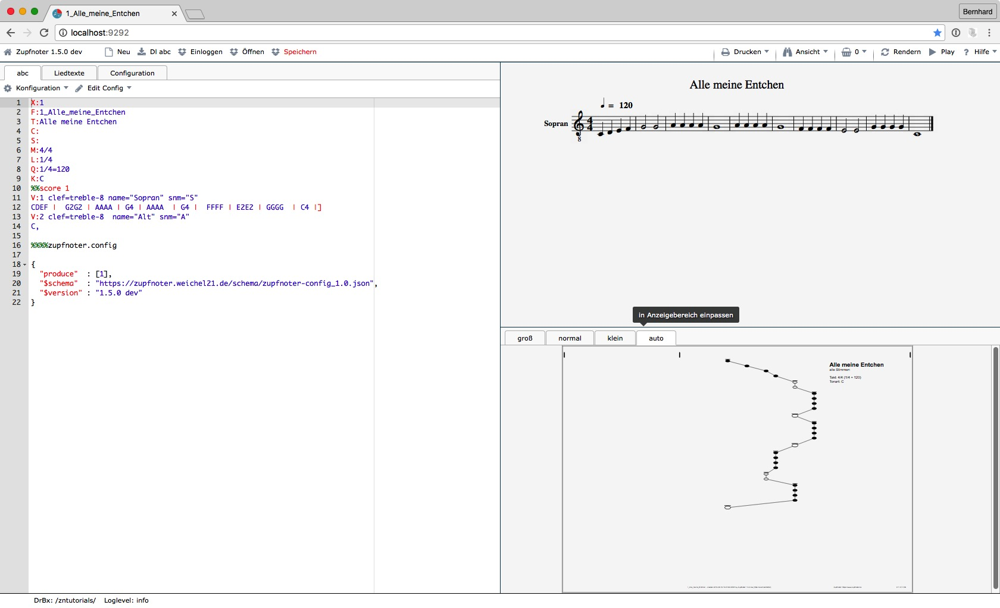

# Erste Schritte mit Zupfnoter

Mit dem Zupfnoter kannst du ganz schnell einfache Musikstücke eingeben
und als Unterlegnoten darstellen. Mit der Zeit wirst du immer mehr
Funktionen und Möglichkeiten von Zufnoter erobern, um auch komplexe
Musikstücke zu bearbeiten bzw. die Unterlegnoten im Detail nach deinen
Wünschen zu gestalten.

## Zupfnoter starten

Starte nun Zupfnoter in folgenden Schritten:

1.  öffne deinen Web-Browser (vorzugsweise Chrome)

2.  gehe zu "https://www.zupfnoter.de"

3.  drücke auf die Schaltfläche "Zupfnoter Starten"

     

    Hinweis: Wer lieber erst die Einführungsvideos anschaut, kann
    natürlich auch auf die Schaltfläche "Tutorials" klicken :-).

Beim ersten Aufruf des Zupfnoter erscheint ein beispielhaftes
Musikstück. Mit diesem Beispiel kannst du in die Grundlagen des
Zupfnoters einsteigen.

Anhand der schriftlichen Anleitungen unter dem Hilfemenü und mit den
mündlichen Unterweisung in den Tutorial-Videos (Selbstlerneinheiten)
lassen sich gut die einzelnen Schritte für die Erstellung “Alle meine
Entchen” nachvollziehen.

## Dein erstes Musikstück eingeben

1.  klicke auf Schaltfläche "Neu"

2.  gib die Liednummer und den Titel ein (z.B.; "1", "Alle meine
    Entchen")

3.  klicke im linken Fenster in Zeile 12

4.  gib ein:

    `CDEF |  G2G2 | AAAA | G4 | AAAA  | G4 |  FFFF | E2E2 | GGGG  | C4 |]`

    Da du zunächst nur eine Stimme eingegeben hast kannst du in Zeile 10
    die "2" am Ende löschen. Dann wird nur die erste Stimme dargestellt.

5.  klicke auf Schaltfläche "Rendern"

6.  im Fenster links unten siehst du nun eine Vorschau der
    Unterlegnoten.

     

**Hinweis** Um Taktstriche, Wiederholungszeichen und Schlussstriche
darstellen zu können benötigt man folgende Tastenkombinationen zur
erstellung des senkrechten Striches (vertical bar)

**Windows**

-   `|` erzeugt man mit der Taste AltGr und der Taste links vom Y
-   `[` erzeugt man mit der Taste `AltGr` und der Taste `8`
-   `]` erzeugt man mit der Taste `AltGr` und der Taste `9`

**Mac**

-   `|` erzeugt man mit der Taste `Alt` und der Taste `7`
-   `[` erzeugt man mit der Taste `Alt` und der Taste `5`
-   `]` erzeugt man mit der Taste Alt und der Taste `6`

**Herzlichen Glüchwunsch!** Du hast dein erstes Musikstück mit Zupfnoter
erstellt.

## Das Musikstück prüfen

Du möchtest nun prüfen, ob die Noten auch korrekt sind. Dazu kannst du
es einfach mal anhören:

1.  klicke auf die Schaltfläche "Play"

    Zupfnoter spielt "Alle meine Entchen" von Beginn an.

2.  klicke auf die erste ganze Note Fenster rechts oben (das sollte ein
    "G" sein). Diese wird dadurch ausgewählt und in allen Fenstern
    markiert.

    **Hinweis**: Die Note ist nun auch im linken Fenster selektiert. Auf
    diese Weise kann einfach in der ABC-Notation navigiert werden.

3.  klicke wieder auf die Schaltfläche "Play"

    Zupfnoter spielt "Alle meine Entchen" ab der ausgewählten Note.

## Die Unterlegnoten gestalten

Als nächstes kannst du die Unterlegnoten gestalten. Zupfnoter bietet
eine sehr große Vielfalt an Gestaltungsmöglichkeiten. Als einfaches
Beispiel kannst zunächst einen Liedtext hinzufügen:

1.  klicke im linken Fenster auf die Zeile 15, also in die Zeile nach
    dem "C,".

2.  füge die folgenden Zeilen ein (dies die Darstellung von Liedtexten
    in der ABC-Notation):

        W: schwimmen auf dem See
        W: schwimmen auf dem See
        W: Köpfchen in das Wasser
        W: Schwänzchen in die Höh

    Dieser Text erscheint sofort in dem Fenster rechts oben (der
    Notenvorschau), nicht jedoch in den Unterlegnoten. Dort erscheint
    der Liedtext erst, wenn die Einstellungen zur Gestaltung und
    Positionierung eingefügt worden sind.

3.  klicke auf die Schaltfläche "Einstellungen". Dadurch öffnet sich das
    Menü zum Einfügen von Einstellungen in das Musikstück.

4.  klicke auf den Eintrag "Liedtexte", um die Einstellungen für
    Liedtexte hinzuzufügen. Dadurch wird im linken Fenster folgendes
    eingefügt (zunächst musst du hier nichts tun. Wenn du einst ein
    Profi im Zupfnoter sein wirst, wirst du diese Zeilen schätzen
    lernen):

          "extract"  : {
            "0" : {
              "lyrics" : {
                "1" : {
                  "verses" : [1, 2, 3, 4, 5, 6, 7, 8, 9, 10],
                  "pos"    : [350, 70]
                }
              }
            }
          }

5.  klicke auf die Schaltfläche "Rendern", um die Harfennoten zu
    aktualisieren.

    Nun erscheinen die Liedtexte.

6.  Verschiebe mit der Maus die Liedtexte in der Vorschau der
    Harfennoten (Fenster rechts unten) an die Position, die dir gefällt.

    **Hinweis:** Der Liedtext ist nun rot um bei nahe an einander
    liegenden Texten anzuzeigen, welcher Text verschoben wurde. Durch
    "Rendern" wird er wieder schwarz.

## Das Musikstück drucken

Wenn das Musikstück fertig gestaltet ist, willst du es natürlich auch
drucken:

1.  klicke auf die Schaltfläche "Drucken"

2.  klicke auf "A4" (oder auf "A3", wenn du einen Din-A3 Drucker hast)

    Es erscheint eine Druckvorschau des Unterlegnotenblattes.

3.  klicke auf das Druckersymbol oben rechts.

    Es öffnet sich ein Druckdialog.

    **Hinweis**: bitte konfiguriere den Druckereinstellung so, der
    Ausdruck nicht vergößert oder verkleinert wird (100%, 1:1 ...).

    Schneide die ausgedruckten Blätter an den linken Schnittmarken (die
    kleinen "x" oben und unten am Blatt) mittig im "x" durch und klebe
    die Blätter so zusammen, dass die Schnittmarken wieder genau ein "x"
    ergeben.

Wenn du dein Musikstück als herkömmliche Noten ausdrucken willst:

1.  gehe zurück zum Zupfnoter und klicke erneut auf die Schaltfläche
    "Drucken"

2.  klicke auf Menüeintrag "Noten"

    Es erscheint eine Vorschauseite der herkömmlichen Noten

3.  Wähle in deinem Browser zum Drucken die Druckfunktion aus.

## Dein Muskstück speichern

### Speichern per Download

Du hast vielleicht schon bemerkt, dass Zupfnoter bei einem Neustart
immer das zuletzt bearbeitete Musikstück wieder geladen hat. Natürlich
solltest du dein Musikstück auf deinem Rechner so abspeichern, damit du
es später auch überarbeiten kannst.

1.  klicke auf die Schaltfläche "Dl abc"
2.  dein Musikstück wird in deinem Downloads - Ordner abgelegt.
    Zupfnoter bildet den Dateinamen aus der Information in Zeile 2:

    aus `F: 1_Alle-meine-Entchen` entsteht `1_Alle-meine-Entchen.abc`

Bei Bedarf kannst du die Unterlegnoten als PDF herunterladen (z.B. um
diese weiter zu geben):

1.  klicke auf die Schaltfläche "Drucken"

2.  klicke auf "A4" (oder auf "A3", wenn du einen Din-A3 Drucker hast)

    Es erscheint eine Druckvorschau des Unterlegnotenblattes.

3.  klicke auf das Downloadsymbol oben rechts

4.  Wähle den Speicherort

    Zupfnoter bildet auch hier den Dateinamen aus der Information in
    Zeile 2:

    aus `F: 1_Alle-meine-Entchen` entsteht
    `1_Alle-meine-Entchen_alle-Stimmen.pdf`

### Speichern in der Dropbox

Wenn du regelmäßig mit Zupfnoter arbeiten willst, bietet es sich an, zum
Speichern der Muskstücke die Dropbox zu benutzen. Eine Dropbox ist ein
Speicher außerhalb deines Rechners. Mit der Dropbox hast du viele
Vorteile bei Zupfbnoter:

-   Zupfnoter speichert abc, pdf und Noten mit nur einem Klick
-   du hast alle deine Musikstücke zentral abgelegt und kannst sie mit
    einem Klick wieder in den Zupfnoter laden
-   Dropbox speichert frühere Versionen, so dass du bei Problemen darauf
    zurück greifen kannst
-   Über die Dropbox kannst du deine Dateien mit anderen teilen, um
    gemeinsam einem Musikstück zu arbeiten
-   Selbst, wenn du nicht online bist, hast du ein Kopie aller deiner
    Musikstücke (auch der PDFs) auf deiner lokalen Platte

Zur Einrichtung einer Dropbox gehst du auf <https://www.dropbox.com/de>.
Wenn du dich bei Dropbox angemeldet hast, findest du dort ein
deutschsprachiges Benutzerhandbuch.

Hinweis: Dropbox speichet seine Daten nicht in Deutschland.

Wenn du ein Konto bei Dropbox hast, musst du Zupfnoter einmalig pro
verwendetem Browser mit diesem Konto verbinden:

-   klicke auf Schaltfläche "Einloggen"
-   es erscheint das Anmeldefenster der Dropbox
-   gib Email-Adresse und Kennwort ein
-   Zupfnoter ist nun verbunden

## Musikstück importieren

Falls du schon ein anderes Musikprogramm verwendest (z.B. Musescore
<https://www.musescore.com>) kannst deine Musikstücke in den Zupfnoter
importieren, wenn dein Programm MusicXml
(<https://www.musicxml.com/de/>) exportieren kann.

Es gibt auch Webseiten, die frei zugängliche Musikstücke als MusicXML
oder ABC Dateien zum Download anbieten.

Um ABC oder MusiXML zu importieren kannst du einfach die Datei aus
deinem Rechner (Explorer oder Finder) in den Zupfnoter ziehe.

**Hinweis**: bitte achte darauf dass du die Zeile "F:" ggf. von Hand
hinzufügst, damit Zupfnoter den Dateinamen kenn unter dem er das
Musikstück speichern soll.
