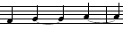
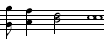

Abc-Notation Teil 1
-------------------

Die Abc-Musiknotation wurde erfunden, um Melodien in Computern zu
erfassen. Sie eignet sich aber auch gut für handschriftliche Notizen, um
Melodien aufschreiben, wenn man kein Notenpapier zur Hand hat. Es genügt
ein Schmierzettel, oder am Computer ein Text-Eingabefeld.

Abc-Notation ist zwar nicht ganz so übersichtlich wie herkömmliche
Musiknoten, aber doch lesbar genug, so dass Musiker sie mit etwas Übung
vom Blatt spielen können. Gleichzeitig ist sie auch so exakt, dass
[Computer](http://abcnotation.com/software) sie interpretieren können –
z. B. um sie zu
[transponieren](http://de.wikipedia.org/wiki/Transposition_(Musik)),
abzuspielen oder automatisch in klassische Notenschrift zu übertragen.

Die Abc-Notation ist heute vor allem im englischen Sprachraum bei
Folkmusikern und Freunden traditioneller Musik verbreitet. Im Internet
gibt es Sammlungen volkstümlicher Weisen in Abc. Freunde traditioneller
irischer, britischer oder nordamerikanischer Musik geben ihre Weisen
häufig in Form von Abc weiter.

### Inhaltsverzeichnis

[Kopffelder](http://penzeng.de/Geige/Abc.htm#Kopffelder) ·
[Noten](http://penzeng.de/Geige/Abc.htm#Noten) ·
[Notenwerte](http://penzeng.de/Geige/Abc.htm#Notenwerte) ·
[Pausen](http://penzeng.de/Geige/Abc.htm#Pausen) · [Taktstriche,
Wiederholungszeichen](http://penzeng.de/Geige/Abc.htm#Taktstriche) ·
[Versetzungszeichen](http://penzeng.de/Geige/Abc.htm#Vorzeichen) ·
[Punktierung](http://penzeng.de/Geige/Abc.htm#Punktierung) ·
[Triolen](http://penzeng.de/Geige/Abc.htm#Triolen) · [Halte- und
Bindebögen](http://penzeng.de/Geige/Abc.htm#Boegen) ·
[Staccato](http://penzeng.de/Geige/Abc.htm#Staccato) ·
[Akkorde](http://penzeng.de/Geige/Abc.htm#Akkorde) ·
[Sonstiges](http://penzeng.de/Geige/Abc.htm#Sonstiges)

### Beispiel

Die Melodie von „Alle meine Entchen“ sieht in Abc-Notation so aus:

  ------------------------------------------------------------------------------------------------------------------------------------------------
  Abc-Notation                              Umsetzung in herkömmliche Noten
  ----------------------------------------- ------------------------------------------------------------------------------------------------------
  X:1\                                      {width="100%" height="130"}
  T:Alle meine Entchen\                     
  M:2/4\                                    
  L:1/8\                                    
  K:C\                                      
  C D E F | G2 G2 \[|: A A A A | G4 :|\]\   
  F F F F | E2 E2 | G G G G | C4 |\]        
  ------------------------------------------------------------------------------------------------------------------------------------------------

### [Kopffelder]()

Die ersten fünf Zeilen sind Kopffelder. Bei handschriftlichen Notizen
kann man die weglassen, aber zur elektronischen Verarbeitung sind sie
nötig:\
X:
[Indexnummer](http://penzeng.de/Geige/Abc2.htm#X) – irgendeine
fortlaufende Nummer\
T: [Titel](http://penzeng.de/Geige/Abc2.htm#T)
– der Name des Stücks\
M:
[Metrum](http://de.wikipedia.org/wiki/Metrum_(Musik)) – z. B.
Dreivierteltakt, Viervierteltakt…\
L:
Standard-[Notenwert](http://de.wikipedia.org/wiki/Notenwert) – gibt an,
ob hauptsächlich Viertel, Achtel oder Sechzehntel gezählt werden\
K:
[Tonart](http://de.wikipedia.org/wiki/Tonart)

Das Kopffeld „X:“ steht immer als erstes, und „K:“ immer als letztes,
unmittelbar vor der Melodie.\
Dazwischen können auch noch [weitere
Kopffelder](http://penzeng.de/Geige/Abc2.htm#Weitere) eingefügt werden.

### [Noten/Tonhöhe]()

Die einzelnen Töne werden als Buchstaben notiert.\
Großbuchstaben stehen für die tieferen Töne, Kleinbuchstaben für die
höheren:

  Abc             Noten
  --------------- -------------------------------------------------------------------------------------------
  C D E F G A B   {width="195" height="40"}
  c d e f g a b   {width="196" height="39"}

Achtung bei „b“ und „h“: Es gilt hier die englische Schreibweise. Man
schreibt immer „b“ statt „h“! Wo wirklich das deutsche „b“ gemeint ist
(ein Halbton tiefer als h), schreibt man „b“ mit
[Versetzungszeichen](http://penzeng.de/Geige/Abc.htm#Vorzeichen).

[Für noch höhere Töne schreibt man Kleinbuchstaben mit Hochkommas,\
für noch tiefere Töne Großbuchstaben mit Kommas:]()

  Abc                                        Noten
  ------------------------------------------ ---------------------------------------------------------------------------------------
  c' d' e' f' g' a' b' c'' d'' e'' f'' g''   {width="337" height="63"}
  C B, A, G, F, E, D, C, B,, A,, G,,         {width="292" height="42"}

Zwischen den Buchstaben dürfen Leerzeichen stehen, um die Melodie besser
lesbar zu machen. Man darf auch lückenlos hintereinander schreiben. Bei
kurzen Notenwerten macht das im Notenbild einen Unterschied:

  Abc               Noten
  ----------------- -----------------------------------------------------------------------------------------------------------
  C D E F G CDEFG   {width="200" height="35"}

Lückenlose Schreibweise entspricht Noten mit Balken;\
Trennung durch Leerzeichen entspricht Noten mit Fähnchen.

### [Notenwerte]()

Alle Noten bekommen standardmäßig den Notenwert, der im [Kopffeld
„L:“](http://penzeng.de/Geige/Abc2.htm#L) festgelegt wurde.\
Durch nachgestellte Ziffern wird dieser Notenwert vervielfacht:

  Abc              Mit L:1/8                                                                                           Mit L:1/4
  ---------------- --------------------------------------------------------------------------------------------------- ------------------------------------------------------------------------------------------------------
  a a2 a4 a8 a16   {width="170" height="35"}   {width="225" height="38"}

Mit einem Schrägstrich werden Notenwerte verkürzt:

  Abc                 Mit L:1/8                                                                                           Mit L:1/4
  ------------------- --------------------------------------------------------------------------------------------------- ---------------------------------------------------------------------------------------------------
  a a/ a/4 a/8 a/16   {width="66" height="38"}   {width="89" height="38"}

### [Pausen]()

Pausen werden mit dem Buchstaben „z“ notiert. Sie bekommen standardmäßig
die Länge, die im [Kopffeld „L:“](http://penzeng.de/Geige/Abc2.htm#L)
festgelegt wurde.\
Durch nachgestellte Ziffern wird diese Länge vervielfacht:

  Abc              Mit L:1/8                                                                                           Mit L:1/4
  ---------------- --------------------------------------------------------------------------------------------------- -----------------------------------------------------------------------------------------------------
  z z2 z4 z8 z16   {width="145" height="38"}   {width="197" height="35"}

Mit einem Schrägstrich wird die Länge verkürzt:

  Abc                 Mit L:1/8                                                                       Mit L:1/4
  ------------------- ------------------------------------------------------------------------------- -------------------------------------------------------------------------------
  z z/ z/4 z/8 z/16   {width="64" height="35"}   {width="82" height="35"}

### [Taktstriche, Wiederholungszeichen, Schlussstrich]()

Ein senkrechter Strich „|“ stellt einen Taktstrich dar. Eckige Klammern
\[ \] stellen dicke Striche dar, z. B. beim Schlussstrich:\
|\]\
oder bei Wiederholungszeichen:\
\[|:   :|\]\
Wiederholungszeichen dürfen auch ohne eckige Klammern stehen:\
|:   :|\
Wo zwei Wiederholungszeichen aufeinandertreffen, schreibt man:\
:|:\
oder kürzer:\
::

Wo Wiederholungen unterschiedlich enden, schreibt man Ziffern 1 und 2
unmittelbar hinterm Taktstrich. Beispiel:

  -----------------------------------------------------------------------------------------------------------------------------------------------------------------------
  Abc-Notation                                             Umsetzung in Noten
  -------------------------------------------------------- --------------------------------------------------------------------------------------------------------------
  X:1\                                                     {width="100%" height="136"}
  T:Fuchs du hast die Gans gestohlen\                      
  M:C\                                                     
  L:1/8\                                                   
  K:C\                                                     
  C D E F G G G G \[|: A F c A G4 :|:\                     
  G F F F F E E E |1 E D E D C E G2 :|\]2 E D E D C4 |\]   
  -----------------------------------------------------------------------------------------------------------------------------------------------------------------------

### [Versetzungszeichen]()

Durch ein vorangestelltes „\^“ wird ein Ton um einen Halbton erhöht.
Dies entspricht in der Notenschrift dem
[Kreuz](http://de.wikipedia.org/wiki/Kreuz_(Notenschrift)).\
Durch ein vorangestelltes „\_“ wird ein Ton um einen Halbton erniedrigt.
Dies entspricht in der Notenschrift dem
[b](http://de.wikipedia.org/wiki/B_(Notenschrift)).\
Durch ein „=“ wird ein vorangegangenes Versetzungszeichen aufgelöst.
Dies entspricht in der Notenschrift dem
[Auflösungszeichen](http://de.wikipedia.org/wiki/Aufl%C3%B6sungszeichen).\
Beispiel:

  Abc            Noten
  -------------- -------------------------------------------------------------------------------------------------
  G \^G \_G =G   {width="106" height="36"}

Für Versetzungszeichen gelten in Abc-Notation dieselben Regeln wie in
herkömmlicher Notenschrift: Ein Versetzungszeichen gilt bis zum Ende des
Taktes, oder bis es aufgelöst wird. Vorzeichen, die sich ohnehin aus der
Tonart ergeben, muss man innerhalb der Melodie nicht notieren.

Doppelte Versetzungszeichen sind notierbar, indem man die
Versetzungszeichen doppelt schreibt, also „\^\^“ für
[Doppelkreuz](http://de.wikipedia.org/wiki/Doppelkreuz_(Notenschrift))
bzw. „\_\_“ für [Doppel-b](http://de.wikipedia.org/wiki/Doppel-b).

### [Punktierung]()

[Punktierte](http://de.wikipedia.org/wiki/Punktierung_(Musik)) Noten
kann man in Abc schreiben, indem man ihre Länge als Vielfaches oder
Bruchteil des [Standard-Notenwerts](http://penzeng.de/Geige/Abc2.htm#L)
angibt, z. B.:\
g3 dreimal der Standard-Notenwert\
g3/2 dreimal die Hälfte des
Standard-Notenwerts\
g3/4 drei Viertel des Standard-Notenwerts.

Es gibt aber auch eine einfachere Möglichkeit: Meistens stehen
punktierte Noten ja als Päärchen zusammen mit einer entsprechend
verkürzten Note: {width="14" height="9"}
Für solche Päärchen gibt es eine vereinfachte Schreibweise:\
g&gt;a\
Der Ton links vom „&gt;“ wird um die Hälfte verlängert, der Ton rechts
vom „&gt;“ entsprechend um die Hälfte verkürzt. Dasselbe funktioniert
auch umgekehrt mit dem Zeichen „&lt;“:\
g&lt;a entspricht einem verkürzten g mit
anschießendem punktierten a.

Man kann die Noten in so einem Päärchen wiederum mit den üblichen
Zeichen verlängern oder verkürzen, z. B.:\
Notenwerte verdoppeln: g2&gt;a2 oder\
Notenwerte halbieren: g/&gt;a/

Innerhalb solcher Päärchen dürfen keine Leerzeichen vorkommen.

### [Triolen]()

[Triolen](http://de.wikipedia.org/wiki/Triole)
{width="20" height="19"}
werden in Abc so notiert: (3EFG

Auch andere Teilungen sind ebenso notierbar:\
(2EF Duole (2 Töne im Zeitraum von dreien)\
(3EFG Triole (3 Töne im Zeitraum von zweien)\
(4EFGA Quartole (4 Töne im Zeitraum von
dreien)\
(5EFGAG Quintole (5 Töne im Zeitraum von
zweien oder dreien \*)\
(6EFGAGF Sextole (6 Töne im Zeitraum von
zweien)\
(7EFGAGFE Septole (7 Töne im Zeitraum von
zweien oder dreien \*)\
(8EFGAGFED Oktole (8 Töne im Zeitraum von
dreien)\
(9EFGAGFEDC Nontole (9 Töne im Zeitraum von
zweien oder dreien \*)

\* Der Zeitraum von dreien gilt bei ungeraden Taktarten wie 3/4, 3/8,
9/8…\
  Der Zeitraum von zweien gilt bei geraden Taktarten wie C, 4/4, 2/4…

Längere Abschnitte mit außergewöhnlicher Teilung lassen sich auch wie
folgt notieren:\
(p:q:r\
Für p wird die Anzahl der Noten eingesetzt,
die in den Zeitraum q passen soll.\
Anstelle von r wird die Anzahl von Noten
eingesetzt, für die diese Regel gelten soll.

### [Bögen]()

[Haltebögen](http://de.wikipedia.org/wiki/Haltebogen) werden in Abc mit
Bindestrich notiert:

  Abc          Noten
  ------------ --------------------------------------------------------------------------------
  F G-G A-|A   {width="137" height="34"}

[Bindebögen](http://de.wikipedia.org/wiki/Bindebogen) und
[Phrasierungsbögen](http://de.wikipedia.org/wiki/Phrasierungsbogen)
werden mit runden Klammern notiert:\
Klammer auf für den Beginn eines Bogens,\
Klammer zu für das Ende eines Bogens.

Unmittelbar nach der öffnenden Klammer und unmittelbar vor der
schließenden Klammer darf kein Leerzeichen stehen.\
Man kann Klammern auch ineinander verschachteln:

  Abc                  Noten
  -------------------- --------------------------------------------------------------------------------------
  (F2 (GABc) de-|ef)   {width="184" height="41"}

### [Staccato]()

Staccato wird mit einem vorangestellten Punkt notiert:

  Abc                    Noten
  ---------------------- ----------------------------------------------------------------------------------
  c2 d B | .A2 .G2 .F2   {width="144" height="34"}

### [Akkorde]()

Mit eckigen Klammern \[ \] kann man Noten übereinander stapeln und so
Akkorde aus einzelnen Tönen zusammenbauen:

  Abc                         Noten
  --------------------------- ------------------------------------------------------------------------------
  G \[FA\] \[DGB\] \[CEGc\]   {width="103" height="37"}

Innerhalb der eckigen Klammern dürfen keine Leerzeichen stehen, und es
ist üblich, die Töne darin in aufsteigender Reihenfolge vom tiefsten bis
zum höchsten zu notieren.

Eckige Klammern können auch dazu dienen, mehrere Stimmen in ein
Notensystem zu schreiben:

  Abc                                 Noten
  ----------------------------------- -------------------------------------------------------------------------------
  \[G/g/\] \[Af\] \[B2d2\] \[c4c4\]   {width="104" height="40"}

[Sollen Akkorde nur als Gitarrengriffe über oder unter den Noten
erscheinen, so schreibt man sie in Anführungszeichen:]()

  Abc                                     Noten
  --------------------------------------- --------------------------------------------------------------------------------
  G/B/ | "C" c G "em" G E/G/ | "dm7" A2   {width="189" height="42"}

Für Gitarrengriffe gelten folgende Regeln:\
Man schreibt zuerst einen Buchstaben A bis G,\
dann eventuell \# oder b,\
dann eventuell m für Moll, oder min, maj, sus, dim, +, 7, 9, oder was
auch immer,\
dann eventuell noch einen Schrägstrich / und einen Basston.

### [Zeilenumbruch]()

Wenn Abc in klassische Notenschrift umgewandelt wird, wird aus einer
Zeile Abc normalerweise eine Notenzeile gemacht. Sollte eine Zeile aber
zu lang sein, kann auch vorher ein Zeilenumbruch passieren. Ein „\\“ am
Ende einer Abc-Zeile unterdrückt den Zeilenumbruch, ein „!“ erzwingt
ihn.

### Aufstrich, Abstrich

Speziell für Streichinstrumente sind die Zeichen\
u (up-bow) für
[Aufstrich](http://penzeng.de/Geige/Streichen.htm#AufAbstrich) und\
v (down-bow) für
[Abstrich](http://penzeng.de/Geige/Streichen.htm#AufAbstrich).\
Sie können den Noten vorangestellt werden, um die Strichrichtung
anzuzeigen.

Bei der Ziehharmonika gibt man mit diesen Zeichen an, ob der Balg
auseinandergezogen oder zusammengedrückt wird.

### Kommentare

Nach einem Prozentzeichen % können in Abc beliebige Kommentare
hinzugefügt werden. Computerprogramme ignorieren alles, was zwischen
einem Prozentzeichen und dem Ende der betreffenden Zeile steht.

### Reihenfolge

Falls bei einer Note viele Eigenschaften zusammentreffen, werden sie in
folgender Reihenfolge notiert:

1.  "[Gitarrengriff](http://penzeng.de/Geige/Abc.htm#Gitarrengriff)"
2.  [Staccato](http://penzeng.de/Geige/Abc.htm#Staccato) . oder [anderer
    Akzent](http://penzeng.de/Geige/Abc2.htm#Verzierungen)
3.  [Versetzungszeichen](http://penzeng.de/Geige/Abc.htm#Vorzeichen)
4.  [Note](http://penzeng.de/Geige/Abc.htm#Noten)
5.  [Oktavenzeichen](http://penzeng.de/Geige/Abc.htm#HoeherTiefer) '
    oder ,
6.  Änderung des
    [Notenwerts](http://penzeng.de/Geige/Abc.htm#Notenwerte)

### Verweise

Im [2. Teil](http://penzeng.de/Geige/Abc2.htm) dieser Anleitung werden
Kopffelder und Erweiterungen des Abc-Standards beschrieben.\
[Abc notation home page](http://abcnotation.com/) ·
[Software](http://abcnotation.com/software) · [How to interpret abc
music notation](http://www.lesession.co.uk/abc/abc_notation.htm) · [Abc
converter at mandolintab.net](http://mandolintab.net/abcconverter.php)

------------------------------------------------------------------------

[&lt;&lt; vorige](http://penzeng.de/Musik) / [nächste
Seite](http://penzeng.de/Geige/Abc2.htm) &gt;&gt;   ·  
[Musik](http://penzeng.de/Musik)   ·  
[Impressum](http://penzeng.de/InEigenerSache.htm)   ·  
[http://Penzeng.de](http://penzeng.de/)/[Musik](http://penzeng.de/Musik)
